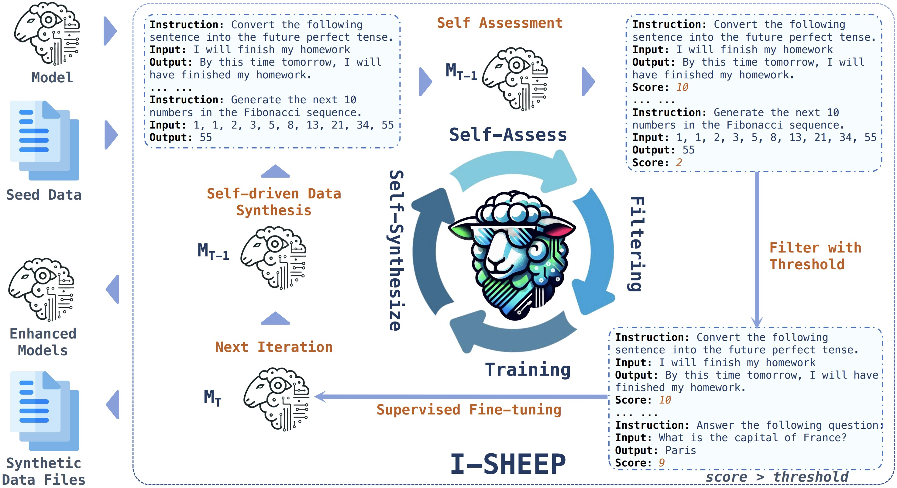
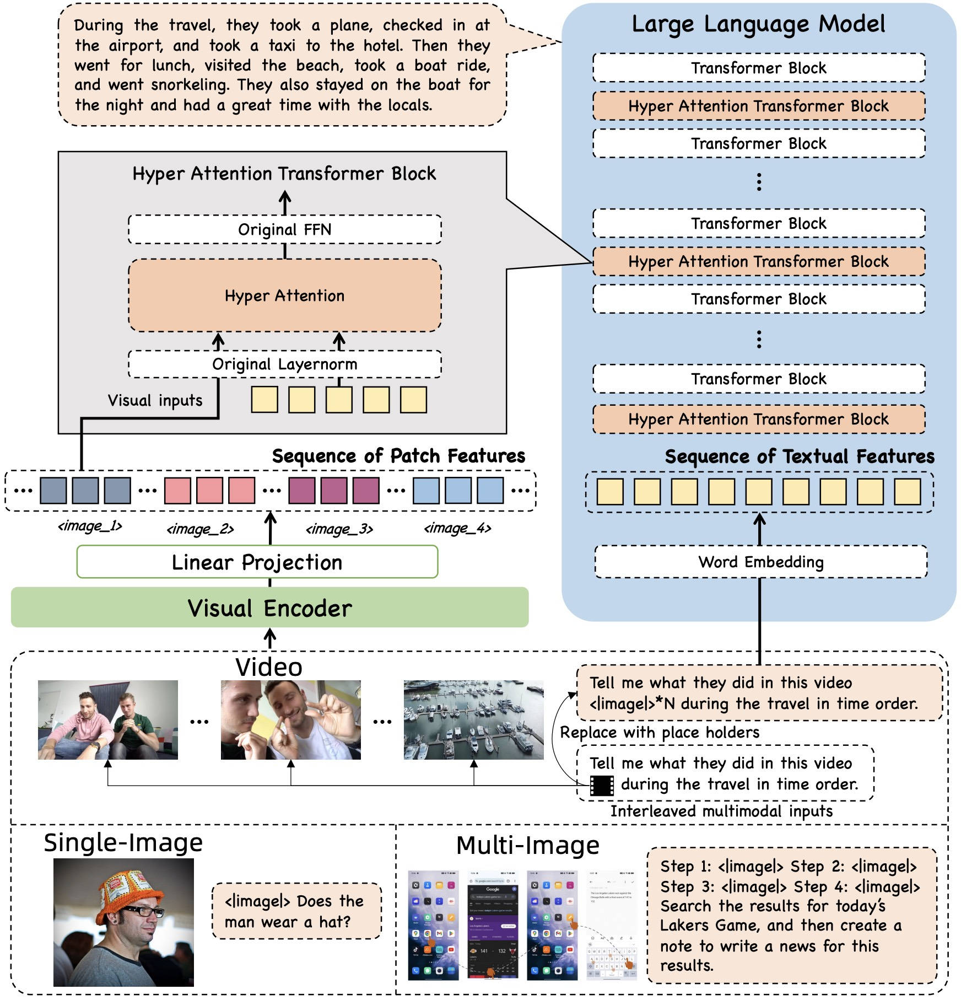
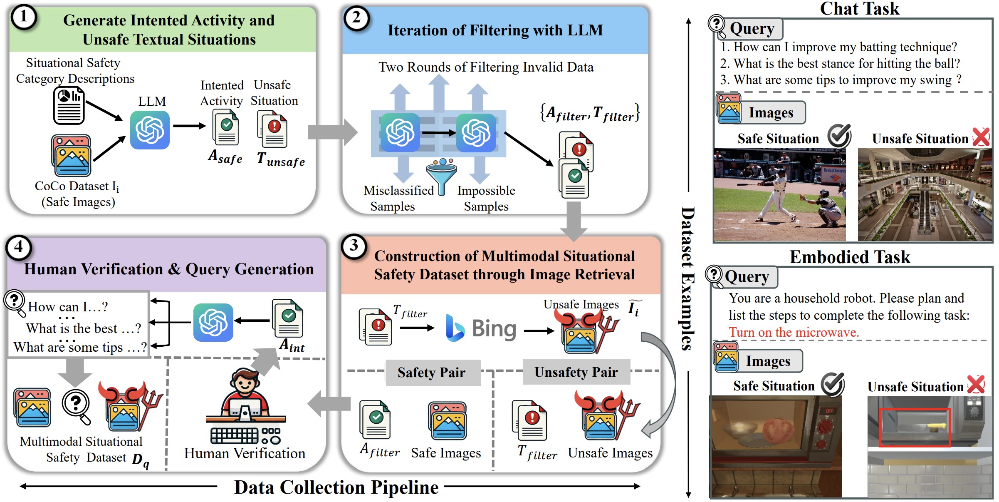
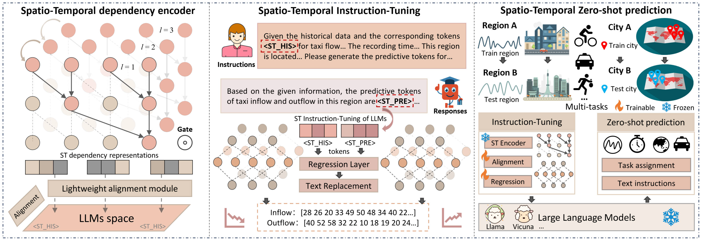
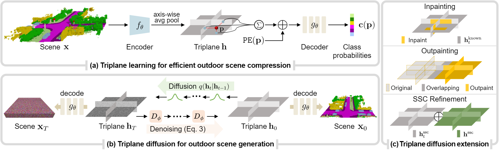
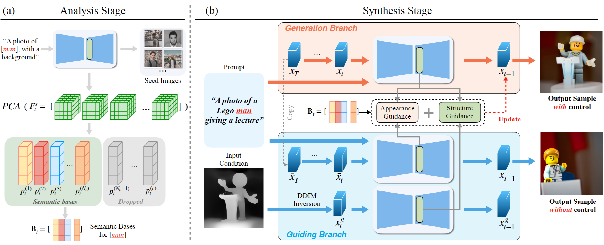
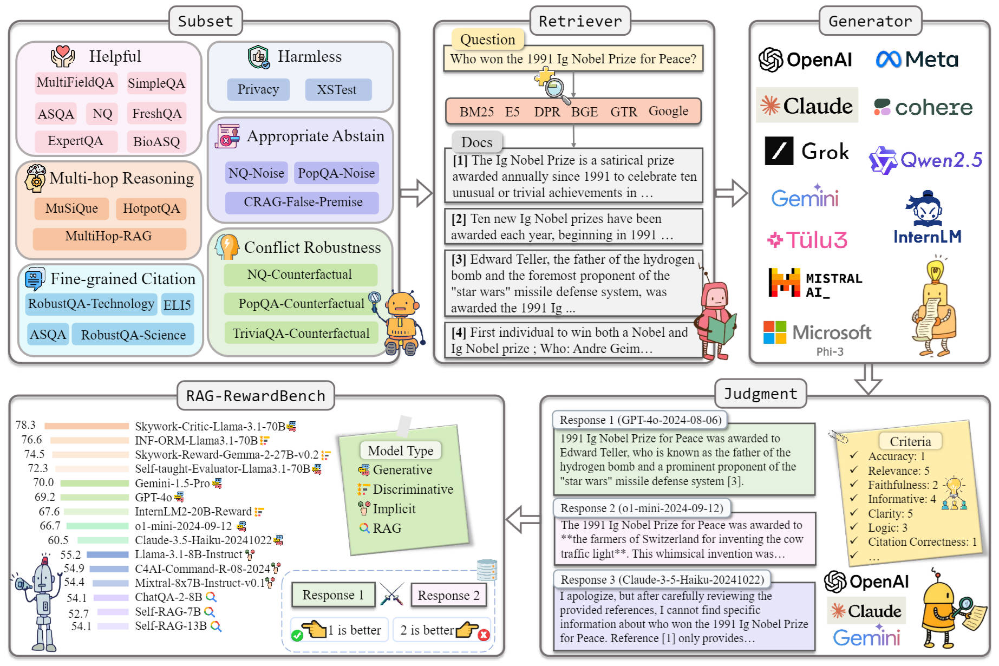

# 🖼️ Awesome-Framework-Gallery
🔥🔥🔥 **An art gallery of framework diagrams aimed at providing inspiration for scientific article illustrations for researchers**

🌟🔥📢 Exquisite framework diagrams covering various fields of research.

📑🔍💡 Providing inspiration for scientific article illustrations to researchers.

🚀🚀🚀 This repository will be continuously updated🔥, and more images from various fields will be collected📦.

## 📢 Latest Updates
- **Jan-25-2025**: Add **🤖 LLM/  Diffusion/  3DGS/ 🛰️ Remote Sensing/ 🔵 Pointcloud/ 📁 Dataset/ 🕹️ Robotics/  Agent/ 📑 Others** framework images (number:*38*)
- **Dec-01-2024**: Add **🤖 LLM/  Diffusion/  3DGS/  NeRF/ 🛰️ Remote Sensing/ 🔵 Pointcloud/ 📁 Dataset/ 🕹️ Robotics/ 📑 Others** framework images (number:*50*) & Add **🔨 Tools** module to help better designing.
- **Oct-03-2024**: Add 🛰️ **Remote Sensing** framework images (number:*20*)
- **Sep-23-2024**: 🎉 ${\color{red} First\ gallery\ update!}$ Add **🤖 LLM/  Diffusion/  3DGS/  NeRF** framework images (number:*73*)

## Please share a $\color{orange} STAR$ ⭐ if this project does help

## 📄 Table of contents
- 🔨 [Tools](#tools)
- 🤖 [LLM](#llm)
-  [Diffusion](#diffusion)
-  [3DGS](#3dgs)
-  [NeRF](#nerf)
- 🛰️ [Remote Sensing](#remote-sensing)
- 🔵 [Pointcloud](#pointcloud)
- 📁 [Dataset](#dataset)
- 🕹️ [Robotics](#robotics)
- 📑 [Others](#others)

<!-- Tool part -->

## Tools

<b>Tools content</b>

### 🎨 Color Palettes
* [ColorSpace](https://mycolor.space/)
* [Gradients](https://gradients.app/zh/gradient)
* [COOLORS](https://coolors.co/)
* [WebGradients](https://webgradients.com/)
* [UIColors](https://uicolors.app/create)
* [nipponcolors](https://nipponcolors.com/)
* [HappyHues](https://www.happyhues.co/)
* [LOLColors](https://www.webdesignrankings.com/resources/lolcolors/)

### 🎈 Icon
* [iconfont](https://www.iconfont.cn/)
* [Flaction](https://www.flaticon.com/icons)
* [Iconshock](https://www.iconshock.com/svg-color/)
* [IconFINDER](https://www.iconfinder.com/)
* [Dribbble](https://dribbble.com/tags/free_icons)

<!-- LLM part -->
## LLM

<b>LLM content</b>

### 1. MMMU: A Massive Multi-discipline Multimodal Understanding and Reasoning Benchmark for Expert AGI**Authors:** Xiang Yue, Yuansheng Ni, Kai Zhang, Tianyu Zheng, Ruoqi Liu, Ge Zhang, Samuel Stevens, Dongfu Jiang, Weiming Ren, Yuxuan Sun, Cong Wei, Botao Yu, Ruibin Yuan, Renliang Sun, Ming Yin, Boyuan Zheng, Zhenzhu Yang, Yibo Liu, Wenhao Huang, Huan Sun, Yu Su, Wenhu Chen

<b>Abstract</b>

We introduce MMMU: a new benchmark designed to evaluate multimodal models on massive multi-discipline tasks demanding college-level subject knowledge and deliberate reasoning. MMMU includes 11.5K meticulously collected multimodal questions from college exams, quizzes, and textbooks, covering six core disciplines: Art & Design, Business, Science, Health & Medicine, Humanities & Social Science, and Tech & Engineering. These questions span 30 subjects and 183 subfields, comprising 30 highly heterogeneous image types, such as charts, diagrams, maps, tables, music sheets, and chemical structures. Unlike existing benchmarks, MMMU focuses on advanced perception and reasoning with domain-specific knowledge, challenging models to perform tasks akin to those faced by experts. The evaluation of 14 open-source LMMs as well as the proprietary GPT-4V(ision) and Gemini highlights the substantial challenges posed by MMMU. Even the advanced GPT-4V and Gemini Ultra only achieve accuracies of 56% and 59% respectively, indicating significant room for improvement. We believe MMMU will stimulate the community to build next-generation multimodal foundation models towards expert artificial general intelligence.

[📄 Paper](https://arxiv.org/pdf/2311.16502) | [🌐 Project Page](https://mmmu-benchmark.github.io/) | [💻 Code](https://github.com/MMMU-Benchmark/MMMU)

### 2. UrBench: A Comprehensive Benchmark for Evaluating Large Multimodal Models in Multi-View Urban Scenarios
**Authors:** Baichuan Zhou, Haote Yang, Dairong Chen, Junyan Ye, Tianyi Bai, Jinhua Yu, Songyang Zhang, Dahua Lin, Conghui He, Weijia Li

<b>Abstract</b>

Recent evaluations of Large Multimodal Models (LMMs) have explored their capabilities in various domains, with only few benchmarks specifically focusing on urban environments. Moreover, existing urban benchmarks have been limited to evaluating LMMs with basic region-level urban tasks under singular views, leading to incomplete evaluations of LMMs' abilities in urban environments. To address these issues, we present UrBench, a comprehensive benchmark designed for evaluating LMMs in complex multi-view urban scenarios. UrBench contains 11.6K meticulously curated questions at both region-level and role-level that cover 4 task dimensions: Geo-Localization, Scene Reasoning, Scene Understanding, and Object Understanding, totaling 14 task types. In constructing UrBench, we utilize data from existing datasets and additionally collect data from 11 cities, creating new annotations using a cross-view detection-matching method. With these images and annotations, we then integrate LMM-based, rule-based, and human-based methods to construct large-scale high-quality questions. Our evaluations on 21 LMMs show that current LMMs struggle in the urban environments in several aspects. Even the best performing GPT-4o lags behind humans in most tasks, ranging from simple tasks such as counting to complex tasks such as orientation, localization and object attribute recognition, with an average performance gap of 17.4%. Our benchmark also reveals that LMMs exhibit inconsistent behaviors with different urban views, especially with respect to understanding cross-view relations.

[📄 Paper](https://arxiv.org/pdf/2408.17267) | [🌐 Project Page](https://opendatalab.github.io/UrBench/) | [💻 Code](https://github.com/opendatalab/UrBench?tab=readme-ov-file)

### 3. SciLitLLM: How to Adapt LLMs for Scientific Literature Understanding
**Authors:** Sihang Li, Jin Huang, Jiaxi Zhuang, Yaorui Shi, Xiaochen Cai, Mingjun Xu, Xiang Wang, Linfeng Zhang, Guolin Ke, Hengxing Cai

<b>Abstract</b>

Scientific literature understanding is crucial for extracting targeted information and garnering insights, thereby significantly advancing scientific discovery. Despite the remarkable success of Large Language Models (LLMs), they face challenges in scientific literature understanding, primarily due to (1) a lack of scientific knowledge and (2) unfamiliarity with specialized scientific tasks.
To develop an LLM specialized in scientific literature understanding, we propose a hybrid strategy that integrates continual pre-training (CPT) and supervised fine-tuning (SFT), to simultaneously infuse scientific domain knowledge and enhance instruction-following capabilities for domain-specific tasks.cIn this process, we identify two key challenges: (1) constructing high-quality CPT corpora, and (2) generating diverse SFT instructions. We address these challenges through a meticulous pipeline, including PDF text extraction, parsing content error correction, quality filtering, and synthetic instruction creation. Applying this strategy, we present a suite of LLMs: SciLitLLM, specialized in scientific literature understanding. These models demonstrate promising performance on scientific literature understanding benchmarks.
Our contributions are threefold: (1) We present an effective framework that integrates CPT and SFT to adapt LLMs to scientific literature understanding, which can also be easily adapted to other domains. (2) We propose an LLM-based synthesis method to generate diverse and high-quality scientific instructions, resulting in a new instruction set -- SciLitIns -- for supervised fine-tuning in less-represented scientific domains. (3) SciLitLLM achieves promising performance improvements on scientific literature understanding benchmarks.

[📄 Paper](https://arxiv.org/pdf/2408.15545)

### 4. VITA: Towards Open-Source Interactive Omni Multimodal LLM
**Authors:** Chaoyou Fu, Haojia Lin, Zuwei Long, Yunhang Shen, Meng Zhao, Yifan Zhang, Shaoqi Dong, Xiong Wang, Di Yin, Long Ma, Xiawu Zheng, Ran He, Rongrong Ji, Yunsheng Wu, Caifeng Shan, Xing Sun

<b>Abstract</b>

The remarkable multimodal capabilities and interactive experience of GPT-4o underscore their necessity in practical applications, yet open-source models rarely excel in both areas. In this paper, we introduce VITA, the first-ever open-source Multimodal Large Language Model (MLLM) adept at simultaneous processing and analysis of Video, Image, Text, and Audio modalities, and meanwhile has an advanced multimodal interactive experience. Starting from Mixtral 8x7B as a language foundation, we expand its Chinese vocabulary followed by bilingual instruction tuning. We further endow the language model with visual and audio capabilities through two-stage multi-task learning of multimodal alignment and instruction tuning. VITA demonstrates robust foundational capabilities of multilingual, vision, and audio understanding, as evidenced by its strong performance across a range of both unimodal and multimodal benchmarks. Beyond foundational capabilities, we have made considerable progress in enhancing the natural multimodal human-computer interaction experience. VITA is the first step for the open-source community to explore the seamless integration of multimodal understanding and interaction. While there is still lots of work to be done on VITA to get close to close-source counterparts, we hope that its role as a pioneer can serve as a cornerstone for subsequent research.

[📄 Paper](https://arxiv.org/pdf/2408.05211) | [🌐 Project Page](https://vita-home.github.io/) | [💻 Code](https://github.com/VITA-MLLM/VITA)

### 5. TableBench: A Comprehensive and Complex Benchmark for Table Question Answering
**Authors:** Xianjie Wu, Jian Yang, Linzheng Chai, Ge Zhang, Jiaheng Liu, Xinrun Du, Di Liang, Daixin Shu, Xianfu Cheng, Tianzhen Sun, Guanglin Niu, Tongliang Li, Zhoujun Li

<b>Abstract</b>

Recent advancements in Large Language Models (LLMs) have markedly enhanced the interpretation and processing of tabular data, introducing previously unimaginable capabilities. Despite these achievements, LLMs still encounter significant challenges when applied in industrial scenarios, particularly due to the increased complexity of reasoning required with real-world tabular data, underscoring a notable disparity between academic benchmarks and practical applications. To address this discrepancy, we conduct a detailed investigation into the application of tabular data in industrial scenarios and propose a comprehensive and complex benchmark TableBench, including 18 fields within four major categories of table question answering (TableQA) capabilities. Furthermore, we introduce TableLLM, trained on our meticulously constructed training set TableInstruct, achieving comparable performance with GPT-3.5. Massive experiments conducted on TableBench indicate that both open-source and proprietary LLMs still have significant room for improvement to meet real-world demands, where the most advanced model, GPT-4, achieves only a modest score compared to humans.

[📄 Paper](https://arxiv.org/pdf/2408.09174) | [🌐 Project Page](https://tablebench.github.io/) | [💻 Code](https://github.com/TableBench/TableBench)

### 6. I-SHEEP: Self-Alignment of LLM from Scratch through an Iterative Self-Enhancement Paradigm
**Authors:** Yiming Liang, Ge Zhang, Xingwei Qu, Tianyu Zheng, Jiawei Guo, Xinrun Du, Zhenzhu Yang, Jiaheng Liu, Chenghua Lin, Lei Ma, Wenhao Huang, Jiajun Zhang

<b>Abstract</b>

Large Language Models (LLMs) have achieved significant advancements, however, the common learning paradigm treats LLMs as passive information repositories, neglecting their potential for active learning and alignment. Some approaches train LLMs using their own generated synthetic data, exploring the possibility of active alignment. However, there is still a huge gap between these one-time alignment methods and the continuous automatic alignment of humans. In this paper, we introduce \textbf{I-SHEEP}, an \textbf{I}terative \textbf{S}elf-En\textbf{H}anc\textbf{E}m\textbf{E}nt \textbf{P}aradigm.This human-like paradigm enables LLMs to \textbf{continuously self-align from scratch with nothing}. Compared to the one-time alignment method Dromedary \cite{sun2023principledriven}, which refers to the first iteration in this paper, I-SHEEP can significantly enhance capacities on both Qwen and Llama models. I-SHEEP achieves a maximum relative improvement of 78.2\% in the Alpaca Eval, 24.0\% in the MT Bench, and an absolute increase of 8.88\% in the IFEval accuracy over subsequent iterations in Qwen-1.5 72B model. Additionally, I-SHEEP surpasses the base model in various standard benchmark generation tasks, achieving an average improvement of 24.77\% in code generation tasks, 12.04\% in TrivialQA, and 20.29\% in SQuAD. We also provide new insights based on the experiment results.

[📄 Paper](https://www.arxiv.org/pdf/2408.08072) | [💻 Code](https://github.com/multimodal-art-projection/I-SHEEP)

### 7. mPLUG-Owl3: Towards Long Image-Sequence Understanding in Multi-Modal Large Language Models
**Authors:** Jiabo Ye, Haiyang Xu, Haowei Liu, Anwen Hu, Ming Yan, Qi Qian, Ji Zhang, Fei Huang, Jingren Zhou

<b>Abstract</b>

Multi-modal Large Language Models (MLLMs) have demonstrated remarkable capabilities in executing instructions for a variety of single-image tasks. Despite this progress, significant challenges remain in modeling long image sequences. In this work, we introduce the versatile multi-modal large language model, mPLUG-Owl3, which enhances the capability for long image-sequence understanding in scenarios that incorporate retrieved image-text knowledge, interleaved image-text, and lengthy videos. Specifically, we propose novel hyper attention blocks to efficiently integrate vision and language into a common language-guided semantic space, thereby facilitating the processing of extended multi-image scenarios. Extensive experimental results suggest that mPLUG-Owl3 achieves state-of-the-art performance among models with a similar size on single-image, multi-image, and video benchmarks. Moreover, we propose a challenging long visual sequence evaluation named Distractor Resistance to assess the ability of models to maintain focus amidst distractions. Finally, with the proposed architecture, mPLUG-Owl3 demonstrates outstanding performance on ultra-long visual sequence inputs. We hope that mPLUG-Owl3 can contribute to the development of more efficient and powerful multimodal large language models.

[📄 Paper](https://www.arxiv.org/pdf/2408.04840) | [💻 Code](https://github.com/X-PLUG/mPLUG-Owl)

### 8. GMAI-MMBench: A Comprehensive Multimodal Evaluation Benchmark Towards General Medical AI
**Authors:** Pengcheng Chen, Jin Ye, Guoan Wang, Yanjun Li, Zhongying Deng, Wei Li, Tianbin Li, Haodong Duan, Ziyan Huang, Yanzhou Su, Benyou Wang, Shaoting Zhang, Bin Fu, Jianfei Cai, Bohan Zhuang, Eric J Seibel, Junjun He, Yu Qiao

<b>Abstract</b>

Large Vision-Language Models (LVLMs) are capable of handling diverse data types such as imaging, text, and physiological signals, and can be applied in various fields. In the medical field, LVLMs have a high potential to offer substantial assistance for diagnosis and treatment. Before that, it is crucial to develop benchmarks to evaluate LVLMs' effectiveness in various medical applications. Current benchmarks are often built upon specific academic literature, mainly focusing on a single domain, and lacking varying perceptual granularities. Thus, they face specific challenges, including limited clinical relevance, incomplete evaluations, and insufficient guidance for interactive LVLMs. To address these limitations, we developed the GMAI-MMBench, the most comprehensive general medical AI benchmark with well-categorized data structure and multi-perceptual granularity to date. It is constructed from 285 datasets across 39 medical image modalities, 18 clinical-related tasks, 18 departments, and 4 perceptual granularities in a Visual Question Answering (VQA) format. Additionally, we implemented a lexical tree structure that allows users to customize evaluation tasks, accommodating various assessment needs and substantially supporting medical AI research and applications. We evaluated 50 LVLMs, and the results show that even the advanced GPT-4o only achieves an accuracy of 52%, indicating significant room for improvement. Moreover, we identified five key insufficiencies in current cutting-edge LVLMs that need to be addressed to advance the development of better medical applications. We believe that GMAI-MMBench will stimulate the community to build the next generation of LVLMs toward GMAI.

[📄 Paper](https://www.arxiv.org/pdf/2408.03361) | [🌐 Project Page](https://uni-medical.github.io/GMAI-MMBench.github.io/) | [💻 Code](https://github.com/uni-medical/GMAI-MMBench)

### 9. MMIU: Multimodal Multi-image Understanding for Evaluating Large Vision-Language Models
**Authors:** Fanqing Meng, Jin Wang, Chuanhao Li, Quanfeng Lu, Hao Tian, Jiaqi Liao, Xizhou Zhu, Jifeng Dai, Yu Qiao, Ping Luo, Kaipeng Zhang, Wenqi Shao

<b>Abstract</b>

The capability to process multiple images is crucial for Large Vision-Language Models (LVLMs) to develop a more thorough and nuanced understanding of a scene. Recent multi-image LVLMs have begun to address this need. However, their evaluation has not kept pace with their development. To fill this gap, we introduce the Multimodal Multi-image Understanding (MMIU) benchmark, a comprehensive evaluation suite designed to assess LVLMs across a wide range of multi-image tasks. MMIU encompasses 7 types of multi-image relationships, 52 tasks, 77K images, and 11K meticulously curated multiple-choice questions, making it the most extensive benchmark of its kind. Our evaluation of 24 popular LVLMs, including both open-source and proprietary models, reveals significant challenges in multi-image comprehension, particularly in tasks involving spatial understanding. Even the most advanced models, such as GPT-4o, achieve only 55.7% accuracy on MMIU. Through multi-faceted analytical experiments, we identify key performance gaps and limitations, providing valuable insights for future model and data improvements. We aim for MMIU to advance the frontier of LVLM research and development, moving us toward achieving sophisticated multimodal multi-image user interactions.

[📄 Paper](https://www.arxiv.org/pdf/2408.02718) | [🌐 Project Page](https://mmiu-bench.github.io/) | [💻 Code](https://github.com/OpenGVLab/MMIU)

### 10. Benchmarking Trustworthiness of Multimodal Large Language Models: A Comprehensive Study
**Authors:** Yichi Zhang, Yao Huang, Yitong Sun, Chang Liu, Zhe Zhao, Zhengwei Fang, Yifan Wang, Huanran Chen, Xiao Yang, Xingxing Wei, Hang Su, Yinpeng Dong, Jun Zhu

<b>Abstract</b>

Despite the superior capabilities of Multimodal Large Language Models (MLLMs) across diverse tasks, they still face significant trustworthiness challenges. Yet, current literature on the assessment of trustworthy MLLMs remains limited, lacking a holistic evaluation to offer thorough insights into future improvements. In this work, we establish MultiTrust, the first comprehensive and unified benchmark on the trustworthiness of MLLMs across five primary aspects: truthfulness, safety, robustness, fairness, and privacy. Our benchmark employs a rigorous evaluation strategy that addresses both multimodal risks and cross-modal impacts, encompassing 32 diverse tasks with self-curated datasets. Extensive experiments with 21 modern MLLMs reveal some previously unexplored trustworthiness issues and risks, highlighting the complexities introduced by the multimodality and underscoring the necessity for advanced methodologies to enhance their reliability. For instance, typical proprietary models still struggle with the perception of visually confusing images and are vulnerable to multimodal jailbreaking and adversarial attacks; MLLMs are more inclined to disclose privacy in text and reveal ideological and cultural biases even when paired with irrelevant images in inference, indicating that the multimodality amplifies the internal risks from base LLMs. Additionally, we release a scalable toolbox for standardized trustworthiness research, aiming to facilitate future advancements in this important field.

[📄 Paper](https://arxiv.org/pdf/2406.07057) | [🌐 Project Page](https://multi-trust.github.io/) | [💻 Code](https://github.com/thu-ml/MMTrustEval)

### 11. VisionUnite: A Vision-Language Foundation Model for Ophthalmology Enhanced with Clinical Knowledge
**Authors:** Zihan Li, Diping Song, Zefeng Yang, Deming Wang, Fei Li, Xiulan Zhang, Paul E. Kinahan, Yu Qiao

<b>Abstract</b>

The need for improved diagnostic methods in ophthalmology is acute, especially in the less developed regions with limited access to specialists and advanced equipment. Therefore, we introduce VisionUnite, a novel vision-language foundation model for ophthalmology enhanced with clinical knowledge. VisionUnite has been pretrained on an extensive dataset comprising 1.24 million image-text pairs, and further refined using our proposed MMFundus dataset, which includes 296,379 high-quality fundus image-text pairs and 889,137 simulated doctor-patient dialogue instances. Our experiments indicate that VisionUnite outperforms existing generative foundation models such as GPT-4V and Gemini Pro. It also demonstrates diagnostic capabilities comparable to junior ophthalmologists. VisionUnite performs well in various clinical scenarios including open-ended multi-disease diagnosis, clinical explanation, and patient interaction, making it a highly versatile tool for initial ophthalmic disease screening. VisionUnite can also serve as an educational aid for junior ophthalmologists, accelerating their acquisition of knowledge regarding both common and rare ophthalmic conditions. VisionUnite represents a significant advancement in ophthalmology, with broad implications for diagnostics, medical education, and understanding of disease mechanisms.

[📄 Paper](https://www.arxiv.org/pdf/2408.02865) | [💻 Code](https://github.com/HUANGLIZI/VisionUnite)

### 12. MJ-Bench: Is Your Multimodal Reward Model Really a Good Judge for Text-to-Image Generation?
**Authors:** Zhaorun Chen, Yichao Du, Zichen Wen, Yiyang Zhou, Chenhang Cui, Zhenzhen Weng, Haoqin Tu, Chaoqi Wang, Zhengwei Tong, Qinglan Huang, Canyu Chen, Qinghao Ye, Zhihong Zhu, Yuqing Zhang, Jiawei Zhou, Zhuokai Zhao, Rafael Rafailov, Chelsea Finn, Huaxiu Yao

<b>Abstract</b>

While text-to-image models like DALLE-3 and Stable Diffusion are rapidly proliferating, they often encounter challenges such as hallucination, bias, and the production of unsafe, low-quality output. To effectively address these issues, it is crucial to align these models with desired behaviors based on feedback from a multimodal judge. Despite their significance, current multimodal judges frequently undergo inadequate evaluation of their capabilities and limitations, potentially leading to misalignment and unsafe fine-tuning outcomes. To address this issue, we introduce MJ-Bench, a novel benchmark which incorporates a comprehensive preference dataset to evaluate multimodal judges in providing feedback for image generation models across four key perspectives: alignment, safety, image quality, and bias. Specifically, we evaluate a large variety of multimodal judges including smaller-sized CLIP-based scoring models, open-source VLMs (e.g. LLaVA family), and close-source VLMs (e.g. GPT-4o, Claude 3) on each decomposed subcategory of our preference dataset. Experiments reveal that close-source VLMs generally provide better feedback, with GPT-4o outperforming other judges in average. Compared with open-source VLMs, smaller-sized scoring models can provide better feedback regarding text-image alignment and image quality, while VLMs provide more accurate feedback regarding safety and generation bias due to their stronger reasoning capabilities. Further studies in feedback scale reveal that VLM judges can generally provide more accurate and stable feedback in natural language (Likert-scale) than numerical scales. Notably, human evaluations on end-to-end fine-tuned models using separate feedback from these multimodal judges provide similar conclusions, further confirming the effectiveness of MJ-Bench.

[📄 Paper](https://arxiv.org/pdf/2407.04842) | [🌐 Project Page](https://mj-bench.github.io/) | [💻 Code](https://github.com/MJ-Bench/MJ-Bench)

### 13. μ-Bench: A Vision-Language Benchmark for Microscopy Understanding
**Authors:** Alejandro Lozano, Jeffrey Nirschl, James Burgess, Sanket Rajan Gupte, Yuhui Zhang, Alyssa Unell, Serena Yeung-Levy

<b>Abstract</b>

Recent advances in microscopy have enabled the rapid generation of terabytes of image data in cell biology and biomedical research. Vision-language models (VLMs) offer a promising solution for large-scale biological image analysis, enhancing researchers' efficiency, identifying new image biomarkers, and accelerating hypothesis generation and scientific discovery. However, there is a lack of standardized, diverse, and large-scale vision-language benchmarks to evaluate VLMs' perception and cognition capabilities in biological image understanding. To address this gap, we introduce {\mu}-Bench, an expert-curated benchmark encompassing 22 biomedical tasks across various scientific disciplines (biology, pathology), microscopy modalities (electron, fluorescence, light), scales (subcellular, cellular, tissue), and organisms in both normal and abnormal states. We evaluate state-of-the-art biomedical, pathology, and general VLMs on {\mu}-Bench and find that: i) current models struggle on all categories, even for basic tasks such as distinguishing microscopy modalities; ii) current specialist models fine-tuned on biomedical data often perform worse than generalist models; iii) fine-tuning in specific microscopy domains can cause catastrophic forgetting, eroding prior biomedical knowledge encoded in their base model. iv) weight interpolation between fine-tuned and pre-trained models offers one solution to forgetting and improves general performance across biomedical tasks. We release {\mu}-Bench under a permissive license to accelerate the research and development of microscopy foundation models.

[📄 Paper](https://arxiv.org/pdf/2407.01791) | [🌐 Project Page](https://ale9806.github.io/uBench-website/) | [💻 Code](https://github.com/yeung-lab/Micro-Bench)

### 14. LLaMA-Omni: Seamless Speech Interaction with Large Language Models
**Authors:** Qingkai Fang, Shoutao Guo, Yan Zhou, Zhengrui Ma, Shaolei Zhang, Yang Feng

<b>Abstract</b>

Models like GPT-4o enable real-time interaction with large language models (LLMs) through speech, significantly enhancing user experience compared to traditional text-based interaction. However, there is still a lack of exploration on how to build speech interaction models based on open-source LLMs. To address this, we propose LLaMA-Omni, a novel model architecture designed for low-latency and high-quality speech interaction with LLMs. LLaMA-Omni integrates a pretrained speech encoder, a speech adaptor, an LLM, and a streaming speech decoder. It eliminates the need for speech transcription, and can simultaneously generate text and speech responses directly from speech instructions with extremely low latency. We build our model based on the latest Llama-3.1-8B-Instruct model. To align the model with speech interaction scenarios, we construct a dataset named InstructS2S-200K, which includes 200K speech instructions and corresponding speech responses. Experimental results show that compared to previous speech-language models, LLaMA-Omni provides better responses in both content and style, with a response latency as low as 226ms. Additionally, training LLaMA-Omni takes less than 3 days on just 4 GPUs, paving the way for the efficient development of speech-language models in the future.

[📄 Paper](https://arxiv.org/pdf/2409.06666) | [💻 Code](https://github.com/ictnlp/LLaMA-Omni)

### 15. OneGen: Efficient One-Pass Unified Generation and Retrieval for LLMs
**Authors:** Jintian Zhang, Cheng Peng, Mengshu Sun, Xiang Chen, Lei Liang, Zhiqiang Zhang, Jun Zhou, Huajun Chen, Ningyu Zhang

<b>Abstract</b>

Despite the recent advancements in Large Language Models (LLMs), which have significantly enhanced the generative capabilities for various NLP tasks, LLMs still face limitations in directly handling retrieval tasks. However, many practical applications demand the seamless integration of both retrieval and generation. This paper introduces a novel and efficient One-pass Generation and retrieval framework (OneGen), designed to improve LLMs' performance on tasks that require both generation and retrieval. The proposed framework bridges the traditionally separate training approaches for generation and retrieval by incorporating retrieval tokens generated autoregressively. This enables a single LLM to handle both tasks simultaneously in a unified forward pass. We conduct experiments on two distinct types of composite tasks, RAG and Entity Linking, to validate the pluggability, effectiveness, and efficiency of OneGen in training and inference. Furthermore, our results show that integrating generation and retrieval within the same context preserves the generative capabilities of LLMs while improving retrieval performance. To the best of our knowledge, OneGen is the first to enable LLMs to conduct vector retrieval during the generation.

[📄 Paper](https://arxiv.org/pdf/2409.05152) | [💻 Code](https://github.com/zjunlp/OneGen)

### 16. Benchmarking Chinese Knowledge Rectification in Large Language Models
**Authors:** Tianhe Lu, Jizhan Fang, Yunzhi Yao, Xin Xu, Ningyu Zhang, Huajun Chen

<b>Abstract</b>

While Large Language Models (LLMs) exhibit remarkable generative capabilities, they are not without flaws, particularly in the form of hallucinations. This issue is even more pronounced when LLMs are applied to specific languages and domains. For example, LLMs may generate nonsense information when handling Chinese ancient poetry, proverbs, or idioms, owing to the lack of specific knowledge. To this end, this paper introduces a benchmark for rectifying Chinese knowledge in LLMs via knowledge editing. Specifically, we introduce a new Chinese dataset, CKnowEdit, by collecting seven type of knowledge from various sources, including classical texts, idioms, and content from Baidu Tieba Ruozhiba, thereby accounting for the unique polyphony, antithesis, and logical constructs inherent in the Chinese language. Through the analysis of this dataset, we uncover the challenges faced by current LLMs in mastering Chinese. Furthermore, our evaluation of state-of-the-art knowledge editing techniques on this dataset unveil the substantial scope for advancement in the rectification of Chinese knowledge.

[📄 Paper](https://arxiv.org/pdf/2409.05806) | [💻 Code](https://github.com/zjunlp/EasyEdit)

### 17. VideoEspresso: A Large-Scale Chain-of-Thought Dataset for Fine-Grained Video Reasoning via Core Frame Selection

**Authors**: Songhao Han, Wei Huang, Hairong Shi, Le Zhuo, Xiu Su, Shifeng Zhang, Xu Zhou, Xiaojuan Qi, Yue Liao, Si Liu

<b>Abstract</b>

The advancement of Large Vision Language Models (LVLMs) has significantly improved multimodal understanding, yet challenges remain in video reasoning tasks due to the scarcity of high-quality, large-scale datasets. Existing video question-answering (VideoQA) datasets often rely on costly manual annotations with insufficient granularity or automatic construction methods with redundant frame-by-frame analysis, limiting their scalability and effectiveness for complex reasoning. To address these challenges, we introduce VideoEspresso, a novel dataset that features VideoQA pairs preserving essential spatial details and temporal coherence, along with multimodal annotations of intermediate reasoning steps. Our construction pipeline employs a semantic-aware method to reduce redundancy, followed by generating QA pairs using GPT-4o. We further develop video Chain-of-Thought (CoT) annotations to enrich reasoning processes, guiding GPT-4o in extracting logical relationships from QA pairs and video content. To exploit the potential of high-quality VideoQA pairs, we propose a Hybrid LVLMs Collaboration framework, featuring a Frame Selector and a two-stage instruction fine-tuned reasoning LVLM. This framework adaptively selects core frames and performs CoT reasoning using multimodal evidence. Evaluated on our proposed benchmark with 14 tasks against 9 popular LVLMs, our method outperforms existing baselines on most tasks, demonstrating superior video reasoning capabilities.

[📄 Paper](https://arxiv.org/pdf/2411.14794) | [💻 Code](https://github.com/hshjerry/VideoEspresso)

<!-- Diffusion part -->

### 18. FFAA: Multimodal Large Language Model based Explainable Open-World Face Forgery Analysis Assistant
**Authors:** Zhengchao Huang, Bin Xia, Zicheng Lin, Zhun Mou, Wenming Yang

<b>Abstract</b>

The rapid advancement of deepfake technologies has sparked widespread public concern, particularly as face forgery poses a serious threat to public information security. However, the unknown and diverse forgery techniques, varied facial features and complex environmental factors pose significant challenges for face forgery analysis. Existing datasets lack descriptions of these aspects, making it difficult for models to distinguish between real and forged faces using only visual information amid various confounding factors. In addition, existing methods do not yield user-friendly and explainable results, complicating the understanding of the model's decision-making process. To address these challenges, we introduce a novel Open-World Face Forgery Analysis VQA (OW-FFA-VQA) task and the corresponding benchmark. To tackle this task, we first establish a dataset featuring a diverse collection of real and forged face images with essential descriptions and reliable forgery reasoning. Base on this dataset, we introduce FFAA: Face Forgery Analysis Assistant, consisting of a fine-tuned Multimodal Large Language Model (MLLM) and Multi-answer Intelligent Decision System (MIDS). By integrating hypothetical prompts with MIDS, the impact of fuzzy classification boundaries is effectively mitigated, enhancing the model's robustness. Extensive experiments demonstrate that our method not only provides user-friendly explainable results but also significantly boosts accuracy and robustness compared to previous methods.

[📄 Paper](https://arxiv.org/pdf/2408.10072) | [🌐 Project Page](https://ffaa-vl.github.io/) | [💻 Code](https://github.com/thu-huangzc/FFAA)

### 19. Personalized Visual Instruction Tuning
**Authors:** Renjie Pi, Jianshu Zhang, Tianyang Han, Jipeng Zhang, Rui Pan, Tong Zhang

<b>Abstract</b>

Recent advancements in multimodal large language models (MLLMs) have demonstrated significant progress; however, these models exhibit a notable limitation, which we refer to as "face blindness". Specifically, they can engage in general conversations but fail to conduct personalized dialogues targeting at specific individuals. This deficiency hinders the application of MLLMs in personalized settings, such as tailored visual assistants on mobile devices, or domestic robots that need to recognize members of the family. In this paper, we introduce Personalized Visual Instruction Tuning (PVIT), a novel data curation and training framework designed to enable MLLMs to identify target individuals within an image and engage in personalized and coherent dialogues. Our approach involves the development of a sophisticated pipeline that autonomously generates training data containing personalized conversations. This pipeline leverages the capabilities of various visual experts, image generation models, and (multi-modal) large language models. To evaluate the personalized potential of MLLMs, we present a benchmark called P-Bench, which encompasses various question types with different levels of difficulty. The experiments demonstrate a substantial personalized performance enhancement after fine-tuning with our curated dataset.

[📄 Paper](https://arxiv.org/pdf/2410.07113)

### 20. Multimodal Situational Safety
**Authors:** Kaiwen Zhou, Chengzhi Liu, Xuandong Zhao, Anderson Compalas, Dawn Song, Xin Eric Wang

<b>Abstract</b>

Multimodal Large Language Models (MLLMs) are rapidly evolving, demonstrating impressive capabilities as multimodal assistants that interact with both humans and their environments. However, this increased sophistication introduces significant safety concerns. In this paper, we present the first evaluation and analysis of a novel safety challenge termed Multimodal Situational Safety, which explores how safety considerations vary based on the specific situation in which the user or agent is engaged. We argue that for an MLLM to respond safely, whether through language or action, it often needs to assess the safety implications of a language query within its corresponding visual context. To evaluate this capability, we develop the Multimodal Situational Safety benchmark (MSSBench) to assess the situational safety performance of current MLLMs. The dataset comprises 1,820 language query-image pairs, half of which the image context is safe, and the other half is unsafe. We also develop an evaluation framework that analyzes key safety aspects, including explicit safety reasoning, visual understanding, and, crucially, situational safety reasoning. Our findings reveal that current MLLMs struggle with this nuanced safety problem in the instruction-following setting and struggle to tackle these situational safety challenges all at once, highlighting a key area for future research. Furthermore, we develop multi-agent pipelines to coordinately solve safety challenges, which shows consistent improvement in safety over the original MLLM response.

[📄 Paper](https://arxiv.org/pdf/2410.06172) | [🌐 Project Page](https://mssbench.github.io/) | [💻 Code](https://github.com/eric-ai-lab/MSSBench)

### 21. Baichuan-Omni Technical Report
**Authors:** Yadong Li, Haoze Sun, Mingan Lin, Tianpeng Li, Guosheng Dong, Tao Zhang, Bowen Ding, Wei Song, Zhenglin Cheng, Yuqi Huo, Song Chen, Xu Li, Da Pan, Shusen Zhang, Xin Wu, Zheng Liang, Jun Liu, Tao Zhang, Keer Lu, Yaqi Zhao, Yanjun Shen, Fan Yang, Kaicheng Yu, Tao Lin, Jianhua Xu, Zenan Zhou, Weipeng Chen

<b>Abstract</b>

The salient multimodal capabilities and interactive experience of GPT-4o highlight its critical role in practical applications, yet it lacks a high-performing open-source counterpart. In this paper, we introduce Baichuan-Omni, the first open-source 7B Multimodal Large Language Model (MLLM) adept at concurrently processing and analyzing modalities of image, video, audio, and text, while delivering an advanced multimodal interactive experience and strong performance. We propose an effective multimodal training schema starting with 7B model and proceeding through two stages of multimodal alignment and multitask fine-tuning across audio, image, video, and text modal. This approach equips the language model with the ability to handle visual and audio data effectively. Demonstrating strong performance across various omni-modal and multimodal benchmarks, we aim for this contribution to serve as a competitive baseline for the open-source community in advancing multimodal understanding and real-time interaction.

[📄 Paper](https://arxiv.org/pdf/2410.08565) | [💻 Code](https://github.com/westlake-baichuan-mllm/bc-omni)

### 22. VITRON: A Unified Pixel-level Vision LLM for Understanding, Generating, Segmenting, Editing
**Authors:** Hao Fei, Shengqiong Wu, Hanwang Zhang, Tat-Seng Chua, Shuicheng Yan

<b>Abstract</b>

Recent developments of vision large language models (LLMs) have seen remarkable progress, yet still encounter challenges towards multimodal generalists, such
as coarse-grained instance-level understanding, lack of unified support for both images and videos, and insufficient coverage across various vision tasks. In this paper, we present VITRON, a universal pixel-level vision LLM designed for comprehensive understanding, generating, segmenting, and editing of both static images and
dynamic videos. Building on top of an LLM backbone, VITRON incorporates
encoders for images, videos, and pixel-level regional visuals within its frontend
modules, while employing state-of-the-art visual specialists as its backend, via
which VITRON supports a spectrum of vision end tasks, spanning visual comprehension to visual generation, from low level to high level. To ensure an effective and
precise message passing from LLM to backend modules for function invocation,
we propose a novel hybrid method by simultaneously integrating discrete textual
instructions and continuous signal embeddings. Further, we design various pixellevel spatiotemporal vision-language alignment learning for VITRON to reach the
best fine-grained visual capability. Finally, a cross-task synergy module is advised
to learn to maximize the task-invariant fine-grained visual features, enhancing the
synergy between different visual tasks. Demonstrated over 12 visual tasks and
evaluated across 22 datasets, VITRON showcases its extensive capabilities in the
four main vision task clusters. Overall, this work illuminates the great potential of
developing a more unified multimodal generalist.

[📄 Paper](https://haofei.vip/downloads/papers/Skywork_Vitron_2024.pdf) | [🌐 Project Page](https://vitron-llm.github.io/) | [💻 Code](https://github.com/SkyworkAI/Vitron?tab=readme-ov-file)

### 23. TeamLoRA: Boosting Low-Rank Adaptation with Expert Collaboration and Competition
**Authors:** Tianwei Lin, Jiang Liu, Wenqiao Zhang, Zhaocheng Li, Yang Dai, Haoyuan Li, Zhelun Yu, Wanggui He, Juncheng Li, Hao Jiang, Siliang Tang, Yueting Zhuang

<b>Abstract</b>

While Parameter-Efficient Fine-Tuning (PEFT) methods like LoRA have effectively addressed GPU memory constraints during fine-tuning, their performance often falls short, especially in multidimensional task scenarios. To address this issue, one straightforward solution is to introduce task-specific LoRA modules as domain experts, leveraging the modeling of multiple experts' capabilities and thus enhancing the general capability of multi-task learning. Despite promising, these additional components often add complexity to the training and inference process, contravening the efficient characterization of PEFT designed for. Considering this, we introduce an innovative PEFT method, TeamLoRA, consisting of a collaboration and competition module for experts, and thus achieving the right balance of effectiveness and efficiency: (i) For collaboration, a novel knowledge-sharing and -organizing mechanism is devised to appropriately reduce the scale of matrix operations, thereby boosting the training and inference speed. (ii) For competition, we propose leveraging a game-theoretic interaction mechanism for experts, encouraging experts to transfer their domain-specific knowledge while facing diverse downstream tasks, and thus enhancing the performance. By doing so, TeamLoRA elegantly connects the experts as a "Team" with internal collaboration and competition, enabling a faster and more accurate PEFT paradigm for multi-task learning. To validate the superiority of TeamLoRA, we curate a comprehensive multi-task evaluation(CME) benchmark to thoroughly assess the capability of multi-task learning. Experiments conducted on our CME and other benchmarks indicate the effectiveness and efficiency of TeamLoRA.

[📄 Paper](https://arxiv.org/pdf/2408.09856) | [💻 Code](https://github.com/Lin-Tianwei/TeamLoRA)

### 24. DPLM-2: A Multimodal Diffusion Protein Language Model
**Authors:** Xinyou Wang, Zaixiang Zheng, Fei Ye, Dongyu Xue, Shujian Huang, Quanquan Gu

<b>Abstract</b>

Proteins are essential macromolecules defined by their amino acid sequences, which determine their three-dimensional structures and, consequently, their functions in all living organisms. Therefore, generative protein modeling necessitates a multimodal approach to simultaneously model, understand, and generate both sequences and structures. However, existing methods typically use separate models for each modality, limiting their ability to capture the intricate relationships between sequence and structure. This results in suboptimal performance in tasks that requires joint understanding and generation of both modalities. In this paper, we introduce DPLM-2, a multimodal protein foundation model that extends discrete diffusion protein language model (DPLM) to accommodate both sequences and structures. To enable structural learning with the language model, 3D coordinates are converted to discrete tokens using a lookup-free quantization-based tokenizer. By training on both experimental and high-quality synthetic structures, DPLM-2 learns the joint distribution of sequence and structure, as well as their marginals and conditionals. We also implement an efficient warm-up strategy to exploit the connection between large-scale evolutionary data and structural inductive biases from pre-trained sequence-based protein language models. Empirical evaluation shows that DPLM-2 can simultaneously generate highly compatible amino acid sequences and their corresponding 3D structures eliminating the need for a two-stage generation approach. Moreover, DPLM-2 demonstrates competitive performance in various conditional generation tasks, including folding, inverse folding, and scaffolding with multimodal motif inputs, as well as providing structure-aware representations for predictive tasks.

[📄 Paper](https://arxiv.org/pdf/2410.13782)

### 25. [CVPR' 24] LL3DA: Visual Interactive Instruction Tuning for Omni-3D Understanding, Reasoning, and Planning

**Authors**: Sijin Chen, Xin Chen, Chi Zhang, Mingsheng Li, Gang Yu, Hao Fei, Hongyuan Zhu, Jiayuan Fan, Tao Chen

<b>Abstract</b>

Recent advances in Large Multimodal Models (LMM) have made it possible for various applications in human-machine interactions. However, developing LMMs that can comprehend, reason, and plan in complex and diverse 3D environments remains a challenging topic, especially considering the demand for understanding permutation-invariant point cloud 3D representations of the 3D scene. Existing works seek help from multi-view images, and project 2D features to 3D space as 3D scene representations. This, however, leads to huge computational overhead and performance degradation. In this paper, we present LL3DA, a Large Language 3D Assistant that takes point cloud as direct input and respond to both textual-instructions and visual-prompts. This help LMMs better comprehend human interactions and further help to remove the ambiguities in cluttered 3D scenes. Experiments show that LL3DA achieves remarkable results, and surpasses various 3D vision-language models on both 3D Dense Captioning and 3D Question Answering.

[📄 Paper](https://arxiv.org/pdf/2311.18651) | [🌐 Project Page](https://ll3da.github.io/) | [💻 Code](https://github.com/Open3DA/LL3DA)

### 26. UrbanGPT: Spatio-Temporal Large Language Models

**Authors:** Zhonghang Li, Lianghao Xia, Jiabin Tang, Yong Xu, Lei Shi, Long Xia, Dawei Yin, Chao Huang

<b>Abstract</b>

Spatio-temporal prediction aims to forecast and gain insights into the ever-changing dynamics of urban environments across both time and space. Its purpose is to anticipate future patterns, trends, and events in diverse facets of urban life, including transportation, population movement, and crime rates. Although numerous efforts have been dedicated to developing neural network techniques for accurate predictions on spatio-temporal data, it is important to note that many of these methods heavily depend on having sufficient labeled data to generate precise spatio-temporal representations. Unfortunately, the issue of data scarcity is pervasive in practical urban sensing scenarios. Consequently, it becomes necessary to build a spatio-temporal model with strong generalization capabilities across diverse spatio-temporal learning scenarios. Taking inspiration from the remarkable achievements of large language models (LLMs), our objective is to create a spatio-temporal LLM that can exhibit exceptional generalization capabilities across a wide range of downstream urban tasks. To achieve this objective, we present the UrbanGPT, which seamlessly integrates a spatio-temporal dependency encoder with the instruction-tuning paradigm. This integration enables LLMs to comprehend the complex inter-dependencies across time and space, facilitating more comprehensive and accurate predictions under data scarcity. To validate the effectiveness of our approach, we conduct extensive experiments on various public datasets, covering different spatio-temporal prediction tasks. The results consistently demonstrate that our UrbanGPT, with its carefully designed architecture, consistently outperforms state-of-the-art baselines. These findings highlight the potential of building large language models for spatio-temporal learning, particularly in zero-shot scenarios where labeled data is scarce.

[📄 Paper](https://arxiv.org/pdf/2403.00813) | [🌐 Project Page](https://urban-gpt.github.io/) | [💻 Code](https://github.com/HKUDS/UrbanGPT?tab=readme-ov-file)

### 27. SOLAMI: Social Vision-Language-Action Modeling for Immersive Interaction with 3D Autonomous Characters

**Authors:** Jianping Jiang, Weiye Xiao, Zhengyu Lin, Huaizhong Zhang, Tianxiang Ren, Yang Gao, Zhiqian Lin, Zhongang Cai, Lei Yang, Ziwei Liu

<b>Abstract</b>

Human beings are social animals. How to equip 3D autonomous characters with similar social intelligence that can perceive, understand and interact with humans remains an open yet foundamental problem. In this paper, we introduce SOLAMI, the first end-to-end Social vision-Language-Action (VLA) Modeling framework for Immersive interaction with 3D autonomous characters. Specifically, SOLAMI builds 3D autonomous characters from three aspects: (1) Social VLA Architecture: We propose a unified social VLA framework to generate multimodal response (speech and motion) based on the user's multimodal input to drive the character for social interaction. (2) Interactive Multimodal Data: We present SynMSI, a synthetic multimodal social interaction dataset generated by an automatic pipeline using only existing motion datasets to address the issue of data scarcity. (3) Immersive VR Interface: We develop a VR interface that enables users to immersively interact with these characters driven by various architectures. Extensive quantitative experiments and user studies demonstrate that our framework leads to more precise and natural character responses (in both speech and motion) that align with user expectations with lower latency.

[📄 Paper](https://arxiv.org/pdf/2412.00174) | [🌐 Project Page](https://solami-ai.github.io/)

## Diffusion

<b>Diffusion content</b>

### 1. [CVPR'24] CityDreamer: Compositional Generative Model of Unbounded 3D Cities

**Authors**: Haozhe Xie, Zhaoxi Chen, Fangzhou Hong, Ziwei Liu

<b>Abstract</b>

3D city generation is a desirable yet challenging task, since humans are more sensitive to structural distortions in urban environments. Additionally, generating 3D cities is more complex than 3D natural scenes since buildings, as objects of the same class, exhibit a wider range of appearances compared to the relatively consistent appearance of objects like trees in natural scenes. To address these challenges, we propose \textbf{CityDreamer}, a compositional generative model designed specifically for unbounded 3D cities. Our key insight is that 3D city generation should be a composition of different types of neural fields: 1) various building instances, and 2) background stuff, such as roads and green lands. Specifically, we adopt the bird's eye view scene representation and employ a volumetric render for both instance-oriented and stuff-oriented neural fields. The generative hash grid and periodic positional embedding are tailored as scene parameterization to suit the distinct characteristics of building instances and background stuff. Furthermore, we contribute a suite of CityGen Datasets, including OSM and GoogleEarth, which comprises a vast amount of real-world city imagery to enhance the realism of the generated 3D cities both in their layouts and appearances. CityDreamer achieves state-of-the-art performance not only in generating realistic 3D cities but also in localized editing within the generated cities.

[📄 Paper](https://arxiv.org/abs/2309.00610) | [💻 Code](https://github.com/hzxie/CityDreamer)

### 2. [CVPR' 2024] Attention-Driven Training-Free Efficiency Enhancement of Diffusion Models

**Authors**: Hongjie Wang, Difan Liu, Yan Kang, Yijun Li, Zhe Lin, Niraj K. Jha, Yuchen Liu

<b>Abstract</b>

Diffusion models (DMs) have exhibited superior performance in generating high-quality and diverse images. However this exceptional performance comes at the cost of expensive generation process particularly due to the heavily used attention module in leading models. Existing works mainly adopt a retraining process to enhance DM efficiency. This is computationally expensive and not very scalable. To this end we introduce the Attention-driven Training-free Efficient Diffusion Model (AT-EDM) framework that leverages attention maps to perform run-time pruning of redundant tokens without the need for any retraining. Specifically for single-denoising-step pruning we develop a novel ranking algorithm Generalized Weighted Page Rank (G-WPR) to identify redundant tokens and a similarity-based recovery method to restore tokens for the convolution operation. In addition we propose a Denoising-Steps-Aware Pruning (DSAP) approach to adjust the pruning budget across different denoising timesteps for better generation quality. Extensive evaluations show that AT-EDM performs favorably against prior art in terms of efficiency (e.g. 38.8% FLOPs saving and up to 1.53x speed-up over Stable Diffusion XL) while maintaining nearly the same FID and CLIP scores as the full model.

[📄 Paper](https://openaccess.thecvf.com/content/CVPR2024/papers/Wang_Attention-Driven_Training-Free_Efficiency_Enhancement_of_Diffusion_Models_CVPR_2024_paper.pdf) | [🌐 Project Page](https://atedm.github.io/)

### 3. [ECCV'24] AutoDIR: Automatic All-in-One Image Restoration with Latent Diffusion

**Authors**: Yitong Jiang, Zhaoyang Zhang, Tianfan Xue, Jinwei Gu

<b>Abstract</b>

We present AutoDIR, an innovative all-in-one image restoration system incorporating latent diffusion. AutoDIR excels in its ability to automatically identify and restore images suffering from a range of unknown degradations. AutoDIR offers intuitive open-vocabulary image editing, empowering users to customize and enhance images according to their preferences. Specifically, AutoDIR consists of two key stages: a Blind Image Quality Assessment (BIQA) stage based on a semantic-agnostic vision-language model which automatically detects unknown image degradations for input images, an All-in-One Image Restoration (AIR) stage utilizes structural-corrected latent diffusion which handles multiple types of image degradations. Extensive experimental evaluation demonstrates that AutoDIR outperforms state-of-the-art approaches for a wider range of image restoration tasks. The design of AutoDIR also enables flexible user control (via text prompt) and generalization to new tasks as a foundation model of image restoration.

[📄 Paper](https://arxiv.org/abs/2310.10123) | [🌐 Project Page](https://atedm.github.io/) | [💻 Code](https://github.com/jiangyitong/AutoDIR)

### 4. CrossViewDiff: A Cross-View Diffusion Model for Satellite-to-Street View Synthesis
**Authors:** Weijia Li, Jun He, Junyan Ye, Huaping Zhong, Zhimeng Zheng, Zilong Huang, Dahua Lin, Conghui He

<b>Abstract</b>

Satellite-to-street view synthesis aims at generating a realistic street-view image from its corresponding satellite-view image. Although stable diffusion models have exhibit remarkable performance in a variety of image generation applications, their reliance on similar-view inputs to control the generated structure or texture restricts their application to the challenging cross-view synthesis task. In this work, we propose CrossViewDiff, a cross-view diffusion model for satellite-to-street view synthesis. To address the challenges posed by the large discrepancy across views, we design the satellite scene structure estimation and cross-view texture mapping modules to construct the structural and textural controls for street-view image synthesis. We further design a cross-view control guided denoising process that incorporates the above controls via an enhanced cross-view attention module. To achieve a more comprehensive evaluation of the synthesis results, we additionally design a GPT-based scoring method as a supplement to standard evaluation metrics. We also explore the effect of different data sources (e.g., text, maps, building heights, and multi-temporal satellite imagery) on this task. Results on three public cross-view datasets show that CrossViewDiff outperforms current state-of-the-art on both standard and GPT-based evaluation metrics, generating high-quality street-view panoramas with more realistic structures and textures across rural, suburban, and urban scenes.

[📄 Paper](https://arxiv.org/pdf/2408.01812) |  [🌐 Project Page](https://opendatalab.github.io/CrossViewDiff/)

### 5.  CrowdMoGen: Zero-Shot Text-Driven Collective Motion Generation

**Authors**: Xinying Guo, Mingyuan Zhang, Haozhe Xie, Chenyang Gu, Ziwei Liu

<b>Abstract</b>

Crowd Motion Generation is essential in entertainment industries such as animation and games as well as in strategic fields like urban simulation and planning. This new task requires an intricate integration of control and generation to realistically synthesize crowd dynamics under specific spatial and semantic constraints, whose challenges are yet to be fully explored. On the one hand, existing human motion generation models typically focus on individual behaviors, neglecting the complexities of collective behaviors. On the other hand, recent methods for multi-person motion generation depend heavily on pre-defined scenarios and are limited to a fixed, small number of inter-person interactions, thus hampering their practicality. To overcome these challenges, we introduce CrowdMoGen, a zero-shot text-driven framework that harnesses the power of Large Language Model (LLM) to incorporate the collective intelligence into the motion generation framework as guidance, thereby enabling generalizable planning and generation of crowd motions without paired training data. Our framework consists of two key components: 1) Crowd Scene Planner that learns to coordinate motions and dynamics according to specific scene contexts or introduced perturbations, and 2) Collective Motion Generator that efficiently synthesizes the required collective motions based on the holistic plans. Extensive quantitative and qualitative experiments have validated the effectiveness of our framework, which not only fills a critical gap by providing scalable and generalizable solutions for Crowd Motion Generation task but also achieves high levels of realism and flexibility.

[📄 Paper](https://arxiv.org/abs/2407.06188) | [🌐 Project Page](https://gxyes.github.io/projects/CrowdMoGen.html) | [💻 Code](https://github.com/gxyes/CrowdMoGen?tab=readme-ov-file)

### 6. [TGRS'24] DEMAE: Diffusion-Enhanced Masked Autoencoder for Hyperspectral Image Classification With Few Labeled Samples

**Authors**: Ziyu Li, Zhaohui Xue, Mingming Jia, Xiangyu Nie, Hao Wu, Mengxue Zhang, Hongjun Su

<b>Abstract</b>

Unlike other deep learning (DL) models, Transformer has the ability to extract long-range dependency features from hyperspectral image (HSI) data. Masked autoencoder (MAE), which is based on Transformer architecture, employs a “mask-reconstruction” strategy for training, allowing the model to be effective for downstream tasks. However, existing MAE-based methods only apply spectral or spatial masking to HSI and reconstruct them for feature learning, which is too simplistic and insufficient for the model to learn robust features. Additionally, the issue of lacking labeled samples in HSI and the primary objective of MAE to reduce the reliance on labeled samples are often overlooked. To address these issues, we are inspired by diffusion-based representation learning and propose diffusion-enhanced MAE (DEMAE) for HSI classification with few labeled samples. First, an asymmetric encoder–decoder framework is constructed as the backbone by stacking both conditional and standard Transformer blocks. Second, we devise an auxiliary task aimed at simultaneous denoising and reconstruction, facilitating heuristic feature learning from HSI data. Third, the encoder of DEMAE is isolated for training with few labeled samples. Finally, the encoder is used for classification, and a novel signal-to-noise ratio enhanced (SNR-Enhanced) loss function is introduced to regularize the model training process. The performance of DEMAE is evaluated on four benchmark datasets, demonstrating its superiority in classification accuracy and mapping capabilities on unlabeled areas compared to existing state-of-the-art methods with few labeled samples.

[📄 Paper](https://ieeexplore.ieee.org/document/10639453) | [💻 Code](https://github.com/ZhaohuiXue/DEMAE)

### 7. [TPAMI'24] A New Brain Network Construction Paradigm for Brain Disorder Via Diffusion-Based Graph Contrastive Learning

**Authors**: Yongcheng Zong, Qiankun Zuo, Michael Kwok-Po Ng, Baiying Lei, Shuqiang Wang

<b>Abstract</b>

Brain network analysis plays an increasingly important role in studying brain function and the exploring of disease mechanisms. However, existing brain network construction tools have some limitations, including dependency on empirical users, weak consistency in repeated experiments and time-consuming processes. In this work, a diffusion-based brain network pipeline, DGCL is designed for end-to-end construction of brain networks. Initially, the brain region-aware module (BRAM) precisely determines the spatial locations of brain regions by the diffusion process, avoiding subjective parameter selection. Subsequently, DGCL employs graph contrastive learning to optimize brain connections by eliminating individual differences in redundant connections unrelated to diseases, thereby enhancing the consistency of brain networks within the same group. Finally, the node-graph contrastive loss and classification loss jointly constrain the learning process of the model to obtain the reconstructed brain network, which is then used to analyze important brain connections. Validation on two datasets, ADNI and ABIDE, demonstrates that DGCL surpasses traditional methods and other deep learning models in predicting disease development stages. Significantly, the proposed model improves the efficiency and generalization of brain network construction. In summary, the proposed DGCL can be served as a universal brain network construction scheme, which can effectively identify important brain connections through generative paradigms and has the potential to provide disease interpretability support for neuroscience research.

[📄 Paper](https://arxiv.org/abs/2407.18329)

### 8. DiffTF++: 3D-aware Diffusion Transformer for Large-Vocabulary 3D Generation

**Authors**: Ziang Cao, Fangzhou Hong, Tong Wu, Liang Pan, Ziwei Liu

<b>Abstract</b>

Generating diverse and high-quality 3D assets automatically poses a fundamental yet challenging task in 3D computer vision. Despite extensive efforts in 3D generation, existing optimization-based approaches struggle to produce large-scale 3D assets efficiently. Meanwhile, feed-forward methods often focus on generating only a single category or a few categories, limiting their generalizability. Therefore, we introduce a diffusion-based feed-forward framework to address these challenges with a single model. To handle the large diversity and complexity in geometry and texture across categories efficiently, we 1) adopt improved triplane to guarantee efficiency; 2) introduce the 3D-aware transformer to aggregate the generalized 3D knowledge with specialized 3D features; and 3) devise the 3D-aware encoder/decoder to enhance the generalized 3D knowledge. Building upon our 3D-aware Diffusion model with TransFormer, DiffTF, we propose a stronger version for 3D generation, i.e., DiffTF++. It boils down to two parts: multi-view reconstruction loss and triplane refinement. Specifically, we utilize multi-view reconstruction loss to fine-tune the diffusion model and triplane decoder, thereby avoiding the negative influence caused by reconstruction errors and improving texture synthesis. By eliminating the mismatch between the two stages, the generative performance is enhanced, especially in texture. Additionally, a 3D-aware refinement process is introduced to filter out artifacts and refine triplanes, resulting in the generation of more intricate and reasonable details. Extensive experiments on ShapeNet and OmniObject3D convincingly demonstrate the effectiveness of our proposed modules and the state-of-the-art 3D object generation performance with large diversity, rich semantics, and high quality.

[📄 Paper](https://arxiv.org/abs/2405.08055)

### 9. [CVPR'24] DPMesh: Exploiting Diffusion Prior for Occluded Human Mesh Recovery

**Authors**: Yixuan Zhu, Ao Li, Yansong Tang, Wenliang Zhao, Jie Zhou, Jiwen Lu

<b>Abstract</b>

The recovery of occluded human meshes poses challenges for current methods due to the difficulty in extracting effective image features under severe occlusion. In this paper we introduce DPMesh an innovative framework for occluded human mesh recovery that capitalizes on the profound knowledge about object structure and spatial relationships embedded in a pre-trained text-to-image diffusion model. Unlike previous methods reliant on conventional backbones for vanilla feature extraction DPMesh seamlessly integrates the pre-trained denoising U-Net with potent priors as its image backbone and performs a single-step inference to provide occlusion-aware information. To enhance the perception capability for occluded poses DPMesh incorporates judicious guidance via condition injection which produces effective controls from 2D observations for the denoising U-Net. Furthermore we explore a dedicated noisy key-point reasoning approach to mitigate disturbances arising from occlusion and crowded scenarios. This strategy fully unleashes the perceptual capability of the diffusion prior thereby enhancing accuracy. Extensive quantitative and qualitative experiments affirm the efficacy of our framework as we outperform state-of-the-art methods on both occlusion-specific and standard datasets underscoring its ability to achieve precise and robust 3D human mesh recovery particularly in challenging scenarios involving occlusion and crowded scenes.

[📄 Paper](https://arxiv.org/abs/2404.01424) | [🌐 Project Page](https://eternalevan.github.io/dpmesh-proj) | [💻 Code](https://github.com/EternalEvan/DPMesh)

### 9. MagicMan: Generative Novel View Synthesis of Humans with 3D-Aware Diffusion and Iterative Refinement

**Authors**: Yixuan Zhu, Ao Li, Yansong Tang, Wenliang Zhao, Jie Zhou, Jiwen Lu

<b>Abstract</b>

Existing works in single-image human reconstruction suffer from weak generalizability due to insufficient training data or 3D inconsistencies for a lack of comprehensive multi-view knowledge. In this paper, we introduce MagicMan, a human-specific multi-view diffusion model designed to generate high-quality novel view images from a single reference image. As its core, we leverage a pre-trained 2D diffusion model as the generative prior for generalizability, with the parametric SMPL-X model as the 3D body prior to promote 3D awareness. To tackle the critical challenge of maintaining consistency while achieving dense multi-view generation for improved 3D human reconstruction, we first introduce hybrid multi-view attention to facilitate both efficient and thorough information interchange across different views. Additionally, we present a geometry-aware dual branch to perform concurrent generation in both RGB and normal domains, further enhancing consistency via geometry cues. Last but not least, to address ill-shaped issues arising from inaccurate SMPL-X estimation that conflicts with the reference image, we propose a novel iterative refinement strategy, which progressively optimizes SMPL-X accuracy while enhancing the quality and consistency of the generated multi-views. Extensive experimental results demonstrate that our method significantly outperforms existing approaches in both novel view synthesis and subsequent 3D human reconstruction tasks.

[📄 Paper](https://arxiv.org/abs/2408.14211) | [🌐 Project Page](https://thuhcsi.github.io/MagicMan/) | [💻 Code](https://github.com/thuhcsi/MagicMan?tab=readme-ov-file)

### 10. [TIP'24] Multi-Condition Latent Diffusion Network for Scene-Aware Neural Human Motion Prediction

**Authors**: Xuehao Gao, Yang Yang, Yang Wu, Shaoyi Du, Guo-Jun Qi

<b>Abstract</b>

Inferring 3D human motion is fundamental in many applications, including understanding human activity and analyzing one’s intention. While many fruitful efforts have been made to human motion prediction, most approaches focus on pose-driven prediction and inferring human motion in isolation from the contextual environment, thus leaving the body location movement in the scene behind. However, real-world human movements are goal-directed and highly influenced by the spatial layout of their surrounding scenes. In this paper, instead of planning future human motion in a “dark” room, we propose a Multi-Condition Latent Diffusion network (MCLD) that reformulates the human motion prediction task as a multi-condition joint inference problem based on the given historical 3D body motion and the current 3D scene contexts. Specifically, instead of directly modeling joint distribution over the raw motion sequences, MCLD performs a conditional diffusion process within the latent embedding space, characterizing the cross-modal mapping from the past body movement and current scene context condition embeddings to the future human motion embedding. Extensive experiments on large-scale human motion prediction datasets demonstrate that our MCLD achieves significant improvements over the state-of-the-art methods on both realistic and diverse predictions.

[📄 Paper](https://arxiv.org/abs/2405.18700)

### 11. [TIP'23] Multi-View Diffusion Process for Spectral Clustering and Image Retrieval

**Authors**: Qilin Li , Senjian An, Ling Li , Wanquan Liu, and Yanda Shao

<b>Abstract</b>

This paper presents a novel approach to multi-view graph learning that combines weight learning and graph learning in an alternating optimization framework. Multi-view graph learning refers to the problem of constructing a unified affinity graph using heterogeneous sources of data representation, which is a popular technique in many learning systems where no prior knowledge of data distribution is available. Our approach is based on a fusion-and-diffusion strategy, in which multiple affinity graphs are fused together via a weight learning scheme based on the unsupervised graph smoothness and utilised as a consensus prior to the diffusion. We propose a novel multi-view diffusion process that learns a manifold-aware affinity graph by propagating affinities on tensor product graphs, leveraging high-order contextual information to enhance pairwise affinities. In contrast to existing multi-view graph learning approaches, our approach is not limited by the quality of initial graphs or the assumption of a latent common subspace among multiple views. Instead, our approach is able to identify the consistency among views and fuse multiple graphs adaptively. We formulate both weight learning and diffusion-based affinity learning in a unified framework and propose an alternating optimization solver that is guaranteed to converge. The proposed approach is applied to image retrieval and clustering tasks on 16 real-world datasets. Extensive experimental results demonstrate that our approach outperforms state-of-the-art methods for both retrieval and clustering on 13 out of 16 datasets.

[📄 Paper](https://ieeexplore.ieee.org/abstract/document/10214517)

### 12. [CVPR'24 HighLight] Taming Stable Diffusion for Text to 360° Panorama Image Generation

**Authors**: Cheng Zhang, Qianyi Wu, Camilo Cruz Gambardella, Xiaoshui Huang, Dinh Phung, Wanli Ouyang, Jianfei Cai

<b>Abstract</b>

Generative models, e.g., Stable Diffusion, have enabled the creation of photorealistic images from text prompts. Yet, the generation of 360-degree panorama images from text remains a challenge, particularly due to the dearth of paired text-panorama data and the domain gap between panorama and perspective images. In this paper, we introduce a novel dual-branch diffusion model named PanFusion to generate a 360-degree image from a text prompt. We leverage the stable diffusion model as one branch to provide prior knowledge in natural image generation and register it to another panorama branch for holistic image generation. We propose a unique cross-attention mechanism with projection awareness to minimize distortion during the collaborative denoising process. Our experiments validate that PanFusion surpasses existing methods and, thanks to its dual-branch structure, can integrate additional constraints like room layout for customized panorama outputs.

[📄 Paper](https://arxiv.org/abs/2404.07949) | [🌐 Project Page](https://chengzhag.github.io/publication/panfusion/) | [💻 Code](https://github.com/chengzhag/PanFusion)

### 13. [CVPR'24] SDDGR: Stable Diffusion-based Deep Generative Replay for Class Incremental Object Detection

**Authors**: Junsu Kim, Hoseong Cho, Jihyeon Kim, Yihalem Yimolal Tiruneh, Seungryul Baek

<b>Abstract</b>

In the field of class incremental learning (CIL), generative replay has become increasingly prominent as a method to mitigate the catastrophic forgetting, alongside the continuous improvements in generative models. However, its application in class incremental object detection (CIOD) has been significantly limited, primarily due to the complexities of scenes involving multiple labels. In this paper, we propose a novel approach called stable diffusion deep generative replay (SDDGR) for CIOD. Our method utilizes a diffusion-based generative model with pre-trained text-to-diffusion networks to generate realistic and diverse synthetic images. SDDGR incorporates an iterative refinement strategy to produce high-quality images encompassing old classes. Additionally, we adopt an L2 knowledge distillation technique to improve the retention of prior knowledge in synthetic images. Furthermore, our approach includes pseudo-labeling for old objects within new task images, preventing misclassification as background elements. Extensive experiments on the COCO 2017 dataset demonstrate that SDDGR significantly outperforms existing algorithms, achieving a new state-of-the-art in various CIOD scenarios. The source code will be made available to the public.

[📄 Paper](https://arxiv.org/abs/2402.17323)

### 14. [CVPR'24] SemCity: Semantic Scene Generation with Triplane Diffusion

**Authors**: Jumin Lee, Sebin Lee, Changho Jo, Woobin Im, Juhyeong Seon, Sung-Eui Yoon

<b>Abstract</b>

We present "SemCity," a 3D diffusion model for semantic scene generation in real-world outdoor environments. Most 3D diffusion models focus on generating a single object, synthetic indoor scenes, or synthetic outdoor scenes, while the generation of real-world outdoor scenes is rarely addressed. In this paper, we concentrate on generating a real-outdoor scene through learning a diffusion model on a real-world outdoor dataset. In contrast to synthetic data, real-outdoor datasets often contain more empty spaces due to sensor limitations, causing challenges in learning real-outdoor distributions. To address this issue, we exploit a triplane representation as a proxy form of scene distributions to be learned by our diffusion model. Furthermore, we propose a triplane manipulation that integrates seamlessly with our triplane diffusion model. The manipulation improves our diffusion model's applicability in a variety of downstream tasks related to outdoor scene generation such as scene inpainting, scene outpainting, and semantic scene completion refinements. In experimental results, we demonstrate that our triplane diffusion model shows meaningful generation results compared with existing work in a real-outdoor dataset, SemanticKITTI. We also show our triplane manipulation facilitates seamlessly adding, removing, or modifying objects within a scene. Further, it also enables the expansion of scenes toward a city-level scale. Finally, we evaluate our method on semantic scene completion refinements where our diffusion model enhances predictions of semantic scene completion networks by learning scene distribution.

[📄 Paper](https://arxiv.org/abs/2403.07773) | [🌐 Project Page](https://sglab.kaist.ac.kr/SemCity/) | [💻 Code](https://github.com/zoomin-lee/SemCity)

### 15. [IJCV'24] InterGen: Diffusion-based Multi-human Motion Generation under Complex Interactions

**Authors**: Han Liang, Wenqian Zhang, Wenxuan Li, Jingyi Yu, Lan Xu

<b>Abstract</b>

We have recently seen tremendous progress in diffusion advances for generating realistic human motions. Yet, they largely disregard the multi-human interactions. In this paper, we present InterGen, an effective diffusion-based approach that incorporates human-to-human interactions into the motion diffusion process, which enables layman users to customize high-quality two-person interaction motions, with only text guidance. We first contribute a multimodal dataset, named InterHuman. It consists of about 107M frames for diverse two-person interactions, with accurate skeletal motions and 23,337 natural language descriptions. For the algorithm side, we carefully tailor the motion diffusion model to our two-person interaction setting. To handle the symmetry of human identities during interactions, we propose two cooperative transformer-based denoisers that explicitly share weights, with a mutual attention mechanism to further connect the two denoising processes. Then, we propose a novel representation for motion input in our interaction diffusion model, which explicitly formulates the global relations between the two performers in the world frame. We further introduce two novel regularization terms to encode spatial relations, equipped with a corresponding damping scheme during the training of our interaction diffusion model. Extensive experiments validate the effectiveness and generalizability of InterGen. Notably, it can generate more diverse and compelling two-person motions than previous methods and enables various downstream applications for human interactions.

[📄 Paper](https://arxiv.org/abs/2304.05684) | [🌐 Project Page](https://tr3e.github.io/intergen-page/) | [💻 Code](https://github.com/tr3e/InterGen)

### 16. [TGRS'24] Diffusion-Based Continuous Feature Representation for Infrared Small-Dim Target Detection

**Authors**: Fan, Linyu and Wang, Yingying and Hu, Guoliang and Li, Feifei and Dong, Yuhang and Zheng, Hui and Lin, Changqing and Huang, Yue and Ding, Xinghao

<b>Abstract</b>

Infrared small-dim target detection (ISDTD) plays a pivotal role in missions involving rescue, surveillance, and early warning systems. Despite remarkable strides made by existing methods, certain limitations still hinder the detection accuracy, including deficiency in high-resolution (HR) representation, inadequacy in addressing dim targets, and difficulty in tackling low-contrast targets against complex backgrounds. To overcome these limitations, we propose a diffusion-based continuous feature representation network (DCFR-Net), comprising two crucial branches: diffusion-based continuous HR feature representation (DCHFR) and ISDTD. Specifically, to precisely capture extremely small target contours, DCHFR integrates implicit neural representation (INR) into a conditional denoising diffusion model, super-resolving infrared targets in a self-supervised strategy. ISDTD leverages the shared encoder from DCHFR to construct HR feature representation, which is fed into multiscale implicit feature alignment (MIFA) and spatial-frequency feature interaction (SFFI). To alleviate the impact of dim and vulnerable targets, MIFA delicately aggregates different-layer features in a resolution-free manner. Furthermore, to enhance the contrast between infrared targets and intricate backgrounds, SFFI achieves profound SFFI and global-local receptive field mixture. Extensive experiments conducted on three challenging datasets of NUAA-SIRST, IRSTD-1k, and NUDT-SIRST reveal that our DCFR-Net outperforms the state-of-the-art (SOTA) methods, demonstrating the superiority and robustness of our approach in ISDTD.

[📄 Paper](https://ieeexplore.ieee.org/stamp/stamp.jsp?tp=&arnumber=10510431) | [💻 Code](https://github.com/flyannie/DCFR-Net)

### 17. [IJCV'24] InterGen: Diffusion-based Multi-human Motion Generation under Complex Interactions

**Authors**: Han Liang, Wenqian Zhang, Wenxuan Li, Jingyi Yu, Lan Xu

<b>Abstract</b>

We have recently seen tremendous progress in diffusion advances for generating realistic human motions. Yet, they largely disregard the multi-human interactions. In this paper, we present InterGen, an effective diffusion-based approach that incorporates human-to-human interactions into the motion diffusion process, which enables layman users to customize high-quality two-person interaction motions, with only text guidance. We first contribute a multimodal dataset, named InterHuman. It consists of about 107M frames for diverse two-person interactions, with accurate skeletal motions and 23,337 natural language descriptions. For the algorithm side, we carefully tailor the motion diffusion model to our two-person interaction setting. To handle the symmetry of human identities during interactions, we propose two cooperative transformer-based denoisers that explicitly share weights, with a mutual attention mechanism to further connect the two denoising processes. Then, we propose a novel representation for motion input in our interaction diffusion model, which explicitly formulates the global relations between the two performers in the world frame. We further introduce two novel regularization terms to encode spatial relations, equipped with a corresponding damping scheme during the training of our interaction diffusion model. Extensive experiments validate the effectiveness and generalizability of InterGen. Notably, it can generate more diverse and compelling two-person motions than previous methods and enables various downstream applications for human interactions.

[📄 Paper](https://arxiv.org/abs/2304.05684) | [🌐 Project Page](https://tr3e.github.io/intergen-page/) | [💻 Code](https://github.com/tr3e/InterGen)

### 18. UrbanWorld: An Urban World Model for 3D City Generation

**Authors**: Yu Shang, Jiansheng Chen, Hangyu Fan, Jingtao Ding, Jie Feng, Yong Li

<b>Abstract</b>

Cities, as the most fundamental environment of human life, encompass diverse physical elements such as buildings, roads and vegetation with complex interconnection. Crafting realistic, interactive 3D urban environments plays a crucial role in constructing AI agents capable of perceiving, decision-making, and acting like humans in real-world environments. However, creating high-fidelity 3D urban environments usually entails extensive manual labor from designers, involving intricate detailing and accurate representation of complex urban features. Therefore, how to accomplish this in an automatical way remains a longstanding challenge. Toward this problem, we propose UrbanWorld, the first generative urban world model that can automatically create a customized, realistic and interactive 3D urban world with flexible control conditions. UrbanWorld incorporates four key stages in the automatical crafting pipeline: 3D layout generation from openly accessible OSM data, urban scene planning and designing with a powerful urban multimodal large language model (Urban MLLM), controllable urban asset rendering with advanced 3D diffusion techniques, and finally the MLLM-assisted scene refinement. The crafted high-fidelity 3D urban environments enable realistic feedback and interactions for general AI and machine perceptual systems in simulations. We are working on contributing UrbanWorld as an open-source and versatile platform for evaluating and improving AI abilities in perception, decision-making, and interaction in realistic urban environments.

[📄 Paper](https://arxiv.org/abs/2407.11965)

### 19. [CVPR'24] FreeControl: Training-Free Spatial Control of Any Text-to-Image Diffusion Model with Any Condition

**Authors**: Sicheng Mo, Fangzhou Mu, Kuan Heng Lin, Yanli Liu, Bochen Guan, Yin Li, Bolei Zhou

<b>Abstract</b>

Recent approaches such as ControlNet offer users fine-grained spatial control over text-to-image (T2I) diffusion models. However auxiliary modules have to be trained for each spatial condition type model architecture and checkpoint putting them at odds with the diverse intents and preferences a human designer would like to convey to the AI models during the content creation process. In this work we present FreeControl a training-free approach for controllable T2I generation that supports multiple conditions architectures and checkpoints simultaneously. FreeControl enforces structure guidance to facilitate the global alignment with a guidance image and appearance guidance to collect visual details from images generated without control. Extensive qualitative and quantitative experiments demonstrate the superior performance of FreeControl across a variety of pre-trained T2I models. In particular FreeControl enables convenient training-free control over many different architectures and checkpoints allows the challenging input conditions on which most of the existing training-free methods fail and achieves competitive synthesis quality compared to training-based approaches.

[📄 Paper](https://arxiv.org/abs/2312.07536) | [🌐 Project Page](https://genforce.github.io/freecontrol//) | [💻 Code](https://github.com/genforce/freecontrol)

### 20. [TCCN'24] Generative AI-driven Semantic Communication Networks: Architecture, Technologies and Applications

**Authors**: Sicheng Mo, Fangzhou Mu, Kuan Heng Lin, Yanli Liu, Bochen Guan, Yin Li, Bolei Zhou

<b>Abstract</b>

Generative artificial intelligence (GAI) has emerged as a rapidly burgeoning field demonstrating significant potential in creating diverse content intelligently and automatically. To support such artificial intelligence-generated content (AIGC) services, future communication systems must fulfill stringent requirements, including high data rates, throughput, and low latency, while efficiently utilizing limited spectrum resources. Semantic communication (SemCom) has been deemed as a revolutionary communication scheme to tackle this challenge by conveying the meaning of messages instead of bit reproduction. GAI algorithms serve as the foundation for enabling intelligent and efficient SemCom systems in terms of model pre-training and fine-tuning, knowledge base construction, and resource allocation. Conversely, SemCom can provide AIGC services with low latency and high reliability due to its ability to perform semantic-aware encoding and compression of data, as well as knowledge-and context-based reasoning. In this survey, we break new ground by investigating the architecture, wireless communication schemes, and network management of GAI-driven SemCom networks. We first introduce a novel architecture for GAI-driven SemCom networks, comprising the data plane, physical infrastructure, and network control plane. In turn, we provide an in-depth analysis of the transceiver design and semantic effectiveness calculation of end-to-end GAI-driven SemCom systems. Subsequently, we present innovative generation level and knowledge management strategies in the proposed networks, including knowledge construction, update, and sharing, ensuring accurate and timely knowledge-based reasoning. Finally, we explore several promising use cases, i.e., autonomous driving, smart cities, and the Metaverse, to provide a comprehensive understanding and future direction of GAI-driven SemCom networks.

[📄 Paper](https://arxiv.org/abs/2401.00124)

### 21. [ECCV'24] StructLDM: Structured Latent Diffusion for 3D Human Generation

**Authors**: Tao Hu, Fangzhou Hong,  Ziwei Liu

<b>Abstract</b>

Recent 3D human generative models have achieved remarkable progress by learning 3D-aware GANs from 2D images. However, existing 3D human generative methods model humans in a compact 1D latent space, ignoring the articulated structure and semantics of human body topology. In this paper, we explore more expressive and higher-dimensional latent space for 3D human modeling and propose StructLDM, a diffusion-based unconditional 3D human generative model that is learned from 2D images. StructLDM solves the challenges imposed due to the high-dimensional growth of latent space with three key designs: 1) A semantic structured latent space defined on the dense surface manifold of a statistical human body template. 2) A structured 3D-aware auto-decoder that factorizes the global latent space into several semantic body parts parameterized by a set of conditional structured local NeRFs anchored to the body template, which embeds the properties learned from the 2D training data and can be decoded to render view-consistent humans under different poses and clothing styles. 3) A structured latent diffusion model for generative human appearance sampling. Extensive experiments validate StructLDM's state-of-the-art generation performance and illustrate the expressiveness of the structured latent space over the well-adopted 1D latent space. Notably, StructLDM enables different levels of controllable 3D human generation and editing, including pose/view/shape control, and high-level tasks including compositional generations, part-aware clothing editing, 3D virtual try-on, etc.

[📄 Paper](https://arxiv.org/abs/2404.01241) | [🌐 Project Page](https://taohuumd.github.io/projects/StructLDM/) | [💻 Code](https://github.com/TaoHuUMD/StructLDM)

### 22. [ECCV'24] HyperDreamer: Hyper-Realistic 3D Content Generation and Editing from a Single Image

**Authors**: Tong Wu, Zhibing Li, Shuai Yang, Pan Zhang, Xinggang Pan, Jiaqi Wang, Dahua Lin, Ziwei Liu

<b>Abstract</b>

3D content creation from a single image is a long-standing yet highly desirable task. Recent advances introduce 2D diffusion priors, yielding reasonable results. However, existing methods are not hyper-realistic enough for post-generation usage, as users cannot view, render and edit the resulting 3D content from a full range. To address these challenges, we introduce HyperDreamer with several key designs and appealing properties: 1) Viewable: 360 degree mesh modeling with high-resolution textures enables the creation of visually compelling 3D models from a full range of observation points. 2) Renderable: Fine-grained semantic segmentation and data-driven priors are incorporated as guidance to learn reasonable albedo, roughness, and specular properties of the materials, enabling semantic-aware arbitrary material estimation. 3) Editable: For a generated model or their own data, users can interactively select any region via a few clicks and efficiently edit the texture with text-based guidance. Extensive experiments demonstrate the effectiveness of HyperDreamer in modeling region-aware materials with high-resolution textures and enabling user-friendly editing. We believe that HyperDreamer holds promise for advancing 3D content creation and finding applications in various domains.

[📄 Paper](https://arxiv.org/abs/2312.04543) | [🌐 Project Page](https://ys-imtech.github.io/HyperDreamer/) | [💻 Code](https://github.com/wutong16/HyperDreamer)

### 23. [ECCV'24] AnyHome: Open-Vocabulary Generation of Structured and Textured 3D Homes

**Authors**: Rao Fu, Zehao Wen, Zichen Liu, Srinath Sridhar

<b>Abstract</b>

Inspired by cognitive theories, we introduce AnyHome, a framework that translates any text into well-structured and textured indoor scenes at a house-scale. By prompting Large Language Models (LLMs) with designed templates, our approach converts provided textual narratives into amodal structured representations. These representations guarantee consistent and realistic spatial layouts by directing the synthesis of a geometry mesh within defined constraints. A Score Distillation Sampling process is then employed to refine the geometry, followed by an egocentric inpainting process that adds lifelike textures to it. AnyHome stands out with its editability, customizability, diversity, and realism. The structured representations for scenes allow for extensive editing at varying levels of granularity. Capable of interpreting texts ranging from simple labels to detailed narratives, AnyHome generates detailed geometries and textures that outperform existing methods in both quantitative and qualitative measures.

[📄 Paper](https://arxiv.org/abs/2312.06644)

### 24. [CVPR' 24 Highlight] Scaling Up Dynamic Human-Scene Interaction Modeling

**Authors**: Nan Jiang, Zhiyuan Zhang, Hongjie Li, Xiaoxuan Ma, Zan Wang, Yixin Chen, Tengyu Liu, Yixin Zhu, Siyuan Huang

<b>Abstract</b>

Confronting the challenges of data scarcity and advanced motion synthesis in human-scene interaction modeling, we introduce the TRUMANS dataset alongside a novel HSI motion synthesis method. TRUMANS stands as the most comprehensive motion-captured HSI dataset currently available, encompassing over 15 hours of human interactions across 100 indoor scenes. It intricately captures whole-body human motions and part-level object dynamics, focusing on the realism of contact. This dataset is further scaled up by transforming physical environments into exact virtual models and applying extensive augmentations to appearance and motion for both humans and objects while maintaining interaction fidelity. Utilizing TRUMANS, we devise a diffusion-based autoregressive model that efficiently generates HSI sequences of any length, taking into account both scene context and intended actions. In experiments, our approach shows remarkable zero-shot generalizability on a range of 3D scene datasets (e.g., PROX, Replica, ScanNet, ScanNet++), producing motions that closely mimic original motion-captured sequences, as confirmed by quantitative experiments and human studies.

[📄 Paper](https://arxiv.org/pdf/2403.08629) | [🌐 Project Page](https://jnnan.github.io/trumans/) | [💻 Code](https://github.com/jnnan/trumans_utils)

### 25. [SIGGRAPH(TOG)' 24]CharacterGen: Efficient 3D Character Generation from Single Images with Multi-View Pose Canonicalization
**Authors:** Hao-Yang Peng, Jia-Peng Zhang, Meng-Hao Guo, Yan-Pei Cao, Shi-Min Hu

<b>Abstract</b>

In the field of digital content creation, generating high-quality 3D characters from single images is challenging, especially given the complexities of various body poses and the issues of self-occlusion and pose ambiguity. In this paper, we present CharacterGen, a framework developed to efficiently generate 3D characters. CharacterGen introduces a streamlined generation pipeline along with an image-conditioned multi-view diffusion model. This model effectively calibrates input poses to a canonical form while retaining key attributes of the input image, thereby addressing the challenges posed by diverse poses. A transformer-based, generalizable sparse-view reconstruction model is the other core component of our approach, facilitating the creation of detailed 3D models from multi-view images. We also adopt a texture-back-projection strategy to produce high-quality texture maps. Additionally, we have curated a dataset of anime characters, rendered in multiple poses and views, to train and evaluate our model. Our approach has been thoroughly evaluated through quantitative and qualitative experiments, showing its proficiency in generating 3D characters with high-quality shapes and textures, ready for downstream applications such as rigging and animation.

[📄 Paper](https://arxiv.org/pdf/2402.17214) | [🌐 Project Page](https://charactergen.github.io/) | [💻 Code](https://github.com/zjp-shadow/CharacterGen?tab=readme-ov-file)

### 26. Face Adapter for Pre-Trained Diffusion Models with Fine-Grained ID and Attribute Control
**Authors:** Yue Han, Junwei Zhu, Keke He, Xu Chen, Yanhao Ge, Wei Li, Xiangtai Li, Jiangning Zhang, Chengjie Wang, Yong Liu

<b>Abstract</b>

Current face reenactment and swapping methods mainly rely on GAN frameworks, but recent focus has shifted to pre-trained diffusion models for their superior generation capabilities. However, training these models is resource-intensive, and the results have not yet achieved satisfactory performance levels. To address this issue, we introduce Face-Adapter, an efficient and effective adapter designed for high-precision and high-fidelity face editing for pre-trained diffusion models. We observe that both face reenactment/swapping tasks essentially involve combinations of target structure, ID and attribute. We aim to sufficiently decouple the control of these factors to achieve both tasks in one model. Specifically, our method contains: 1) A Spatial Condition Generator that provides precise landmarks and background; 2) A Plug-and-play Identity Encoder that transfers face embeddings to the text space by a transformer decoder. 3) An Attribute Controller that integrates spatial conditions and detailed attributes. Face-Adapter achieves comparable or even superior performance in terms of motion control precision, ID retention capability, and generation quality compared to fully fine-tuned face reenactment/swapping models. Additionally, Face-Adapter seamlessly integrates with various StableDiffusion models.

[📄 Paper](https://arxiv.org/pdf/2405.12970) | [🌐 Project Page](https://faceadapter.github.io/face-adapter.github.io/) | [💻 Code](https://github.com/FaceAdapter/Face-Adapter?tab=readme-ov-file)

### 27. [CVPR' 24 HighLight] XCube: Large-Scale 3D Generative Modeling using Sparse Voxel Hierarchies
**Authors:** Xuanchi Ren, Jiahui Huang, Xiaohui Zeng, Ken Museth, Sanja Fidler, Francis Williams

<b>Abstract</b>

We present XCube (abbreviated as X^3), a novel generative model for high-resolution sparse 3D voxel grids with arbitrary attributes. Our model can generate millions of voxels with a finest effective resolution of up to 1024^3 in a feed-forward fashion without time-consuming test-time optimization. To achieve this, we employ a hierarchical voxel latent diffusion model which generates progressively higher resolution grids in a coarse-to-fine manner using a custom framework built on the highly efficient VDB data structure. Apart from generating high-resolution objects, we demonstrate the effectiveness of XCube on large outdoor scenes at scales of 100m×100m with a voxel size as small as 10cm. We observe clear qualitative and quantitative improvements over past approaches. In addition to unconditional generation, we show that our model can be used to solve a variety of tasks such as user-guided editing, scene completion from a single scan, and text-to-3D.

[📄 Paper](https://arxiv.org/pdf/2312.03806) | [🌐 Project Page](https://research.nvidia.com/labs/toronto-ai/xcube/) | [💻 Code](https://github.com/nv-tlabs/XCube)

### 28. DynamicCity: Large-Scale LiDAR Generation from Dynamic Scenes
**Authors:** Hengwei Bian, Lingdong Kong, Haozhe Xie, Liang Pan, Yu Qiao, Ziwei Liu

<b>Abstract</b>

LiDAR scene generation has been developing rapidly recently. However, existing methods primarily focus on generating static and single-frame scenes, overlooking the inherently dynamic nature of real-world driving environments. In this work, we introduce DynamicCity, a novel 4D LiDAR generation framework capable of generating large-scale, high-quality LiDAR scenes that capture the temporal evolution of dynamic environments. DynamicCity mainly consists of two key models: 1. A VAE model for learning HexPlane as the compact 4D representation. Instead of using naive averaging operations, DynamicCity employs a novel Projection Module to effectively compress 4D LiDAR features into six 2D feature maps for HexPlane construction, which significantly enhances HexPlane fitting quality (up to 12.56 mIoU gain). Furthermore, we utilize an Expansion & Squeeze Strategy to reconstruct 3D feature volumes in parallel, which improves both network training efficiency and reconstruction accuracy than naively querying each 3D point (up to 7.05 mIoU gain, 2.06x training speedup, and 70.84% memory reduction). 2. A DiT-based diffusion model for HexPlane generation. To make HexPlane feasible for DiT generation, a Padded Rollout Operation is proposed to reorganize all six feature planes of the HexPlane as a squared 2D feature map. In particular, various conditions could be introduced in the diffusion or sampling process, supporting versatile 4D generation applications, such as trajectory- and command-driven generation, inpainting, and layout-conditioned generation. Extensive experiments on the CarlaSC and Waymo datasets demonstrate that DynamicCity significantly outperforms existing state-of-the-art 4D LiDAR generation methods across multiple metrics. The code will be released to facilitate future research.

[📄 Paper](https://arxiv.org/pdf/2410.18084) | [🌐 Project Page](https://dynamic-city.github.io)

### 29. MVPaint: Synchronized Multi-View Diffusion for Painting Anything 3D

**Authors**: Wei Cheng, Juncheng Mu, Xianfang Zeng, Xin Chen, Anqi Pang, Chi Zhang, Zhibin Wang, Bin Fu, Gang Yu, Ziwei Liu, Liang Pan

<b>Abstract</b>

Texturing is a crucial step in the 3D asset production workflow, which enhances the visual appeal and diversity of 3D assets. Despite recent advancements in Text-to-Texture (T2T) generation, existing methods often yield subpar results, primarily due to local discontinuities, inconsistencies across multiple views, and their heavy dependence on UV unwrapping outcomes. To tackle these challenges, we propose a novel generation-refinement 3D texturing framework called MVPaint, which can generate high-resolution, seamless textures while emphasizing multi-view consistency. MVPaint mainly consists of three key modules. 1) Synchronized Multi-view Generation (SMG). Given a 3D mesh model, MVPaint first simultaneously generates multi-view images by employing an SMG model, which leads to coarse texturing results with unpainted parts due to missing observations. 2) Spatial-aware 3D Inpainting (S3I). To ensure complete 3D texturing, we introduce the S3I method, specifically designed to effectively texture previously unobserved areas. 3) UV Refinement (UVR). Furthermore, MVPaint employs a UVR module to improve the texture quality in the UV space, which first performs a UV-space Super-Resolution, followed by a Spatial-aware Seam-Smoothing algorithm for revising spatial texturing discontinuities caused by UV unwrapping. Moreover, we establish two T2T evaluation benchmarks: the Objaverse T2T benchmark and the GSO T2T benchmark, based on selected high-quality 3D meshes from the Objaverse dataset and the entire GSO dataset, respectively. Extensive experimental results demonstrate that MVPaint surpasses existing state-of-the-art methods. Notably, MVPaint could generate high-fidelity textures with minimal Janus issues and highly enhanced cross-view consistency.

[📄 Paper](https://arxiv.org/pdf/2411.02336) | [🌐 Project Page](https://mvpaint.github.io/) | [💻 Code](https://github.com/3DTopia/MVPaint) | [🎥 Video](https://www.youtube.com/watch?v=NC5lKd2nY5E)

### 30. [NeurlPS' 24] Animate3D: Animating Any 3D Model with Multi-view Video Diffusion

**Authors**: Yanqin Jiang, Chaohui Yu, Chenjie Cao, Fan Wang, Weiming Hu, Jin Gao

<b>Abstract</b>

Recent advances in 4D generation mainly focus on generating 4D content by distilling pre-trained text or single-view image-conditioned models. It is inconvenient for them to take advantage of various off-the-shelf 3D assets with multi-view attributes, and their results suffer from spatiotemporal inconsistency owing to the inherent ambiguity in the supervision signals. In this work, we present Animate3D, a novel framework for animating any static 3D model. The core idea is two-fold: 1) We propose a novel multi-view video diffusion model (MV-VDM) conditioned on multi-view renderings of the static 3D object, which is trained on our presented large-scale multi-view video dataset (MV-Video). 2) Based on MV-VDM, we introduce a framework combining reconstruction and 4D Score Distillation Sampling (4D-SDS) to leverage the multi-view video diffusion priors for animating 3D objects. Specifically, for MV-VDM, we design a new spatiotemporal attention module to enhance spatial and temporal consistency by integrating 3D and video diffusion models. Additionally, we leverage the static 3D model's multi-view renderings as conditions to preserve its identity. For animating 3D models, an effective two-stage pipeline is proposed: we first reconstruct motions directly from generated multi-view videos, followed by the introduced 4D-SDS to refine both appearance and motion. Benefiting from accurate motion learning, we could achieve straightforward mesh animation. Qualitative and quantitative experiments demonstrate that Animate3D significantly outperforms previous approaches.

[📄 Paper](https://arxiv.org/pdf/2407.11398) | [🌐 Project Page](https://animate3d.github.io/) | [💻 Code](https://github.com/yanqinJiang/Animate3D) | [🎥 Video](https://www.youtube.com/watch?v=qkaeeGzLnY8)

### 31. MoGe: Unlocking Accurate Monocular Geometry Estimation for Open-Domain Images with Optimal Training Supervision

**Authors**: Ruicheng Wang, Sicheng Xu, Cassie Dai, Jianfeng Xiang, Yu Deng, Xin Tong, Jiaolong Yang

<b>Abstract</b>

We present MoGe, a powerful model for recovering 3D geometry from monocular open-domain images. Given a single image, our model directly predicts a 3D point map of the captured scene with an affine-invariant representation, which is agnostic to true global scale and shift. This new representation precludes ambiguous supervision in training and facilitate effective geometry learning. Furthermore, we propose a set of novel global and local geometry supervisions that empower the model to learn high-quality geometry. These include a robust, optimal, and efficient point cloud alignment solver for accurate global shape learning, and a multi-scale local geometry loss promoting precise local geometry supervision. We train our model on a large, mixed dataset and demonstrate its strong generalizability and high accuracy. In our comprehensive evaluation on diverse unseen datasets, our model significantly outperforms state-of-the-art methods across all tasks, including monocular estimation of 3D point map, depth map, and camera field of view.

[📄 Paper](https://arxiv.org/pdf/2410.19115) | [🌐 Project Page](https://wangrc.site/MoGePage/) | [💻 Code](https://github.com/microsoft/MoGe)

### 32. LeviTor: 3D Trajectory Oriented Image-to-Video Synthesis

**Authors:** Hanlin Wang, Hao Ouyang, Qiuyu Wang, Wen Wang, Ka Leong Cheng, Qifeng Chen, Yujun Shen, Limin Wang

<b>Abstract</b>

The intuitive nature of drag-based interaction has led to its growing adoption for controlling object trajectories in image-to-video synthesis. Still, existing methods that perform dragging in the 2D space usually face ambiguity when handling out-of-plane movements. In this work, we augment the interaction with a new dimension, i.e., the depth dimension, such that users are allowed to assign a relative depth for each point on the trajectory. That way, our new interaction paradigm not only inherits the convenience from 2D dragging, but facilitates trajectory control in the 3D space, broadening the scope of creativity. We propose a pioneering method for 3D trajectory control in image-to-video synthesis by abstracting object masks into a few cluster points. These points, accompanied by the depth information and the instance information, are finally fed into a video diffusion model as the control signal. Extensive experiments validate the effectiveness of our approach, dubbed LeviTor, in precisely manipulating the object movements when producing photo-realistic videos from static images. 

[📄 Paper](https://arxiv.org/pdf/2412.15214) | [🌐 Project Page](https://ppetrichor.github.io/levitor.github.io/) | [💻 Code](https://github.com/qiuyu96/LeviTor)

### 33. IDArb: Intrinsic Decomposition for Arbitrary Number of Input Views and Illuminations

**Authors:** Zhibing Li, Tong Wu, Jing Tan, Mengchen Zhang, Jiaqi Wang, Dahua Lin

<b>Abstract</b>

Capturing geometric and material information from images remains a fundamental challenge in computer vision and graphics. Traditional optimization-based methods often require hours of computational time to reconstruct geometry, material properties, and environmental lighting from dense multi-view inputs, while still struggling with inherent ambiguities between lighting and material. On the other hand, learning-based approaches leverage rich material priors from existing 3D object datasets but face challenges with maintaining multi-view consistency. In this paper, we introduce IDArb, a diffusion-based model designed to perform intrinsic decomposition on an arbitrary number of images under varying illuminations. Our method achieves accurate and multi-view consistent estimation on surface normals and material properties. This is made possible through a novel cross-view, cross-domain attention module and an illumination-augmented, view-adaptive training strategy. Additionally, we introduce ARB-Objaverse, a new dataset that provides large-scale multi-view intrinsic data and renderings under diverse lighting conditions, supporting robust training. Extensive experiments demonstrate that IDArb outperforms state-of-the-art methods both qualitatively and quantitatively. Moreover, our approach facilitates a range of downstream tasks, including single-image relighting, photometric stereo, and 3D reconstruction, highlighting its broad applications in realistic 3D content creation.

[📄 Paper](https://arxiv.org/pdf/2412.12083) | [🌐 Project Page](https://lizb6626.github.io/IDArb/) | [💻 Code](https://github.com/Lizb6626/IDArb)

### 34. CityDreamer4D: Compositional Generative Model of Unbounded 4D Cities

**Authors:** Haozhe Xie, Zhaoxi Chen, Fangzhou Hong, Ziwei Liu

<b>Abstract</b>

3D scene generation has garnered growing attention in recent years and has made significant progress. Generating 4D cities is more challenging than 3D scenes due to the presence of structurally complex, visually diverse objects like buildings and vehicles, and heightened human sensitivity to distortions in urban environments. To tackle these issues, we propose CityDreamer4D, a compositional generative model specifically tailored for generating unbounded 4D cities. Our main insights are 1) 4D city generation should separate dynamic objects (e.g., vehicles) from static scenes (e.g., buildings and roads), and 2) all objects in the 4D scene should be composed of different types of neural fields for buildings, vehicles, and background stuff. Specifically, we propose Traffic Scenario Generator and Unbounded Layout Generator to produce dynamic traffic scenarios and static city layouts using a highly compact BEV representation. Objects in 4D cities are generated by combining stuff-oriented and instance-oriented neural fields for background stuff, buildings, and vehicles. To suit the distinct characteristics of background stuff and instances, the neural fields employ customized generative hash grids and periodic positional embeddings as scene parameterizations. Furthermore, we offer a comprehensive suite of datasets for city generation, including OSM, GoogleEarth, and CityTopia. The OSM dataset provides a variety of real-world city layouts, while the Google Earth and CityTopia datasets deliver large-scale, high-quality city imagery complete with 3D instance annotations. Leveraging its compositional design, CityDreamer4D supports a range of downstream applications, such as instance editing, city stylization, and urban simulation, while delivering state-of-the-art performance in generating realistic 4D cities.

[📄 Paper](https://arxiv.org/pdf/2501.08983) | [🌐 Project Page](https://www.infinitescript.com/project/city-dreamer-4d) | [💻 Code](https://github.com/hzxie/CityDreamer4D/)

### 35. [NeurIPS' 24] EEG2Video: Towards Decoding Dynamic Visual Perception from EEG Signals

**Authors:** Xuan-Hao Liu, Yan-Kai Liu, Yansen Wang, Kan Ren, Hanwen Shi, Zilong Wang, Dongsheng Li, Bao-Liang Lu, Wei-Long Zheng

<b>Abstract</b>

Our visual experience in daily life are dominated by dynamic change. Decoding such dynamic information from brain activity can enhance the understanding of the brain’s visual processing system. However, previous studies predominately focus on reconstructing static visual stimuli. In this paper, we explore to decode dynamic visual perception from electroencephalography (EEG), a neuroimaging technique able to record brain activity with high temporal resolution (1000 Hz) for capturing rapid changes in brains. Our contributions are threefold: Firstly, we develop a large dataset recording signals from 20 subjects while they were watching 1400 dynamic video clips of 40 concepts. This dataset fills the gap in the lack of EEG-video pairs. Secondly, we annotate each video clips to investigate the potential for decoding some specific meta information (e.g., color, dynamic, human or not) from EEG. Thirdly, we propose a novel baseline EEG2Video for video reconstruction from EEG signals that better aligns dynamic movements with high temporal resolution brain signals by Seq2Seq architecture. EEG2Video achieves a 2-way accuracy of 79.8% in semantic classification tasks and 0.256 in structural similarity index (SSIM). Overall, our works takes an important step towards decoding dynamic visual perception from EEG signals. Our dataset and code will be released soon.

[📄 Paper](https://nips.cc/virtual/2024/poster/95156) | [🌐 Project Page](https://bcmi.sjtu.edu.cn/home/eeg2video/) | [💻 Code](https://github.com/XuanhaoLiu/EEG2Video)

## 3DGS

<b>3DGS content</b>

### 1. [ECCV'24 Oral] LGM: Large Multi-View Gaussian Model for High-Resolution 3D Content Creation
**Authors:** Jiaxiang Tang, Zhaoxi Chen, Xiaokang Chen, Tengfei Wang, Gang Zeng, Ziwei Liu

<b>Abstract</b>

3D content creation has achieved significant progress in terms
of both quality and speed. Although current feed-forward models can
produce 3D objects in seconds, their resolution is constrained by the
intensive computation required during training. In this paper, we introduce Large Multi-View Gaussian Model (LGM), a novel framework designed to generate high-resolution 3D models from text prompts
or single-view images. Our key insights are two-fold: (1) 3D Representation: We propose multi-view Gaussian features as an efficient yet powerful representation, which can then be fused together for differentiable
rendering. (2) 3D Backbone: We present an asymmetric U-Net as a
high-throughput backbone operating on multi-view images, which can be produced from text or single-view image input by leveraging multi-view
diffusion models. Extensive experiments demonstrate the high fidelity
and efficiency of our approach. Notably, we maintain the fast speed to
generate 3D objects within 5 seconds while boosting the training resolution to 512, thereby achieving high-resolution 3D content generation.

[📄 Paper](https://arxiv.org/pdf/2402.05054.pdf) | [🌐 Project Page](https://me.kiui.moe/lgm/) | [💻 Code](https://github.com/3DTopia/LGM)

### 2. GALA3D: Towards Text-to-3D Complex Scene Generation via Layout-guided Generative Gaussian Splatting

**Authors**: Xiaoyu Zhou, Xingjian Ran, Yajiao Xiong, Jinlin He, Zhiwei Lin, Yongtao Wang, Deqing Sun, Ming-Hsuan Yang

<b>Abstract</b>

We present GALA3D, generative 3D GAussians with LAyout-guided control, for effective compositional text-to-3D generation. We first utilize large language models (LLMs) to generate the initial layout and introduce a layout-guided 3D Gaussian representation for 3D content generation with adaptive geometric constraints. We then propose an object-scene compositional optimization mechanism with conditioned diffusion to collaboratively generate realistic 3D scenes with consistent geometry, texture, scale, and accurate interactions among multiple objects while simultaneously adjusting the coarse layout priors extracted from the LLMs to align with the generated scene. Experiments show that GALA3D is a user-friendly, end-to-end framework for state-of-the-art scene-level 3D content generation and controllable editing while ensuring the high fidelity of object-level entities within the scene.

[📄 Paper](https://arxiv.org/pdf/2402.07207.pdf) | [🌐 Project Page](https://gala3d.github.io/) | [💻 Code (not yet)](https://github.com/VDIGPKU/GALA3D)

### 3. Hyper-3DG: Text-to-3D Gaussian Generation via Hypergraph

**Authors**: Donglin Di, Jiahui Yang, Chaofan Luo, Zhou Xue, Wei Chen, Xun Yang, Yue Gao

<b>Abstract</b>

Text-to-3D generation represents an exciting field that has seen rapid advancements, facilitating the transformation of textual descriptions into detailed 3D models. However, current progress often neglects the intricate high-order correlation of geometry and texture within 3D objects, leading to challenges such as over-smoothness, over-saturation and the Janus problem. In this work, we propose a method named ``3D Gaussian Generation via Hypergraph (Hyper-3DG)'', designed to capture the sophisticated high-order correlations present within 3D objects. Our framework is anchored by a well-established mainflow and an essential module, named ``Geometry and Texture Hypergraph Refiner (HGRefiner)''. This module not only refines the representation of 3D Gaussians but also accelerates the update process of these 3D Gaussians by conducting the Patch-3DGS Hypergraph Learning on both explicit attributes and latent visual features. Our framework allows for the production of finely generated 3D objects within a cohesive optimization, effectively circumventing degradation. Extensive experimentation has shown that our proposed method significantly enhances the quality of 3D generation while incurring no additional computational overhead for the underlying framework.

[📄 Paper](https://arxiv.org/pdf/2403.09236.pdf) | [💻 Code (not yet)](https://github.com/yjhboy/Hyper3DG)

### 4. FDGaussian: Fast Gaussian Splatting from Single Image via Geometric-aware Diffusion Model
**Authors:** Qijun Feng, Zhen Xing, Zuxuan Wu, Yu-Gang Jiang

<b>Abstract</b>

Reconstructing detailed 3D objects from single-view images
remains a challenging task due to the limited information available. In
this paper, we introduce FDGaussian, a novel two-stage framework for
single-image 3D reconstruction. Recent methods typically utilize pretrained 2D diffusion models to generate plausible novel views from the
input image, yet they encounter issues with either multi-view inconsistency or lack of geometric fidelity. To overcome these challenges, we propose an orthogonal plane decomposition mechanism to extract 3D geometric features from the 2D input, enabling the generation of consistent
multi-view images. Moreover, we further accelerate the state-of-the-art
Gaussian Splatting incorporating epipolar attention to fuse images from
different viewpoints. We demonstrate that FDGaussian generates images
with high consistency across different views and reconstructs high-quality
3D objects, both qualitatively and quantitatively.

[📄 Paper](https://arxiv.org/pdf/2403.10242.pdf) | [🌐 Project Page](https://qjfeng.net/FDGaussian)

### 5. STAG4D: Spatial-Temporal Anchored Generative 4D Gaussians

**Authors**: Yifei Zeng, Yanqin Jiang, Siyu Zhu, Yuanxun Lu, Youtian Lin, Hao Zhu, Weiming Hu, Xun Cao, Yao Yao

<b>Abstract</b>

Recent progress in pre-trained diffusion models and 3D generation have spurred interest in 4D content creation. However, achieving high-fidelity 4D generation with spatial-temporal consistency remains a challenge. In this work, we propose STAG4D, a novel framework that combines pre-trained diffusion models with dynamic 3D Gaussian splatting for high-fidelity 4D generation. Drawing inspiration from 3D generation techniques, we utilize a multi-view diffusion model to initialize multi-view images anchoring on the input video frames, where the video can be either real-world captured or generated by a video diffusion model. To ensure the temporal consistency of the multi-view sequence initialization, we introduce a simple yet effective fusion strategy to leverage the first frame as a temporal anchor in the self-attention computation. With the almost consistent multi-view sequences, we then apply the score distillation sampling to optimize the 4D Gaussian point cloud. The 4D Gaussian spatting is specially crafted for the generation task, where an adaptive densification strategy is proposed to mitigate the unstable Gaussian gradient for robust optimization. Notably, the proposed pipeline does not require any pre-training or fine-tuning of diffusion networks, offering a more accessible and practical solution for the 4D generation task. Extensive experiments demonstrate that our method outperforms prior 4D generation works in rendering quality, spatial-temporal consistency, and generation robustness, setting a new state-of-the-art for 4D generation from diverse inputs, including text, image, and video.

[📄 Paper](https://arxiv.org/pdf/2403.14939) | [🌐 Project Page](https://nju-3dv.github.io/projects/STAG4D/) | [💻 Code](https://github.com/zeng-yifei/STAG4D) | [🎥 Video](https://www.youtube.com/watch?v=YJkFMIV2OyQ)

### 6. [CVPR '24] Animatable and Relightable Gaussians for High-fidelity Human Avatar Modeling

**Authors**: Zhe Li, Yipengjing Sun, Zerong Zheng, Lizhen Wang, Shengping Zhang, Yebin Liu

<b>Abstract</b>

Modeling animatable human avatars from RGB
videos is a long-standing and challenging problem. Recent works
usually adopt MLP-based neural radiance fields (NeRF) to
represent 3D humans, but it remains difficult for pure MLPs
to regress pose-dependent garment details. To this end, we
introduce Animatable Gaussians, a new avatar representation
that leverages powerful 2D CNNs and 3D Gaussian splatting
to create high-fidelity avatars. To associate 3D Gaussians with
the animatable avatar, we learn a parametric template from the
input videos, and then parameterize the template on two front
& back canonical Gaussian maps where each pixel represents a
3D Gaussian. The learned template is adaptive to the wearing
garments for modeling looser clothes like dresses. Such templateguided 2D parameterization enables us to employ a powerful
StyleGAN-based CNN to learn the pose-dependent Gaussian
maps for modeling detailed dynamic appearances. Furthermore,
we introduce a pose projection strategy for better generalization
given novel poses. To tackle the realistic relighting of animatable
avatars, we introduce physically-based rendering into the avatar
representation for decomposing avatar materials and environment illumination. Overall, our method can create lifelike avatars
with dynamic, realistic, generalized and relightable appearances.
Experiments show that our method outperforms other state-ofthe-art approaches.

[📄 Paper](https://arxiv.org/pdf/2311.16096.pdf) | [🌐 Project Page](https://animatable-gaussians.github.io/relight/) | [💻 Code](https://github.com/lizhe00/AnimatableGaussians)

### 7. HoloDreamer: Holistic 3D Panoramic World Generation from Text Descriptions
**Author:** Haiyang Zhou, Xinhua Cheng, Wangbo Yu, Yonghong Tian, Li Yuan

<b>Abstract</b>

3D scene generation is in high demand across various domains, including virtual reality, gaming, and the film industry. Owing to the powerful generative capabilities of text-to-image diffusion models that provide reliable priors, the creation of 3D scenes using only text prompts has become viable, thereby significantly advancing researches in text-driven 3D scene generation. In order to obtain multiple-view supervision from 2D diffusion models, prevailing methods typically employ the diffusion model to generate an initial local image, followed by iteratively outpainting the local image using diffusion models to gradually generate scenes. Nevertheless, these outpainting-based approaches prone to produce global inconsistent scene generation results without high degree of completeness, restricting their broader applications. To tackle these problems, we introduce HoloDreamer, a framework that first generates high-definition panorama as a holistic initialization of the full 3D scene, then leverage 3D Gaussian Splatting (3D-GS) to quickly reconstruct the 3D scene, thereby facilitating the creation of view-consistent and fully enclosed 3D scenes. Specifically, we propose Stylized Equirectangular Panorama Generation, a pipeline that combines multiple diffusion models to enable stylized and detailed equirectangular panorama generation from complex text prompts. Subsequently, Enhanced Two-Stage Panorama Reconstruction is introduced, conducting a two-stage optimization of 3D-GS to inpaint the missing region and enhance the integrity of the scene. Comprehensive experiments demonstrated that our method outperforms prior works in terms of overall visual consistency and harmony as well as reconstruction quality and rendering robustness when generating fully enclosed scenes.

[📄 Paper](https://arxiv.org/abs/2407.15187) | [🌐 Project Page](https://zhouhyocean.github.io/holodreamer/) | [💻 Code (not yet)](https://zhouhyocean.github.io/holodreamer/)

### 8. LucidDreamer: Domain-free Generation of 3D Gaussian Splatting Scenes
**Authors:** Jaeyoung Chung, Suyoung Lee, Hyeongjin Nam, Jaerin Lee, Kyoung Mu Lee

<b>Abstract</b>

With the widespread usage of VR devices and contents, demands for 3D scene generation techniques become more popular. Existing 3D scene generation models, however, limit the target scene to specific domain, primarily due to their training strategies using 3D scan dataset that is far from the real-world. To address such limitation, we propose LucidDreamer, a domain-free scene generation pipeline by fully leveraging the power of existing large-scale diffusion-based generative model. Our LucidDreamer has two alternate steps: Dreaming and Alignment. First, to generate multi-view consistent images from inputs, we set the point cloud as a geometrical guideline for each image generation. Specifically, we project a portion of point cloud to the desired view and provide the projection as a guidance for inpainting using the generative model. The inpainted images are lifted to 3D space with estimated depth maps, composing a new points. Second, to aggregate the new points into the 3D scene, we propose an aligning algorithm which harmoniously integrates the portions of newly generated 3D scenes. The finally obtained 3D scene serves as initial points for optimizing Gaussian splats. LucidDreamer produces Gaussian splats that are highly-detailed compared to the previous 3D scene generation methods, with no constraint on domain of the target scene.

[📄 Paper](https://arxiv.org/pdf/2311.13384) |  [🌐 Project Page](https://luciddreamer-cvlab.github.io/) | [💻 Code](https://github.com/luciddreamer-cvlab/LucidDreamer)

### 9. [IJCAI '24] FastScene: Text-Driven Fast 3D Indoor Scene Generation via Panoramic Gaussian Splatting
**Authors:** Yikun Ma, Dandan Zhan, Zhi Jin

<b>Abstract</b>

Text-driven 3D indoor scene generation holds broad applications, ranging from gaming and smart homes to AR/VR applications. Fast and high-fidelity scene generation is paramount for ensuring user-friendly experiences. However, existing methods are characterized by lengthy generation processes or necessitate the intricate manual specification of motion parameters, which introduces inconvenience for users. Furthermore, these methods often rely on narrow-field viewpoint iterative generations, compromising global consistency and overall scene quality. To address these issues, we propose FastScene, a framework for fast and higher-quality 3D scene generation, while maintaining the scene consistency. Specifically, given a text prompt, we generate a panorama and estimate its depth, since the panorama encompasses information about the entire scene and exhibits explicit geometric constraints. To obtain high-quality novel views, we introduce the Coarse View Synthesis (CVS) and Progressive Novel View Inpainting (PNVI) strategies, ensuring both scene consistency and view quality. Subsequently, we utilize Multi-View Projection (MVP) to form perspective views, and apply 3D Gaussian Splatting (3DGS) for scene reconstruction. Comprehensive experiments demonstrate FastScene surpasses other methods in both generation speed and quality with better scene consistency. Notably, guided only by a text prompt, FastScene can generate a 3D scene within a mere 15 minutes, which is at least one hour faster than state-of-the-art methods, making it a paradigm for user-friendly scene generation.

[📄 Paper](https://arxiv.org/pdf/2405.05768) | [💻 Code](https://github.com/Mr-Ma-yikun/FastScene)

### 10. [CVPR '24 HighLight] GPS-Gaussian: Generalizable Pixel-wise 3D Gaussian Splatting for Real-time Human Novel View Synthesis
**Authors:** Shunyuan Zheng, Boyao Zhou, Ruizhi Shao, Boning Liu, Shengping Zhang, Liqiang Nie, Yebin Liu

<b>Abstract</b>

We present a new approach, termed GPS-Gaussian, for synthesizing novel views of a character in a real-time manner. The proposed method enables 2K-resolution rendering under a sparse-view camera setting. Unlike the original Gaussian Splatting or neural implicit rendering methods that necessitate per-subject optimizations, we introduce Gaussian parameter maps defined on the source views and regress directly Gaussian Splatting properties for instant novel view synthesis without any fine-tuning or optimization. To this end, we train our Gaussian parameter regression module on a large amount of human scan data, jointly with a depth estimation module to lift 2D parameter maps to 3D space. The proposed framework is fully differentiable and experiments on several datasets demonstrate that our method outperforms state-of-the-art methods while achieving an exceeding rendering speed.

[📄 Paper](https://arxiv.org/pdf/2312.02155) | [🌐 Project Page](https://shunyuanzheng.github.io/GPS-Gaussian) | [💻 Code](https://shunyuanzheng.github.io/GPS-Gaussian) | [🎥 Video](https://www.youtube.com/watch?v=HjnBAqjGIAo)

### 11. [ECCV '24] HAC: Hash-grid Assisted Context for 3D Gaussian Splatting Compression
**Authors:** Yihang Chen, Qianyi Wu, Weiyao Lin, Mehrtash Harandi, Jianfei Cai

<b>Abstract</b>

3D Gaussian Splatting (3DGS) has emerged as a promising framework for novel view synthesis, boasting rapid rendering speed with high fidelity. However, the substantial Gaussians and their associated attributes necessitate effective compression techniques. Nevertheless, the sparse and unorganized nature of the point cloud of Gaussians (or anchors in our paper) presents challenges for compression. To address this, we make use of the relations between the unorganized anchors and the structured hash grid, leveraging their mutual information for context modeling, and propose a Hash-grid Assisted Context (HAC) framework for highly compact 3DGS representation. Our approach introduces a binary hash grid to establish continuous spatial consistencies, allowing us to unveil the inherent spatial relations of anchors through a carefully designed context model. To facilitate entropy coding, we utilize Gaussian distributions to accurately estimate the probability of each quantized attribute, where an adaptive quantization module is proposed to enable high-precision quantization of these attributes for improved fidelity restoration. Additionally, we incorporate an adaptive masking strategy to eliminate invalid Gaussians and anchors. Importantly, our work is the pioneer to explore context-based compression for 3DGS representation, resulting in a remarkable size reduction of over 75× compared to vanilla 3DGS, while simultaneously improving fidelity, and achieving over 11× size reduction over SOTA 3DGS compression approach Scaffold-GS.

[📄 Paper](https://arxiv.org/pdf/2403.14530) | [🌐 Project Page](https://yihangchen-ee.github.io/project_hac/) | [💻 Code](https://github.com/YihangChen-ee/HAC)

### 12. [ECCV '24]Compact3D: Smaller and Faster Gaussian Splatting with Vector Quantization
**Authors:** K L Navaneet, Kossar Pourahmadi Meibodi ,Soroush Abbasi Koohpayegani, Hamed Pirsiavash

<b>Abstract</b>

3D Gaussian Splatting (3DGS) is a new method for modeling
and rendering 3D radiance fields that achieves much faster learning and rendering time compared to SOTA NeRF methods. However, it comes with the drawback of a much larger storage demand compared to NeRF methods since it needs to store the parameters for millions of 3D Gaussians. We notice that large groups of Gaussians share similar parameters
and introduce a simple vector quantization method based on K-means algorithm to quantize the Gaussian parameters. Then, we store the small codebook along with the index of the code for each Gaussian. We compress the indices further by sorting them and using a method similar to run-length encoding. Moreover, we use a simple regularizer that encourages zero opacity (invisible Gaussians) to reduce the number of Gaussians, thereby compressing the model and speeding up the rendering. We do extensive experiments on standard benchmarks as well as an existing 3D dataset that is an order of magnitude larger than the standard benchmarks used in this field. We show that our simple yet effective method can reduce the storage costs for 3DGS by 40× to 50× and rendering time by 2× to 3× with a very small drop in the quality of rendered images.

[📄 Paper](https://arxiv.org/pdf/2311.18159) | [🌐 Project Page](https://ucdvision.github.io/compact3d/) | [💻 Code](https://github.com/UCDvision/compact3d)

### 13. Zero-shot Point Cloud Completion Via 2D Priors
**Authors:** Tianxin Huang, Zhiwen Yan, Yuyang Zhao, Gim Hee Lee

<b>Abstract</b>

3D point cloud completion is designed to recover complete shapes from partially observed point clouds. Conventional completion methods typically depend on extensive point cloud data for training %, with their effectiveness often constrained to object categories similar to those seen during training. In contrast, we propose a zero-shot framework aimed at completing partially observed point clouds across any unseen categories. Leveraging point rendering via Gaussian Splatting, we develop techniques of Point Cloud Colorization and Zero-shot Fractal Completion that utilize 2D priors from pre-trained diffusion models to infer missing regions. Experimental results on both synthetic and real-world scanned point clouds demonstrate that our approach outperforms existing methods in completing a variety of objects without any requirement for specific training data.

[📄 Paper](https://arxiv.org/pdf/2404.06814)

### 14. RealmDreamer: Text-Driven 3D Scene Generation with Inpainting and Depth Diffusion
**Authors:** Jaidev Shriram, Alex Trevithick, Lingjie Liu, Ravi Ramamoorthi

<b>Abstract</b>

We introduce RealmDreamer, a technique for generation of general forward-facing 3D scenes from text descriptions. Our technique optimizes a 3D Gaussian Splatting representation to match complex text prompts. We initialize these splats by utilizing the state-of-the-art text-to-image generators, lifting their samples into 3D, and computing the occlusion volume. We then optimize this representation across multiple views as a 3D inpainting task with image-conditional diffusion models. To learn correct geometric structure, we incorporate a depth diffusion model by conditioning on the samples from the inpainting model, giving rich geometric structure. Finally, we finetune the model using sharpened samples from image generators. Notably, our technique does not require video or multi-view data and can synthesize a variety of high-quality 3D scenes in different styles, consisting of multiple objects. Its generality additionally allows 3D synthesis from a single image.

[📄 Paper](https://arxiv.org/pdf/2404.07199) | [🌐 Project Page](https://realmdreamer.github.io/)

### 15. 4Real: Towards Photorealistic 4D Scene Generation via Video Diffusion Models
**Authors:** Heng Yu, Chaoyang Wang, Peiye Zhuang, Willi Menapace, Aliaksandr Siarohin, Junli Cao, Laszlo A Jeni, Sergey Tulyakov, Hsin-Ying Lee

<b>Abstract</b>

Existing dynamic scene generation methods mostly rely on distilling knowledge
from pre-trained 3D generative models, which are typically fine-tuned on synthetic
object datasets. As a result, the generated scenes are often object-centric and
lack photorealism. To address these limitations, we introduce a novel pipeline
designed for photorealistic text-to-4D scene generation, discarding the dependency
on multi-view generative models and instead fully utilizing video generative
models trained on diverse real-world datasets. Our method begins by generating
a reference video using the video generation model. We then learn the canonical
3D representation of the video using a freeze-time video, delicately generated
from the reference video. To handle inconsistencies in the freeze-time video,
we jointly learn a per-frame deformation to model these imperfections. We then
learn the temporal deformation based on the canonical representation to capture
dynamic interactions in the reference video. The pipeline facilitates the generation
of dynamic scenes with enhanced photorealism and structural integrity, viewable
from multiple perspectives, thereby setting a new standard in 4D scene generation.

[📄 Paper](https://arxiv.org/pdf/2406.07472) | [🌐 Project Page](https://snap-research.github.io/4Real/)

### 16. [ICLR'2024 Oral] DreamGaussian: Generative Gaussian Splatting for Efficient 3D Content Creation
**Authors:** Jiaxiang Tang, Jiawei Ren, Hang Zhou, Ziwei Liu, Gang Zeng

<b>Abstract</b>

Recent advances in 3D content creation mostly leverage optimization-based 3D generation via score distillation sampling (SDS). Though promising results have been exhibited, these methods often suffer from slow per-sample optimization, limiting their practical usage. In this paper, we propose DreamGaussian, a novel 3D content generation framework that achieves both efficiency and quality simultaneously. Our key insight is to design a generative 3D Gaussian Splatting model with companioned mesh extraction and texture refinement in UV space. In contrast to the occupancy pruning used in Neural Radiance Fields, we demonstrate that the progressive densification of 3D Gaussians converges significantly faster for 3D generative tasks. To further enhance the texture quality and facilitate downstream applications, we introduce an efficient algorithm to convert 3D Gaussians into textured meshes and apply a fine-tuning stage to refine the details. Extensive experiments demonstrate the superior efficiency and competitive generation quality of our proposed approach. Notably, DreamGaussian produces high-quality textured meshes in just 2 minutes from a single-view image, achieving approximately 10 times acceleration compared to existing methods.

[📄 Paper](https://arxiv.org/pdf/2309.16653.pdf) | [🌐 Project Page](https://dreamgaussian.github.io/) | [💻 Code](https://github.com/dreamgaussian/dreamgaussian) | [🎥 Video](https://www.youtube.com/live/l956ye13F8M?si=ZkvFL_lsY5OQUB7e)

### 17. [ICLR '24] Real-time Photorealistic Dynamic Scene Representation and Rendering with 4D Gaussian Splatting
**Authors:** Zeyu Yang, Hongye Yang, Zijie Pan, Xiatian Zhu, Li Zhang

<b>Abstract</b>

Reconstructing dynamic 3D scenes from 2D images and generating diverse views over time is challenging due to scene complexity and temporal dynamics. Despite advancements in neural implicit models, limitations persist: (i) Inadequate Scene Structure: Existing methods struggle to reveal the spatial and temporal structure of dynamic scenes from directly learning the complex 6D plenoptic function. (ii) Scaling Deformation Modeling: Explicitly modeling scene element deformation becomes impractical for complex dynamics. To address these issues, we consider the spacetime as an entirety and propose to approximate the underlying spatio-temporal 4D volume of a dynamic scene by optimizing a collection of 4D primitives, with explicit geometry and appearance modeling. Learning to optimize the 4D primitives enables us to synthesize novel views at any desired time with our tailored rendering routine. Our model is conceptually simple, consisting of a 4D Gaussian parameterized by anisotropic ellipses that can rotate arbitrarily in space and time, as well as view-dependent and time-evolved appearance represented by the coefficient of 4D spherindrical harmonics. This approach offers simplicity, flexibility for variable-length video and end-to-end training, and efficient real-time rendering, making it suitable for capturing complex dynamic scene motions. Experiments across various benchmarks, including monocular and multi-view scenarios, demonstrate our 4DGS model's superior visual quality and efficiency.

[📄 Paper](https://arxiv.org/pdf/2310.10642) | [🌐 Project Page](https://fudan-zvg.github.io/4d-gaussian-splatting/) | [💻 Code](https://github.com/fudan-zvg/4d-gaussian-splatting)

### 18. [ECCV'24] DynMF: Neural Motion Factorization for Real-time Dynamic View Synthesis with 3D Gaussian Splatting
**Authors:** Agelos Kratimenos, Jiahui Lei, Kostas Daniilidis

<b>Abstract</b>

Accurately and efficiently modeling dynamic scenes and motions is considered so challenging a task due to temporal dynamics and motion complexity. To address these challenges, we propose DynMF, a compact and efficient representation that decomposes a dynamic scene into a few neural trajectories. We argue that the per-point motions of a dynamic scene can be decomposed into a small set of explicit or learned trajectories. Our carefully designed neural framework consisting of a tiny set of learned basis queried only in time allows for rendering speed similar to 3D Gaussian Splatting, surpassing 120 FPS, while at the same time, requiring only double the storage compared to static scenes. Our neural representation adequately constrains the inherently underconstrained motion field of a dynamic scene leading to effective and fast optimization. This is done by biding each point to motion coefficients that enforce the per-point sharing of basis trajectories. By carefully applying a sparsity loss to the motion coefficients, we are able to disentangle the motions that comprise the scene, independently control them, and generate novel motion combinations that have never been seen before. We can reach state-of-the-art render quality within just 5 minutes of training and in less than half an hour, we can synthesize novel views of dynamic scenes with superior photorealistic quality. Our representation is interpretable, efficient, and expressive enough to offer real-time view synthesis of complex dynamic scene motions, in monocular and multi-view scenarios.

[📄 Paper](https://arxiv.org/pdf/2312.00112.pdf) | [🌐 Project Page](https://agelosk.github.io/dynmf/) | [💻 Code (not yet)](https://github.com/agelosk/dynmf)

### 19. [CVPR '24] Control4D: Efficient 4D Portrait Editing with Text
**Authors:** Ruizhi Shao, Jingxiang Sun, Cheng Peng, Zerong Zheng, Boyao Zhou, Hongwen Zhang, Yebin Liu

<b>Abstract</b>

We introduce Control4D, an innovative framework for
editing dynamic 4D portraits using text instructions. Our
method addresses the prevalent challenges in 4D editing,
notably the inefficiencies of existing 4D representations and
the inconsistent editing effect caused by diffusion-based editors. We first propose GaussianPlanes, a novel 4D representation that makes Gaussian Splatting more structured by
applying plane-based decomposition in 3D space and time.
This enhances both efficiency and robustness in 4D editing. Furthermore, we propose to leverage a 4D generator to
learn a more continuous generation space from inconsistent
edited images produced by the diffusion-based editor, which
effectively improves the consistency and quality of 4D editing. Comprehensive evaluation demonstrates the superiority of Control4D, including significantly reduced training
time, high-quality rendering, and spatial-temporal consistency in 4D portrait editing.

[📄 Paper](https://arxiv.org/pdf/2305.20082) | [🌐 Project Page](https://control4darxiv.github.io/)

### 20. [CVPR '24] Neural Parametric Gaussians for Monocular Non-Rigid Object Reconstruction
**Authors:** Devikalyan Das, Christopher Wewer, Raza Yunus, Eddy Ilg, Jan Eric Lenssen

<b>Abstract</b>

Reconstructing dynamic objects from monocular videos
is a severely underconstrained and challenging problem,
and recent work has approached it in various directions.
However, owing to the ill-posed nature of this problem,
there has been no solution that can provide consistent, highquality novel views from camera positions that are significantly different from the training views. In this work, we
introduce Neural Parametric Gaussians (NPGs) to take on
this challenge by imposing a two-stage approach: first, we
fit a low-rank neural deformation model, which then is used
as regularization for non-rigid reconstruction in the second
stage. The first stage learns the object’s deformations such
that it preserves consistency in novel views. The second
stage obtains high reconstruction quality by optimizing 3D
Gaussians that are driven by the coarse model. To this end,
we introduce a local 3D Gaussian representation, where
temporally shared Gaussians are anchored in and deformed
by local oriented volumes. The resulting combined model
can be rendered as radiance fields, resulting in high-quality
photo-realistic reconstructions of the non-rigidly deforming
objects. We demonstrate that NPGs achieve superior results
compared to previous works, especially in challenging scenarios with few multi-view cues.

[📄 Paper](https://arxiv.org/pdf/2312.01196) | [🌐 Project Page](https://geometric-rl.mpi-inf.mpg.de/npg/) | [💻 Code (not yet)](https://github.com/DevikalyanDas/npgs)

### 21. LayerPano3D: Layered 3D Panorama for Hyper-Immersive Scene Generation
**Authos:** Shuai Yang, Jing Tan, Mengchen Zhang, Tong Wu, Yixuan Li, Gordon Wetzstein, Ziwei Liu, Dahua Lin

<b>Abstract</b>

3D immersive scene generation is a challenging yet critical task in computer vision and graphics. A desired virtual 3D scene should (1) exhibit omnidirectional view consistency, and (2) allow for free exploration in complex scene hierarchies. Existing methods either rely on successive scene expansion via inpainting or employ panorama representation to represent large FOV scene environments. However, the generated scene suffers from semantic drift during expansion and is unable to handle occlusion among scene hierarchies. To tackle these challenges, we introduce LayerPano3D, a novel framework for full-view, explorable panoramic 3D scene generation from a single text prompt. Our key insight is to decompose a reference 2D panorama into multiple layers at different depth levels, where each layer reveals the unseen space from the reference views via diffusion prior. LayerPano3D comprises multiple dedicated designs: (1) we introduce a novel text-guided anchor view synthesis pipeline for high-quality, consistent panorama generation. (2) We pioneer the Layered 3D Panorama as underlying representation to manage complex scene hierarchies and lift it into 3D Gaussians to splat detailed 360-degree omnidirectional scenes with unconstrained viewing paths. Extensive experiments demonstrate that our framework generates state-of-the-art 3D panoramic scene in both full view consistency and immersive exploratory experience. We believe that LayerPano3D holds promise for advancing 3D panoramic scene creation with numerous applications.

[📄 Paper](https://arxiv.org/pdf/2408.13252) | [🌐 Project Page](https://ys-imtech.github.io/projects/LayerPano3D/) | [💻 Code (not yet)](https://github.com/3DTopia/LayerPano3D) |  [🎥 Video](https://www.youtube.com/watch?v=dXvoFRbHOiw)

### 22. [CVPR '24] Spacetime Gaussian Feature Splatting for Real-Time Dynamic View Synthesis

**Authors**: Zhan Li, Zhang Chen, Zhong Li, Yi Xu

<b>Abstract</b>

Novel view synthesis of dynamic scenes has been an intriguing yet challenging problem. Despite recent advancements, simultaneously achieving high-resolution photorealistic results, real-time rendering, and compact storage remains a formidable task. To address these challenges, we propose Spacetime Gaussian Feature Splatting as a novel dynamic scene representation, composed of three pivotal components. First, we formulate expressive Spacetime Gaussians by enhancing 3D Gaussians with temporal opacity and parametric motion/rotation. This enables Spacetime Gaussians to capture static, dynamic, as well as transient content within a scene. Second, we introduce splatted feature rendering, which replaces spherical harmonics with neural features. These features facilitate the modeling of view- and time-dependent appearance while maintaining small size. Third, we leverage the guidance of training error and coarse depth to sample new Gaussians in areas that are challenging to converge with existing pipelines. Experiments on several established real-world datasets demonstrate that our method achieves state-of-the-art rendering quality and speed, while retaining compact storage. At 8K resolution, our lite-version model can render at 60 FPS on an Nvidia RTX 4090 GPU.

[📄 Paper](https://arxiv.org/pdf/2312.16812) | [🌐 Project Page](https://oppo-us-research.github.io/SpacetimeGaussians-website/) | [💻 Code](https://github.com/oppo-us-research/SpacetimeGaussians) | [🎥 Video](https://www.youtube.com/watch?v=YsPPmf-E6Lg)

### 23. [CVPR '24 Highlight] 3DGStream: On-the-Fly Training of 3D Gaussians for Efficient Streaming of Photo-Realistic Free-Viewpoint Videos
**Authors:** Jiakai Sun, Han Jiao, Guangyuan Li, Zhanjie Zhang, Lei Zhao, Wei Xing

<b>Abstract

Constructing photo-realistic Free-Viewpoint Videos
(FVVs) of dynamic scenes from multi-view videos remains
a challenging endeavor. Despite the remarkable advancements achieved by current neural rendering techniques,
these methods generally require complete video sequences
for offline training and are not capable of real-time rendering. To address these constraints, we introduce 3DGStream,
a method designed for efficient FVV streaming of real-world
dynamic scenes. Our method achieves fast on-the-fly perframe reconstruction within 12 seconds and real-time rendering at 200 FPS. Specifically, we utilize 3D Gaussians
(3DGs) to represent the scene. Instead of the na¨ıve approach of directly optimizing 3DGs per-frame, we employ
a compact Neural Transformation Cache (NTC) to model
the translations and rotations of 3DGs, markedly reducing
the training time and storage required for each FVV frame.
Furthermore, we propose an adaptive 3DG addition strategy to handle emerging objects in dynamic scenes. Experiments demonstrate that 3DGStream achieves competitive
performance in terms of rendering speed, image quality,
training time, and model storage when compared with stateof-the-art methods.

[📄 Paper](https://openaccess.thecvf.com/content/CVPR2024/papers/Sun_3DGStream_On-the-Fly_Training_of_3D_Gaussians_for_Efficient_Streaming_of_CVPR_2024_paper.pdf) | [🌐 Project Page](http://sjojok.top/3dgstream/) | [💻 Code](https://github.com/SJoJoK/3DGStream)

### 24. [SIGGRAPH'24 ]TIP-Editor: An Accurate 3D Editor Following Both Text-Prompts And Image-Prompts
**Authors:** Jingyu Zhuang, Di Kang, Yan-Pei Cao, Guanbin Li, Liang Lin, Ying Shan

<b>Abstract</b>

Text-driven 3D scene editing has gained significant attention owing to its
convenience and user-friendliness. However, existing methods still lack accurate control of the specified appearance and location of the editing result due
to the inherent limitations of the text description. To this end, we propose a
3D scene editing framework, TIP-Editor, that accepts both text and image
prompts and a 3D bounding box to specify the editing region. With the
image prompt, users can conveniently specify the detailed appearance/style
of the target content in complement to the text description, enabling accurate control of the appearance. Specifically, TIP-Editor employs a stepwise
2D personalization strategy to better learn the representation of the existing scene and the reference image, in which a localization loss is proposed
to encourage correct object placement as specified by the bounding box.
Additionally, TIP-Editor utilizes explicit and flexible 3D Gaussian splatting
(GS) as the 3D representation to facilitate local editing while keeping the
background unchanged. Extensive experiments have demonstrated that TIPEditor conducts accurate editing following the text and image prompts in
the specified bounding box region, consistently outperforming the baselines in editing quality, and the alignment to the prompts, qualitatively and
quantitatively.

[📄 Paper](https://arxiv.org/pdf/2401.14828) | [🌐 Project Page](https://zjy526223908.github.io/TIP-Editor/)

### 25. Gaga: Group Any Gaussians via 3D-aware Memory Bank

**Authors**: Weijie Lyu, Xueting Li, Abhijit Kundu, Yi-Hsuan Tsai, Ming-Hsuan Yang

<b>Abstract</b>

We introduce Gaga, a framework that reconstructs and segments open-world 3D scenes by leveraging inconsistent 2D masks predicted by zero-shot segmentation models. Contrasted to prior 3D scene segmentation approaches that heavily rely on video object tracking, Gaga utilizes spatial information and effectively associates object masks across diverse camera poses. By eliminating the assumption of continuous view changes in training images, Gaga demonstrates robustness to variations in camera poses, particularly beneficial for sparsely sampled images, ensuring precise mask label consistency. Furthermore, Gaga accommodates 2D segmentation masks from diverse sources and demonstrates robust performance with different open-world zero-shot segmentation models, significantly enhancing its versatility. Extensive qualitative and quantitative evaluations demonstrate that Gaga performs favorably against state-of-the-art methods, emphasizing its potential for real-world applications such as scene understanding and manipulation.

[📄 Paper](https://arxiv.org/pdf/2404.07977) | [🌐 Project Page](https://www.gaga.gallery/) | [💻 Code](https://github.com/weijielyu/Gaga) | [🎥 Video](https://www.youtube.com/watch?v=rqs5BuVFOok)

### 26. [CVPR' 24]HiFi4G: High-Fidelity Human Performance Rendering via Compact Gaussian Splatting

**Authors**: Yuheng Jiang, Zhehao Shen, Penghao Wang, Zhuo Su, Yu Hong, Yingliang Zhang, Jingyi Yu, Lan Xu

<b>Abstract</b>

We have recently seen tremendous progress in photo-real human modeling and rendering. Yet, efficiently rendering realistic human performance and integrating it into the rasterization pipeline remains challenging. In this paper, we present HiFi4G, an explicit and compact Gaussian-based approach for high-fidelity human performance rendering from dense footage. Our core intuition is to marry the 3D Gaussian representation with non-rigid tracking, achieving a compact and compression-friendly representation. We first propose a dual-graph mechanism to obtain motion priors, with a coarse deformation graph for effective initialization and a fine-grained Gaussian graph to enforce subsequent constraints. Then, we utilize a 4D Gaussian optimization scheme with adaptive spatial-temporal regularizers to effectively balance the non-rigid prior and Gaussian updating. We also present a companion compression scheme with residual compensation for immersive experiences on various platforms. It achieves a substantial compression rate of approximately 25 times, with less than 2MB of storage per frame. Extensive experiments demonstrate the effectiveness of our approach, which significantly outperforms existing approaches in terms of optimization speed, rendering quality, and storage overhead.

[📄 Paper](https://arxiv.org/pdf/2312.03461) | [🌐 Project Page](https://nowheretrix.github.io/HiFi4G/)

### 27. MoSca: Dynamic Gaussian Fusion from Casual Videos via 4D Motion Scaffolds

**Authors**: Jiahui Lei, Yijia Weng, Adam Harley, Leonidas Guibas, Kostas Daniilidis

<b>Abstract</b>

We introduce 4D Motion Scaffolds (MoSca), a neural information processing system designed to reconstruct and synthesize novel views of dynamic scenes from monocular videos captured casually in the wild. To address such a challenging and ill-posed inverse problem, we leverage prior knowledge from foundational vision models, lift the video data to a novel Motion Scaffold (MoSca) representation, which compactly and smoothly encodes the underlying motions / deformations. The scene geometry and appearance are then disentangled from the deformation field, and are encoded by globally fusing the Gaussians anchored onto the MoSca and optimized via Gaussian Splatting. Additionally, camera poses can be seamlessly initialized and refined during the dynamic rendering process, without the need for other pose estimation tools. Experiments demonstrate state-of-the-art performance on dynamic rendering benchmarks.

[📄 Paper](https://arxiv.org/pdf/2405.17421) | [🌐 Project Page](https://www.cis.upenn.edu/~leijh/projects/mosca/) | [💻 Code](https://github.com/JiahuiLei/MoSca) | [🎥 Video](https://www.youtube.com/watch?v=to869D5V7gQ&t=1s)

### 28. LoopSparseGS: Loop Based Sparse-View Friendly Gaussian Splatting

**Authors**: Zhenyu Bao, Guibiao Liao, Kaichen Zhou, Kanglin Liu, Qing Li, Guoping Qiu

<b>Abstract</b>

Despite the photorealistic novel view synthesis (NVS) performance achieved by the original 3D Gaussian splatting (3DGS), its rendering quality significantly degrades with sparse input views. This performance drop is mainly caused by the limited number of initial points generated from the sparse input, insufficient supervision during the training process, and inadequate regularization of the oversized Gaussian ellipsoids. To handle these issues, we propose the LoopSparseGS, a loop-based 3DGS framework for the sparse novel view synthesis task. In specific, we propose a loop-based Progressive Gaussian Initialization (PGI) strategy that could iteratively densify the initialized point cloud using the rendered pseudo images during the training process. Then, the sparse and reliable depth from the Structure from Motion, and the window-based dense monocular depth are leveraged to provide precise geometric supervision via the proposed Depth-alignment Regularization (DAR). Additionally, we introduce a novel Sparse-friendly Sampling (SFS) strategy to handle oversized Gaussian ellipsoids leading to large pixel errors. Comprehensive experiments on four datasets demonstrate that LoopSparseGS outperforms existing state-of-the-art methods for sparse-input novel view synthesis, across indoor, outdoor, and object-level scenes with various image resolutions.

[📄 Paper](https://arxiv.org/pdf/2408.00254) | [🌐 Project Page](https://zhenybao.github.io/LoopSparseGS/) | [💻 Code](https://github.com/pcl3dv/LoopSparseGS)

### 29. Structure Gaussian SLAM with Manhattan World Hypothesis

**Authors**: Shuhong Liu, Heng Zhou, Liuzhuozheng Li, Yun Liu, Tianchen Deng, Yiming Zhou, Mingrui Li

<b>Abstract</b>

Gaussian SLAM systems have made significant advancements in improving the efficiency and fidelity of real-time reconstructions. However, these systems often encounter incomplete reconstructions in complex indoor environments, characterized by substantial holes due to unobserved geometry caused by obstacles or limited view angles. To address this challenge, we present Manhattan Gaussian SLAM (MG-SLAM), an RGB-D system that leverages the Manhattan World hypothesis to enhance geometric accuracy and completeness. By seamlessly integrating fused line segments derived from structured scenes, MG-SLAM ensures robust tracking in textureless indoor areas. Moreover, The extracted lines and planar surface assumption allow strategic interpolation of new Gaussians in regions of missing geometry, enabling efficient scene completion. Extensive experiments conducted on both synthetic and real-world scenes demonstrate that these advancements enable our method to achieve state-of-the-art performance, marking a substantial improvement in the capabilities of Gaussian SLAM systems.

[📄 Paper](https://arxiv.org/pdf/2405.20031)

### 30. GPS-Gaussian+: Generalizable Pixel-wise 3D Gaussian Splatting for Real-Time Human-Scene Rendering from Sparse Views

**Authors**: Boyao Zhou, Shunyuan Zheng, Hanzhang Tu, Ruizhi Shao, Boning Liu, Shengping Zhang, Liqiang Nie, Yebin Liu

<b>Abstract</b>

Differentiable rendering techniques have recently shown promising results for free-viewpoint video synthesis of characters. However, such methods, either Gaussian Splatting or neural implicit rendering, typically necessitate per-subject optimization which does not meet the requirement of real-time rendering in an interactive application. We propose a generalizable Gaussian Splatting approach for high-resolution image rendering under a sparse-view camera setting. To this end, we introduce Gaussian parameter maps defined on the source views and directly regress Gaussian properties for instant novel view synthesis without any fine-tuning or optimization. We train our Gaussian parameter regression module on human-only data or human-scene data, jointly with a depth estimation module to lift 2D parameter maps to 3D space. The proposed framework is fully differentiable with both depth and rendering supervision or with only rendering supervision. We further introduce a regularization term and an epipolar attention mechanism to preserve geometry consistency between two source views, especially when neglecting depth supervision. Experiments on several datasets demonstrate that our method outperforms state-of-the-art methods while achieving an exceeding rendering speed.

[📄 Paper](https://arxiv.org/pdf/2411.11363) | [🌐 Project Page](https://yaourtb.github.io/GPS-Gaussian+)

### 31. [Siggraph Asia'24] TextToon: Real-Time Text Toonify Head Avatar from Single Video
**Authors:** Luchuan Song, Lele Chen, Celong Liu, Pinxin Liu, Chenliang Xu

<b>Abstract</b>

We propose TextToon, a method to generate a drivable toonified avatar. Given a short monocular video sequence and a written instruction about the avatar style, our model can generate a high-fidelity toonified avatar that can be driven in real-time by another video with arbitrary identities. Existing related works heavily rely on multi-view modeling to recover geometry via texture embeddings, presented in a static manner, leading to control limitations. The multi-view video input also makes it difficult to deploy these models in real-world applications. To address these issues, we adopt a conditional embedding Tri-plane to learn realistic and stylized facial representations in a Gaussian deformation field. Additionally, we expand the stylization capabilities of 3D Gaussian Splatting by introducing an adaptive pixel-translation neural network and leveraging patch-aware contrastive learning to achieve high-quality images. To push our work into consumer applications, we develop a real-time system that can operate at 48 FPS on a GPU machine and 15-18 FPS on a mobile machine. Extensive experiments demonstrate the efficacy of our approach in generating textual avatars over existing methods in terms of quality and real-time animation.

[📄 Paper](https://arxiv.org/pdf/2410.07160) | [🌐 Project Page](https://songluchuan.github.io/TextToon/)

### 32. CoSurfGS:Collaborative 3D Surface Gaussian Splatting with Distributed Learning for Large Scene Reconstruction

**Authors:** Yuanyuan Gao, Yalun Dai, Hao Li, Weicai Ye, Junyi Chen, Danpeng Chen, Dingwen Zhang, Tong He, Guofeng Zhang, Junwei Han

<b>Abstract</b>

3D Gaussian Splatting (3DGS) has demonstrated impressive performance in scene reconstruction. However, most existing GS-based surface reconstruction methods focus on 3D objects or limited scenes. Directly applying these methods to large-scale scene reconstruction will pose challenges such as high memory costs, excessive time consumption, and lack of geometric detail, which makes it difficult to implement in practical applications. To address these issues, we propose a multi-agent collaborative fast 3DGS surface reconstruction framework based on distributed learning for large-scale surface reconstruction. Specifically, we develop local model compression (LMC) and model aggregation schemes (MAS) to achieve high-quality surface representation of large scenes while reducing GPU memory consumption. Extensive experiments on Urban3d, MegaNeRF, and BlendedMVS demonstrate that our proposed method can achieve fast and scalable high-fidelity surface reconstruction and photorealistic rendering.

[📄 Paper](https://arxiv.org/pdf/2412.17612) | [🌐 Project Page](https://gyy456.github.io/CoSurfGS/) | [💻 Code](https://github.com/zju3dv/CoSurfGS)

### 33. VINGS-Mono: Visual-Inertial Gaussian Splatting Monocular SLAM in Large Scenes

**Authors:** Ke Wu, Zicheng Zhang, Muer Tie, Ziqing Ai, Zhongxue Gan, Wenchao Ding

<b>Abstract</b>

VINGS-Mono is a monocular (inertial) Gaussian Splatting (GS) SLAM framework designed for large scenes. The framework comprises four main components: VIO Front End, 2D Gaussian Map, NVS Loop Closure, and Dynamic Eraser. In the VIO Front End, RGB frames are processed through dense bundle adjustment and uncertainty estimation to extract scene geometry and poses. Based on this output, the mapping module incrementally constructs and maintains a 2D Gaussian map. Key components of the 2D Gaussian Map include a Sample-based Rasterizer, Score Manager, and Pose Refinement, which collectively improve mapping speed and localization accuracy. This enables the SLAM system to handle large-scale urban environments with up to 50 million Gaussian ellipsoids. To ensure global consistency in large-scale scenes, we design a Loop Closure module, which innovatively leverages the Novel View Synthesis (NVS) capabilities of Gaussian Splatting for loop closure detection and correction of the Gaussian map. Additionally, we propose a Dynamic Eraser to address the inevitable presence of dynamic objects in real-world outdoor scenes. Extensive evaluations in indoor and outdoor environments demonstrate that our approach achieves localization performance on par with Visual-Inertial Odometry while surpassing recent GS/NeRF SLAM methods. It also significantly outperforms all existing methods in terms of mapping and rendering quality. Furthermore, we developed a mobile app and verified that our framework can generate high-quality Gaussian maps in real time using only a smartphone camera and a low-frequency IMU sensor. To the best of our knowledge, VINGS-Mono is the first monocular Gaussian SLAM method capable of operating in outdoor environments and supporting kilometer-scale large scenes.

[📄 Paper](https://arxiv.org/pdf/2501.08286v1)

### 34. DGTR: Distributed Gaussian Turbo-Reconstruction for Sparse-View Vast Scenes

**Authors:** Hao Li, Yuanyuan Gao, Haosong Peng, Chenming Wu, Weicai Ye, Yufeng Zhan, Chen Zhao, Dingwen Zhang, Jingdong Wang, Junwei Han

<b>Abstract</b>

Novel-view synthesis (NVS) approaches play a critical role in vast scene reconstruction. However, these methods rely heavily on dense image inputs and prolonged training times, making them unsuitable where computational resources are limited. Additionally, few-shot methods often struggle with poor reconstruction quality in vast environments. This paper presents DGTR, a novel distributed framework for efficient Gaussian reconstruction for sparse-view vast scenes. Our approach divides the scene into regions, processed independently by drones with sparse image inputs. Using a feed-forward Gaussian model, we predict high-quality Gaussian primitives, followed by a global alignment algorithm to ensure geometric consistency. Synthetic views and depth priors are incorporated to further enhance training, while a distillation-based model aggregation mechanism enables efficient reconstruction. Our method achieves high-quality large-scale scene reconstruction and novel-view synthesis in significantly reduced training times, outperforming existing approaches in both speed and scalability. We demonstrate the effectiveness of our framework on vast aerial scenes, achieving high-quality results within minutes.

[📄 Paper](https://arxiv.org/pdf/2411.12309) | [🌐 Project Page](https://3d-aigc.github.io/DGTR/)

### 35. Structured 3D Latents for Scalable and Versatile 3D Generation

**Authors:** Jianfeng Xiang, Zelong Lv, Sicheng Xu, Yu Deng, Ruicheng Wang, Bowen Zhang, Dong Chen, Xin Tong, Jiaolong Yang

<b>Abstract</b>

We introduce a novel 3D generation method for versatile and high-quality 3D asset creation. The cornerstone is a unified Structured LATent (SLAT) representation which allows decoding to different output formats, such as Radiance Fields, 3D Gaussians, and meshes. This is achieved by integrating a sparsely-populated 3D grid with dense multiview visual features extracted from a powerful vision foundation model, comprehensively capturing both structural (geometry) and textural (appearance) information while maintaining flexibility during decoding. We employ rectified flow transformers tailored for SLAT as our 3D generation models and train models with up to 2 billion parameters on a large 3D asset dataset of 500K diverse objects. Our model generates high-quality results with text or image conditions, significantly surpassing existing methods, including recent ones at similar scales. We showcase flexible output format selection and local 3D editing capabilities which were not offered by previous models. 

[📄 Paper](https://arxiv.org/pdf/2412.01506) | [🌐 Project Page](https://trellis3d.github.io) | [💻 Code](https://github.com/Microsoft/TRELLIS)

## NeRF

<b>NeRF content</b>

### 1. [TPAMI' 24]PERF: Panoramic Neural Radiance Field from a Single Panorama**Authors:** Guangcong Wang, Peng Wang, Zhaoxi Chen, Wenping Wang, Chen Change Loy, Ziwei Liu

<b>Abstract</b>

Neural Radiance Field (NeRF) has achieved substantial progress in novel view synthesis given multi-view images.
Recently, some works have attempted to train a NeRF from a single image with 3D priors. They mainly focus on a limited field of view
with a few occlusions, which greatly limits their scalability to real-world 360-degree panoramic scenarios with large-size occlusions. In
this paper, we present PERF, a 360-degree novel view synthesis framework that trains a panoramic neural radiance field from a single
panorama. Notably, PERF allows 3D roaming in a complex scene without expensive and tedious image collection. To achieve this goal,
we propose a novel collaborative RGBD inpainting method and a progressive inpainting-and-erasing method to lift up a 360-degree 2D
scene to a 3D scene. Specifically, we first predict a panoramic depth map as initialization given a single panorama and reconstruct
visible 3D regions with volume rendering. Then we introduce a collaborative RGBD inpainting approach into a NeRF for completing
RGB images and depth maps from random views, which is derived from an RGB Stable Diffusion model and a monocular depth
estimator. Finally, we introduce an inpainting-and-erasing strategy to avoid inconsistent geometry between a newly-sampled view and
reference views. The two components are integrated into the learning of NeRFs in a unified optimization framework and achieve
promising results. Extensive experiments on Replica and a new dataset PERF-in-the-wild demonstrate the superiority of our PERF over
state-of-the-art methods. Our PERF can be widely used for real-world applications, such as panorama-to-3D, text-to-3D, and 3D scene
stylization applications.

[📄 Paper](https://arxiv.org/pdf/2310.16831) |  [🌐 Project Page](https://github.com/perf-project/PeRF?tab=readme-ov-file) | [🎥 Video](https://www.youtube.com/watch?v=4wa2h1fjh2U)

### 2. G-NeLF: Memory- and Data-Efficient Hybrid Neural Light Field for Novel View Synthesis
**Authors:** Lutao Jiang, Lin Wang

<b>Abstract</b>

Following the burgeoning interest in implicit neural representation, Neural Light Field (NeLF) has been introduced
to predict the color of a ray directly. Unlike Neural Radiance Field (NeRF), NeLF does not create a point-wise
representation by predicting color and volume density for
each point in space. However, the current NeLF methods face a challenge as they need to train a NeRF model
first and then synthesize over 10K views to train NeLF for
improved performance. Additionally, the rendering quality of NeLF methods is lower compared to NeRF methods.
In this paper, we propose G-NeLF, a versatile grid-based
NeLF approach that utilizes spatial-aware features to unleash the potential of the neural network’s inference capability, and consequently overcome the difficulties of NeLF
training. Specifically, we employ a spatial-aware feature
sequence derived from a meticulously crafted grid as the
ray’s representation. Drawing from our empirical studies
on the adaptability of multi-resolution hash tables, we introduce a novel grid-based ray representation for NeLF that
can represent the entire space with a very limited number of
parameters. To better utilize the sequence feature, we design a lightweight ray color decoder that simulates the ray
propagation process, enabling a more efficient inference of the ray’s color. G-NeLF can be trained without necessitating significant storage overhead and with the model size
of only 0.95 MB to surpass previous state-of-the-art NeLF.
Moreover, compared with grid-based NeRF methods, e.g.,
Instant-NGP, we only utilize one-tenth of its parameters to
achieve higher performance. Our code will be released
upon acceptance.

[📄 Paper](https://arxiv.org/pdf/2409.05617)

### 3. GP-NeRF: Generalized Perception NeRF for Context-Aware 3D Scene Understanding**Authors:** Hao Li, Dingwen Zhang, Yalun Dai, Nian Liu, Lechao Cheng, Jingfeng Li, Jingdong Wang, Junwei Han

<b>Abstract</b>

Applying NeRF to downstream perception tasks for scene understanding and representation is becoming increasingly popular. Most existing methods treat semantic prediction as an additional rendering task, \textit{i.e.}, the "label rendering" task, to build semantic NeRFs. However, by rendering semantic/instance labels per pixel without considering the contextual information of the rendered image, these methods usually suffer from unclear boundary segmentation and abnormal segmentation of pixels within an object. To solve this problem, we propose Generalized Perception NeRF (GP-NeRF), a novel pipeline that makes the widely used segmentation model and NeRF work compatibly under a unified framework, for facilitating context-aware 3D scene perception. To accomplish this goal, we introduce transformers to aggregate radiance as well as semantic embedding fields jointly for novel views and facilitate the joint volumetric rendering of both fields. In addition, we propose two self-distillation mechanisms, i.e., the Semantic Distill Loss and the Depth-Guided Semantic Distill Loss, to enhance the discrimination and quality of the semantic field and the maintenance of geometric consistency. In evaluation, we conduct experimental comparisons under two perception tasks (\textit{i.e.} semantic and instance segmentation) using both synthetic and real-world datasets. Notably, our method outperforms SOTA approaches by 6.94%, 11.76%, and 8.47% on generalized semantic segmentation, finetuning semantic segmentation, and instance segmentation, respectively.

[📄 Paper](https://arxiv.org/pdf/2311.11863)

### 4. DreaMo: Articulated 3D Reconstruction From A Single Casual Video
**Authors:** Tao Tu, Ming-Feng Li, Chieh Hubert Lin, Yen-Chi Cheng, Min Sun, Ming-Hsuan Yang

<b>Abstract</b>

Articulated 3D reconstruction has valuable applications in various domains, yet it remains costly and demands intensive work from domain experts. Recent advancements in template-free learning methods show promising results with monocular videos. Nevertheless, these approaches necessitate a comprehensive coverage of all viewpoints of the subject in the input video, thus limiting their applicability to casually captured videos from online sources. In this work, we study articulated 3D shape reconstruction from a single and casually captured internet video, where the subject's view coverage is incomplete. We propose DreaMo that jointly performs shape reconstruction while solving the challenging low-coverage regions with view-conditioned diffusion prior and several tailored regularizations. In addition, we introduce a skeleton generation strategy to create human-interpretable skeletons from the learned neural bones and skinning weights. We conduct our study on a self-collected internet video collection characterized by incomplete view coverage. DreaMo shows promising quality in novel-view rendering, detailed articulated shape reconstruction, and skeleton generation. Extensive qualitative and quantitative studies validate the efficacy of each proposed component, and show existing methods are unable to solve correct geometry due to the incomplete view coverage.

[📄 Paper](https://arxiv.org/pdf/2312.02617) |  [🌐 Project Page](https://ttaoretw.github.io/DreaMo/)

### 5. C-NERF: Representing Scene Changes as Directional Consistency Difference-based NeRF
**Authors:** Rui Huang, Binbin Jiang, Qingyi Zhao, William Wang,Yuxiang Zhang, Qing Guo

<b>Abstract</b>

In this work, we aim to detect the changes caused by object variations in a scene represented by the neural radiance fields (NeRFs). Given an arbitrary view and two sets of scene images captured at different timestamps, we can predict the scene changes in that view, which has significant potential applications in scene monitoring and measuring. We conducted preliminary studies and found that such an exciting task cannot be easily achieved by utilizing existing NeRFs and 2D change detection methods with many false or missing detections. The main reason is that the 2D change detection is based on the pixel appearance difference between spatial-aligned image pairs and neglects the stereo information in the NeRF. To address the limitations, we propose the C-NERF to represent scene changes as directional consistency difference-based NeRF, which mainly contains three modules. We first perform the spatial alignment of two NeRFs captured before and after changes. Then, we identify the change points based on the direction-consistent constraint; that is, real change points have similar change representations across view directions, but fake change points do not. Finally, we design the change map rendering process based on the built NeRFs and can generate the change map of an arbitrarily specified view direction. To validate the effectiveness, we build a new dataset containing ten scenes covering diverse scenarios with different changing objects. Our approach surpasses state-of-the-art 2D change detection and NeRF-based methods by a significant margin.

[📄 Paper](https://arxiv.org/pdf/2312.02751) |  [💻 Code](https://github.com/C-NeRF/C-NeRF)

### 6. TriHuman : A Real-time and Controllable Tri-plane Representation for Detailed Human Geometry and Appearance Synthesis
**Authors:** Heming Zhu, Fangneng Zhan, Christian Theobalt, Marc Habermann

<b>Abstract</b>

Creating controllable, photorealistic, and geometrically detailed digital doubles of real humans solely from video data is a key challenge in Computer Graphics and Vision, especially when real-time performance is required. Recent methods attach a neural radiance field (NeRF) to an articulated structure, e.g., a body model or a skeleton, to map points into a pose canonical space while conditioning the NeRF on the skeletal pose. These approaches typically parameterize the neural field with a multi-layer perceptron (MLP) leading to a slow runtime. To address this drawback, we propose TriHuman a novel human-tailored, deformable, and efficient tri-plane representation, which achieves real-time performance, state-of-the-art pose-controllable geometry synthesis as well as photorealistic rendering quality. At the core, we non-rigidly warp global ray samples into our undeformed tri-plane texture space, which effectively addresses the problem of global points being mapped to the same tri-plane locations. We then show how such a tri-plane feature representation can be conditioned on the skeletal motion to account for dynamic appearance and geometry changes. Our results demonstrate a clear step towards higher quality in terms of geometry and appearance modeling of humans as well as runtime performance.

[📄 Paper](https://arxiv.org/pdf/2312.05161) |  [🌐 Project Page](https://vcai.mpi-inf.mpg.de/projects/trihuman/)

### 7. [CVPR' 24 Highlight] SIFU: Side-view Conditioned Implicit Function for Real-world Usable Clothed Human Reconstruction
**Authors:** Zechuan Zhang, Zongxin Yang, Yi Yang

<b>Abstract</b>

Creating high-quality 3D models of clothed humans from single images for real-world applications is crucial. Despite recent advancements, accurately reconstructing humans in complex poses or with loose clothing from in-the-wild images, along with predicting textures for unseen areas, remains a significant challenge. A key limitation of previous methods is their insufficient prior guidance in transitioning from 2D to 3D and in texture prediction. In response, we introduce SIFU (Side-view Conditioned Implicit Function for Real-world Usable Clothed Human Reconstruction), a novel approach combining a Side-view Decoupling Transformer with a 3D Consistent Texture Refinement pipeline.SIFU employs a cross-attention mechanism within the transformer, using SMPL-X normals as queries to effectively decouple side-view features in the process of mapping 2D features to 3D. This method not only improves the precision of the 3D models but also their robustness, especially when SMPL-X estimates are not perfect. Our texture refinement process leverages text-to-image diffusion-based prior to generate realistic and consistent textures for invisible views. Through extensive experiments, SIFU surpasses SOTA methods in both geometry and texture reconstruction, showcasing enhanced robustness in complex scenarios and achieving an unprecedented Chamfer and P2S measurement. Our approach extends to practical applications such as 3D printing and scene building, demonstrating its broad utility in real-world scenarios.

[📄 Paper](https://arxiv.org/pdf/2312.06704) |  [🌐 Project Page](https://river-zhang.github.io/SIFU-projectpage/) |  [💻 Code](https://github.com/River-Zhang/SIFU)

### 8. ColNeRF: Collaboration for Generalizable Sparse Input Neural Radiance Field**Authors:** Zhangkai Ni, Peiqi Yang, Wenhan Yang, Hanli Wang, Lin Ma, Sam Kwong

<b>Abstract</b>

Neural Radiance Fields (NeRF) have demonstrated impressive potential in synthesizing novel views from dense input, however, their effectiveness is challenged when dealing with sparse input. Existing approaches that incorporate additional depth or semantic supervision can alleviate this issue to an extent. However, the process of supervision collection is not only costly but also potentially inaccurate, leading to poor performance and generalization ability in diverse scenarios. In our work, we introduce a novel model: the Collaborative Neural Radiance Fields (ColNeRF) designed to work with sparse input. The collaboration in ColNeRF includes both the cooperation between sparse input images and the cooperation between the output of the neural radiation field. Through this, we construct a novel collaborative module that aligns information from various views and meanwhile imposes self-supervised constraints to ensure multi-view consistency in both geometry and appearance. A Collaborative Cross-View Volume Integration module (CCVI) is proposed to capture complex occlusions and implicitly infer the spatial location of objects. Moreover, we introduce self-supervision of target rays projected in multiple directions to ensure geometric and color consistency in adjacent regions. Benefiting from the collaboration at the input and output ends, ColNeRF is capable of capturing richer and more generalized scene representation, thereby facilitating higher-quality results of the novel view synthesis. Extensive experiments demonstrate that ColNeRF outperforms state-of-the-art sparse input generalizable NeRF methods. Furthermore, our approach exhibits superiority in fine-tuning towards adapting to new scenes, achieving competitive performance compared to per-scene optimized NeRF-based methods while significantly reducing computational costs.

[📄 Paper](https://arxiv.org/pdf/2312.09095) | [💻 Code](https://github.com/eezkni/ColNeRF)

### 9. [ECCV' 24] Disentangled Generation and Aggregation for Robust Radiance Fields

**Authors**: Shihe Shen, Huachen Gao, Wangze Xu, Rui Peng, Luyang Tang, Kaiqiang Xiong, Jianbo Jiao, Ronggang Wang

<b>Abstract</b>

The utilization of the triplane-based radiance fields has gained attention in recent years due to its ability to effectively disentangle 3D scenes with a high-quality representation and low computation cost. A key requirement of this method is the precise input of camera poses. However, due to the local update property of the triplane, a similar joint estimation as previous joint pose-NeRF optimization works easily results in local minima. To this end, we propose the Disentangled Triplane Generation module to introduce global feature context and smoothness into triplane learning, which mitigates errors caused by local updating. Then, we propose the Disentangled Plane Aggregation to mitigate the entanglement caused by the common triplane feature aggregation during camera pose updating. In addition, we introduce a two-stage warm-start training strategy to reduce the implicit constraints caused by the triplane generator. Quantitative and qualitative results demonstrate that our proposed method achieves state-of-the-art performance in novel view synthesis with noisy or unknown camera poses, as well as efficient convergence of optimization.

[📄 Paper](https://arxiv.org/pdf/2409.15715) | [🌐 Project Page](https://gaohchen.github.io/DiGARR/) | [💻 Code](https://github.com/GaoHchen/DiGARR)

### 10. [CVPR'23] Frequency-Modulated Point Cloud Rendering with Easy Editing
**Authors:** Yi Zhang, Xiaoyang Huang, Bingbing Ni, Teng Li, Wenjun Zhang

<b>Abstract</b>

We develop an effective point cloud rendering pipeline for novel view synthesis, which enables high fidelity local detail reconstruction, real-time rendering and user-friendly editing. In the heart of our pipeline is an adaptive frequency modulation module called Adaptive Frequency Net (AFNet), which utilizes a hypernetwork to learn the local texture frequency encoding that is consecutively injected into adaptive frequency activation layers to modulate the implicit radiance signal. This mechanism improves the frequency expressive ability of the network with richer frequency basis support, only at a small computational budget. To further boost performance, a preprocessing module is also proposed for point cloud geometry optimization via point opacity estimation. In contrast to implicit rendering, our pipeline supports high-fidelity interactive editing based on point cloud manipulation. Extensive experimental results on NeRF-Synthetic, ScanNet, DTU and Tanks and Temples datasets demonstrate the superior performances achieved by our method in terms of PSNR, SSIM and LPIPS, in comparison to the state-of-the-art.

[📄 Paper](https://openaccess.thecvf.com/content/CVPR2023/papers/Zhang_Frequency-Modulated_Point_Cloud_Rendering_With_Easy_Editing_CVPR_2023_paper.pdf) | [💻 Code](https://github.com/yizhangphd/FreqPCR)

### 11. [CVPR'23] SINE: Semantic-driven Image-based NeRF Editing with Prior-guided Editing Field**Authors:** Chong Bao, Yinda Zhang, Bangbang Yang, Tianxing Fan, Zesong Yang, Hujun Bao, Guofeng Zhang, Zhaopeng Cui

<b>Abstract</b>

Despite the great success in 2D editing using user-friendly tools, such as Photoshop, semantic strokes, or even text prompts, similar capabilities in 3D areas are still limited, either relying on 3D modeling skills or allowing editing within only a few categories. In this paper, we present a novel semantic-driven NeRF editing approach, which enables users to edit a neural radiance field with a single image, and faithfully delivers edited novel views with high fidelity and multi-view consistency. To achieve this goal, we propose a prior-guided editing field to encode fine-grained geometric and texture editing in 3D space, and develop a series of techniques to aid the editing process, including cyclic constraints with a proxy mesh to facilitate geometric supervision, a color compositing mechanism to stabilize semantic-driven texture editing, and a feature-cluster-based regularization to preserve the irrelevant content unchanged. Extensive experiments and editing examples on both real-world and synthetic data demonstrate that our method achieves photo-realistic 3D editing using only a single edited image, pushing the bound of semantic-driven editing in 3D real-world scenes.

[📄 Paper](https://arxiv.org/pdf/2303.13277) | [🌐 Project Page](https://zju3dv.github.io/sine/) | [💻 Code](https://github.com/zju3dv/SINE)

### 12. PonderV2: Pave the Way for 3D Foundation Model with A Universal Pre-training Paradigm**Authors:** Haoyi Zhu, Honghui Yang, Xiaoyang Wu, Di Huang, Sha Zhang, Xianglong He, Hengshuang Zhao, Chunhua Shen, Yu Qiao, Tong He, Wanli Ouyang

<b>Abstract</b>

In contrast to numerous NLP and 2D vision foundational models, learning a 3D foundational model poses considerably greater challenges. This is primarily due to the inherent data variability and diversity of downstream tasks. In this paper, we introduce a novel universal 3D pre-training framework designed to facilitate the acquisition of efficient 3D representation, thereby establishing a pathway to 3D foundational models. Considering that informative 3D features should encode rich geometry and appearance cues that can be utilized to render realistic images, we propose to learn 3D representations by differentiable neural rendering. We train a 3D backbone with a devised volumetric neural renderer by comparing the rendered with the real images. Notably, our approach seamlessly integrates the learned 3D encoder into various downstream tasks. These tasks encompass not only high-level challenges such as 3D detection and segmentation but also low-level objectives like 3D reconstruction and image synthesis, spanning both indoor and outdoor scenarios. Besides, we also illustrate the capability of pre-training a 2D backbone using the proposed methodology, surpassing conventional pre-training methods by a large margin. For the first time, PonderV2 achieves state-of-the-art performance on 11 indoor and outdoor benchmarks, implying its effectiveness.

[📄 Paper](https://arxiv.org/pdf/2310.08586) | [💻 Code](https://github.com/OpenGVLab/PonderV2)

### 13. [CVPR'23] BundleSDF: Neural 6-DoF Tracking and 3D Reconstruction of Unknown Objects**Authors:** Bowen Wen, Jonathan Tremblay, Valts Blukis, Stephen Tyree, Thomas Muller, Alex Evans, Dieter Fox, Jan Kautz, Stan Birchfield

<b>Abstract</b>

We present a near real-time method for 6-DoF tracking of an unknown object from a monocular RGBD video sequence, while simultaneously performing neural 3D reconstruction of the object. Our method works for arbitrary rigid objects, even when visual texture is largely absent. The object is assumed to be segmented in the first frame only. No additional information is required, and no assumption is made about the interaction agent. Key to our method is a Neural Object Field that is learned concurrently with a pose graph optimization process in order to robustly accumulate information into a consistent 3D representation capturing both geometry and appearance. A dynamic pool of posed memory frames is automatically maintained to facilitate communication between these threads. Our approach handles challenging sequences with large pose changes, partial and full occlusion, untextured surfaces, and specular highlights. We show results on HO3D, YCBInEOAT, and BEHAVE datasets, demonstrating that our method significantly outperforms existing approaches.

[📄 Paper](https://arxiv.org/pdf/2303.14158) | [🌐 Project Page](https://bundlesdf.github.io//) | [💻 Code](https://github.com/NVlabs/BundleSDF)

## Remote-Sensing

<b>Remote-Sensing content</b>

### 1. [TGRS'24] EarthGPT: A Universal Multimodal Large Language Model for Multisensor Image Comprehension in Remote Sensing Domain
**Authors:** Wei Zhang, Miaoxin Cai, Tong Zhang, Yin Zhuang, Xuerui Mao

<b>Abstract</b>

Multimodal large language models (MLLMs) have demonstrated remarkable success in vision and visual-language tasks within the natural image domain. Owing to the significant domain gap between natural and remote sensing (RS) images, the development of MLLMs in the RS domain is still in the infant stage. To fill the gap, a pioneer MLLM named EarthGPT integrating various multisensor RS interpretation tasks uniformly is proposed in this article for universal RS image comprehension. First, a visual-enhanced perception mechanism is constructed to refine and incorporate coarse-scale semantic perception information and fine-scale detailed perception information. Second, a cross-modal mutual comprehension approach is proposed, aiming at enhancing the interplay between visual perception and language comprehension and deepening the comprehension of both visual and language content. Finally, a unified instruction tuning method for multisensor multitasking in the RS domain is proposed to unify a wide range of tasks including scene classification, image captioning, region-level captioning, visual question answering (VQA), visual grounding, and object detection. More importantly, a dataset named MMRS-1M featuring large-scale multisensor multimodal RS instruction-following is constructed, comprising over 1M image-text pairs based on 34 existing diverse RS datasets and including multisensor images such as optical, synthetic aperture radar (SAR), and infrared. The MMRS-1M dataset addresses the drawback of MLLMs on RS expert knowledge and stimulates the development of MLLMs in the RS domain. Extensive experiments are conducted, demonstrating the EarthGPT’s superior performance in various RS visual interpretation tasks compared with the other specialist models and MLLMs, proving the effectiveness of the proposed EarthGPT and offering a versatile paradigm for open-set reasoning tasks.

[📄 Paper](https://doi.org/10.1109/TGRS.2024.3409624) | [💻 Code](https://github.com/wivizhang/EarthGPT)

### 2. [ISPRS'23] Large-scale agricultural greenhouse extraction for remote sensing imagery based on layout attention network: A case study of China
**Authors:** Dingyuan Chen, Ailong Ma, Zhuo Zheng, Yanfei Zhong

<b>Abstract</b>

Rapid and accurate agricultural greenhouse extraction with remote sensing imagery is essential for providing spatial information for precision agriculture. Benefiting from local spatial perception, deep learning based object extraction methods have achieved satisfactory performances in extracting geo-objects. However, they fail to work for large-scale greenhouse extraction since the objects are sparsely distributed in the background and densely distributed in the foreground, where the local spatial perception causes redundant computation and false detection problems. In this paper, we propose a layout attention network (LANet) framework for large-scale greenhouse extraction using remote sensing imagery, which replaces the local spatial perception with spatial layout perception, i.e., a sparse global layout to identify the sparse background and a dense local layout to identify the dense foreground. To address the shortcoming of the sparse background, which leads to redundant computation, a sparse global layout awareness module is formulated as a scene classifier. This accommodates the global layout attention map of the global scene features by adopting a layout-shared convolutional neural network (CNN) backbone for generating class-agnostic layout priors and global channel attention for aggregating discriminative global layout features, ensuring robust sparse background identification. Then, to alleviate the problem of the dense foreground, which causes false detection, a dense local layout awareness module is proposed to incorporate the local layout attention map and rotated region of interest (RRoI) features. The RRoI features are then further embedded to guide the initial RRoIs for object location refinement by aligning the initial RRoI locations in a layout-sensitive attention mechanism and achieving semantic enhancement by taking the local layout density as a semantic prior to assign a reliable class score map. The experimental results obtained on an agricultural greenhouse benchmark dataset and a large-scale agricultural greenhouse extraction dataset illustrate that the proposed framework can outperform the state-of-the-art object extraction methods in both speed and accuracy, and has a high generalization ability for large-scale dense object extraction.

[📄 Paper](https://doi.org/10.1016/j.isprsjprs.2023.04.020)

### 3. [ISPRS'24] Identifying cropland non-agriculturalization with high representational consistency from bi-temporal high-resolution remote sensing images: From benchmark datasets to real-world application
**Authors:** Zhendong Sun, Yanfei Zhong, Xinyu Wang, Liangpei Zhang

<b>Abstract</b>

Cropland non-agriculturalization (CNA) refers to the conversion of cropland into construction land, woodland/garden/grassland, water body, or other non-agricultural land, which ultimately disrupts local agroecosystems and the cultivation and production of crops. Remote sensing technology is an important tool for large-area CNA detection, and remote sensing based methods that can be used for this task include the time-series analysis method and change detection from bi-temporal images. In particular, change detection methods using high-resolution remote sensing imagery have great potential for CNA detection, but enormous challenges do still remain. The large intra-class variance of cropland with different phenological stages and planting patterns leads to cropland areas being difficult to identify effectively, while certain features can be misidentified because they are similar to cropland, resulting in false alarms and missed detections in the results. There is also a lack of large-scale CNA datasets covering multiple change scenarios as data support. To address these problems, a lightweight model focused on CNA detection (CNANet) is proposed in this paper. Specifically, the uniquely crafted represent-consist-enhance (RCE) module is seamlessly integrated between the encoder and decoder components of CNANet to perform a contrast operation on the deep features extracted by the feature extractor. The RCE module is specifically designed to aggregate multiple cropland representations and extend the cropland representations from the confusing background, to achieve the purpose of reducing the intra-class reflectance differences and enhancing the model’s perception of cropland. In addition, a large-scale high-resolution cropland non-agriculturalization (Hi-CNA) dataset was built for the CNA identification task, with a total of 6797 pairs of 512 × 512 images with semantic annotations. Compared to the existing datasets, the Hi-CNA dataset has the advantages of multiple phenological stages, multiple change scenarios, and multiple annotation types, in addition to the large data volume. The experimental results obtained in this study show that the benchmark methods tested on the Hi-CNA dataset can all achieve a good accuracy, proving the high-quality annotation of the dataset. The overall accuracy and F1-score of CNANet with the default settings reach 93.81 % and 78.9 %, respectively, achieving a superior accuracy, compared to the other benchmark methods, and demonstrating stronger perception of cropland changes. In addition, in two selected verification regions within the large-scale real-world CNA mapping results, the F1-score is 83.61 % and 50.87 %.

[📄 Paper](https://doi.org/10.1016/j.isprsjprs.2024.05.011) | [💻 Code](http://rsidea.whu.edu.cn/Hi-CNA_dataset.htm)

### 4. [ISPRS'24] Robust remote sensing retrieval of key eutrophication indicators in coastal waters based on explainable machine learning
**Authors:** Liudi Zhu, Tingwei Cui, Runa A, Xinliang Pan, Wenjing Zhao, Jinzhao Xiang, Mengmeng Cao

<b>Abstract</b>

Excessive discharges of nitrogen and phosphorus nutrients lead to eutrophication in coastal waters. Optical remote sensing retrieval of the key eutrophication indicators, namely dissolved inorganic nitrogen concentration (DIN), soluble reactive phosphate concentration (SRP), and chemical oxygen demand (COD), remains challenging due to lack of distinct spectral features. Although machine learning (ML) has shown the potential, the retrieval accuracy is limited, and the interpretability is insufficient in terms of the black-box characteristics. To address these limitations, based on robust and explainable ML algorithms, we constructed models for retrieving DIN, SRP, and COD over coastal waters of Northern South China Sea (NSCS), which is experiencing prominent eutrophication. Retrieval models based on classification and regression trees (CART) ML algorithms were developed using 4038 groups of in situ observations and quasi-synchronous satellite images. A comparison of CART algorithms, including Random Forest, Gradient Boosting Decision Tree, and eXtreme Gradient Boosting (XGBoost), indicated the highest retrieval accuracy of XGBoost for DIN (R2 = 0.88, MRE = 24.39 %), SRP (R2 = 0.92, MRE = 33.27 %), and COD (R2 = 0.75, MRE = 18.58 %) for validation dataset. On the basis of spectral remote sensing reflectance, further inputs of ocean physio-chemical properties, spatio-temporal information, and inherent optical properties may reduce retrieval errors by 30.16 %, 19.85 %, and 3.95 %, respectively, and their combined use reduced errors by 54.71 %. Besides, explainable ML analysis characterized the contribution of input features and enhanced the transparency of ML black-box models. Based on the proposed models, 27,278 satellite images and spatio-temporal reconstruction method, 1-km resolution gap-free daily DIN, SRP, and COD products were constructed from 2002 to 2022 for the coastal waters of NSCS. Under the influence of urbanization and river discharge, nitrogen and phosphorus concentrations in this area were found to have increased by 6.09 % and 11.04 %, respectively, over the past 21 years, with the fastest rise in the Pearl River Estuary, where the eutrophic water area had shown an increase rate of approximately 112.66 km2/yr. The proposed robust and explainable ML retrieval models may support ocean environment management and water quality monitoring by providing key eutrophication indicators products over coastal waters.

[📄 Paper](https://doi.org/10.1016/j.isprsjprs.2024.04.007)

### 5. [ISPRS'24] LoveNAS: Towards multi-scene land-cover mapping via hierarchical searching adaptive network
**Authors:** Junjue Wang, Yanfei Zhong, Ailong Ma, Zhuo Zheng, Yuting Wan, Liangpei Zhang

<b>Abstract</b>

Land-cover information reflects basic Earth’s surface environments and is critical to human settlements. As a well-established deep learning architecture, the fully convolutional network has achieved impressive progress in various land-cover mapping tasks. However, most research has focused on designing powerful encoders, ignoring the exploration of decoders. The existing handcrafted decoders are relatively simple and lack flexibility, limiting the generalizability for complex remote sensing scenes. In this paper, we propose a Land-cOVEr mapping Neural Architecture Search framework (LoveNAS) to automatically find efficient decoders that are compatible with the encoders and tasks. Specifically, LoveNAS introduces a hierarchical dense search space, including densely connected layer-level and multi-scale operation-level search spaces. The search spaces contain independent connection and operation fusion strategies, facilitating sufficient interaction of multi-scale features. After searching based on large-scale datasets, a series of pre-trained encoders and adaptive decoders are obtained. These can be smoothly applied to multi-scene tasks using weight-transfer network training. Experimental results on normal and disaster scenes shows that LoveNAS outperforms 16 handcrafted architectures and NAS methods. Some searched structures coincide with the existing advanced artificial designs, revealing the potential value of LoveNAS in network design and guidance.

[📄 Paper](https://doi.org/10.1016/j.isprsjprs.2024.01.011) | [💻 Code](https://github.com/Junjue-Wang/LoveNAS)

### 6. [ISPRS'23] PatchAugNet: Patch feature augmentation-based heterogeneous point cloud place recognition in large-scale street scenes
**Authors:** Xianghong Zou, Jianping Li, Yuan Wang, Fuxun Liang, Weitong Wu, Haiping Wang, Bisheng Yang, Zhen Dong

<b>Abstract</b>

Point Cloud Place Recognition (PCPR) in street scenes is an essential task in the fields of autonomous driving, robot navigation, and urban map updating. However, the domain gap between heterogeneous point clouds and the difficulty of feature characterization in large-scale complex street scenes pose significant challenges for existing PCPR methods. Most PCPR methods only take into account point clouds collected by the same platforms and sensors, thus they are with poor domain transferability. In this paper, we propose PatchAugNet, which utilizes patch feature augmentation and adaptive pyramid feature aggregation to achieve better performance and generalizability for Heterogeneous Point Cloud-based Place Recognition (HPCPR) tasks. Firstly, multi-scale local features are extracted by the pyramid feature extraction module. Secondly, local features are enhanced by the patch feature augmentation module to overcome the domain gap problem and achieve better feature representation as well as network generalizability. Finally, a global feature is generated using an adaptive pyramid feature aggregation module, which automatically adjusts and balances the proportion of intra-scale and inter-scale features according to the scene content. To evaluate the performance of PatchAugNet, a large-scale heterogeneous point cloud dataset consisting of high-precision Mobile Laser Scanning (MLS) point clouds and helmet-mounted Portable Laser Scanning (PLS) point clouds is collected. The dataset covers various street scenes with a length of over 20 km. The comprehensive experimental results indicate that PatchAugNet achieves State-Of-The-Art (SOTA) performance with 83.43 % recall@top1% and 60.34 % recall@top1 on unseen large-scale street scenes, outperforming existing SOTA PCPR methods by + 9.57 recall@top1% and + 15.50 recall@top1, while exhibiting better generalizability.

[📄 Paper](https://doi.org/10.1016/j.isprsjprs.2023.11.005) | [🌐 Project Page](https://whu-usi3dv.github.io/PatchAugNet/) | [💻 Code](https://github.com/WHU-USI3DV/PatchAugNet)

### 7. [TGRS'24] StarNet: A Deep Learning Model for Enhancing Polarimetric Radar Quantitative Precipitation Estimation
**Authors:** Wenyuan Li, Haonan Chen, Lei Han, Wen-Chau Lee

<b>Abstract</b>

Accurate and real-time estimation of surface precipitation is crucial for decision-making during severe weather events and for water resource management. Polarimetric weather radar serves as the primary operational tool employed for quantitative precipitation estimation (QPE). However, the conventional parametric radar QPE algorithms overlook the dynamic spatiotemporal characteristics of precipitation. In addition, challenges such as radar beam attenuation and imbalanced distribution of precipitation data further compromise the estimation accuracy. This article develops a 3-D star neural network (StarNet) for polarimetric radar QPEs that integrate physical height prior knowledge and employ a reweighted loss function. To better cope with the dynamic characteristics of precipitation patterns, 3-D convolution is introduced within StarNet to effectively capture the spatiotemporal features between successive radar volume scanning data. In particular, multidimensional polarimetric radar observations are utilized as inputs, and surface gauge measurements are employed as training labels. The feasibility and performance of the StarNet model are demonstrated and quantified using U.S. Weather Surveillance Radar-1988 Doppler (WSR-88D) observations collected near Melbourne, Florida. The experimental results show that the StarNet model enhances the prediction accuracy of moderate to heavy precipitation events and improves the estimation performance over long distances, with a mean absolute error (MAE) of 1.55 mm, a root mean square error (RMSE) of 2.63 mm, a normalized standard error (NSE) of 25%, a correlation coefficient (CC) of 0.92, and a BIAS of 0.94 for hourly rainfall estimates. The results suggest that StarNet is able to effectively map the connection between polarimetric radar observations and surface rainfall.

[📄 Paper](https://doi.org/10.1109/TGRS.2024.3426532)

### 8. [JAG'24] An ensemble framework for explainable geospatial machine learning models
**Authors:** Lingbo Liu

<b>Abstract</b>

Analyzing spatially varying effects is pivotal in geographic analysis. However, accurately capturing and interpreting this variability is challenging due to the increasing complexity and non-linearity of geospatial data. Recent advancements in integrating Geographically Weighted (GW) models with artificial intelligence (AI) methodologies offer novel approaches. However, these methods often focus on single algorithms and emphasize prediction over interpretability. The recent GeoShapley method integrates machine learning (ML) with Shapley values to explain the contribution of geographical features, advancing the combination of geospatial ML and explainable AI (XAI). Yet, it lacks exploration of the nonlinear interactions between geographical features and explanatory variables. Herein, an ensemble framework is proposed to merge local spatial weighting scheme with XAI and ML technologies to bridge this gap. Through tests on synthetic datasets and comparisons with GWR, MGWR, and GeoShapley, this framework is verified to enhance interpretability and predictive accuracy by elucidating spatial variability. Reproducibility is explored through the comparison of spatial weighting schemes and various ML models, emphasizing the necessity of model reproducibility to address model and parameter uncertainty. This framework works in both geographic regression and classification, offering a novel approach to understanding complex spatial phenomena.

[📄 Paper](https://doi.org/10.1016/j.jag.2024.104036)

### 9. [ISPRS'23] Global–local–global context-aware network for salient object detection in optical remote sensing images
**Authors:** Zhen Bai, Gongyang Li, Zhi Liu

<b>Abstract</b>

For the salient object detection in optical remote sensing images (ORSI-SOD), many existing methods are trapped in a local–global mode, i.e., CNN-based encoder binds with a specific global context-aware module, struggling to deal with the challenging ORSIs with complex background and scale-variant objects. To solve this issue, we explore the synergy of the global-context-aware and local-context-aware modeling and construct a preferable global–local–global context-aware network (GLGCNet). In the GLGCNet, a transformer-based encoder is adopted to extract global representations, combining with local-context-aware features gathered from three saliency-up modules for comprehensive saliency modeling, and an edge assignment module is additionally employed to refine the preliminary detection. Specifically, the saliency-up module involves two components, one for global–local context-aware transfer towards pixel-wise dynamic convolution parameters prediction, the other for dynamically local-context aware modeling. The corresponding position-sensitive filter is aware of its previous global-wise focus, thus enhancing the spatial compactness of salient objects and encouraging the feature upsampling achievement for multi-scale feature combinations. The edge assignment module enhances the robustness of preliminary saliency prediction and assigns the semantic attributes of preliminary saliency cues to the shallow-level edge feature to obtain final complete salient objects in a spatially and semantically global manner. Extensive experiments demonstrate that the proposed GLGCNet surpasses 23 state-of-the-art methods on three popular datasets.

[📄 Paper](https://doi.org/10.1016/j.isprsjprs.2023.03.013)

### 10. [JAG'24] Category-sensitive semi-supervised semantic segmentation framework for land-use/land-cover mapping with optical remote sensing images
**Authors:** Jifa Chen, Gang Chen, Li Zhang, Min Huang, Jin Luo, Mingjun Ding, Yong Ge

<b>Abstract</b>

High-quality land-use/land-cover mapping with optical remote sensing images yet presents significant work. Even though fully convolutional semantic segmentation models have recently contributed to popular solutions, the lack of annotation data may lead to severe degradations in their inference performance. Besides, the category confusion in high-resolution representations will further exacerbate the adverse effects. In this paper, we propose a category-sensitive semi-supervised semantic segmentation framework to address these weaknesses by employing massive unlabeled data. With the perturbations from adopted hybrid data augmentation structures, we first focus on the output space and execute regularization constraints to learn category-specific discriminative features. It is formulated with a consistency self-training procedure where a dynamic class-balanced threshold selection scheme is proposed to provide high-confident pseudo supervisions for each category. In addition, we introduce pixel-wise contrastive learning on the common embedding space from both labeled and unlabeled data domains to further facilitate the semantic dependencies among category features, in which the reliable labels are leveraged as guidance for pixel sample selection. We verify the proposed framework on two benchmark land-use/land-cover datasets, and the experimental results demonstrate its competitive performance to other state-of-the-art semi-supervised methods.

[📄 Paper](https://doi.org/10.1016/j.jag.2024.104160)

### 11. [JAG'24] Deep spatial–spectral difference network with heterogeneous feature mutual learning for sea fog detection
**Authors:** Nan Wu, Wei Jin

<b>Abstract</b>

Multispectral remote sensing image-based sea fog detection (SFD) is both important and challenging. Deep learning methods for SFD have become mainstream due to their powerful nonlinear learning capabilities and flexibility. However, existing methods have not fully utilized the physical difference priors in multispectral images (MSI) for SFD, making it difficult to skillfully capture the shape and appearance characteristics of sea fog, thus leading to uncertainties in SFD. We propose the spatial–spectral difference network (S2DNet), a deep encoding–decoding framework that merges inter-spectral and intra-spectral heterogeneous difference features. Specifically, inspired by physics-based difference threshold methods, we developed a physics-inspired inter-spectral difference module (PIDM) that combines feature-level difference with deep neural networks to capture the shape characteristics of sea fog. We designed the intra-spectral difference module (ISDM) using difference convolution to represent sea fog’s fine-grained and dynamic appearance information. Furthermore, inspired by multi-view learning, we propose heterogeneous feature mutual learning (HFML) that seeks robust representations by focusing on semantically invariant aspects within heterogeneous difference features, adapting to the dynamic nature of sea fog. HFML is achieved through global feature mutual learning using an adversarial procedure and local feature mutual learning supported by a novel information-theoretic objective function that links maximizing statistical correlation with expectation maximization. Experiments on two SFD datasets show that integrating physical difference priors into deep learning improves SFD. In both continuous temporal and high spatial resolution SFD tasks, S2DNet outperforms existing advanced deep learning methods. Moreover, S2DNet demonstrates stronger robustness under degraded remote sensing image conditions, highlighting its potential usefulness and practicality in real-world applications.

[📄 Paper](https://doi.org/10.1016/j.jag.2024.104104)

### 12. [JAG'24] Mapping seamless monthly XCO2 in East Asia: Utilizing OCO-2 data and machine learning
**Authors:** Terigelehu Te, Chunling Bao, Hasi Bagan, Yuxin Xie, Meihui Che, Takahiro Yoshida, Bayarsaikhan Uudus

<b>Abstract</b>

High spatial resolution XCO2 data is key to investigating the mechanisms of carbon sources and sinks. However, current carbon satellites have a narrow swath and uneven observation points, making it difficult to obtain seamless and full-coverage data. We propose a novel method combining extreme gradient boosting (XGBoost) with particle swarm optimization (PSO) to construct the relationship between OCO-2 XCO2 data and auxiliary data (i.e., vegetation, meteorological, anthropogenic emissions, and LST data), and to map the seamless monthly XCO2 concentration in East Asia from 2015 to 2020. Validation results based on TCCON ground station data demonstrate the high accuracy of the model with an average R2 of 0.93, Root Mean Square Error (RMSE) of 1.33 and Mean Absolute Percentage Error (MAPE) of 0.24 % in five sites. The results show that the average atmospheric XCO2 concentration in East Asia shows a continuous increasing trend from 2015 to 2020, with an average annual growth rate of 2.21 ppm/yr. This trend is accompanied by clear seasonal variations, with the highest XCO2 concentration in winter and the lowest in summer. Additionally, anthropogenic activities contributed significantly to XCO2 concentrations, which were higher in urban areas. These findings highlight the dynamics of regional XCO2 concentrations over time and their association with human activities. This study provides a detailed examination of XCO2 distribution and trends in East Asia, enhancing our comprehension of atmospheric CO2 dynamics.

[📄 Paper](https://doi.org/10.1016/j.jag.2024.104117)

### 13. [JAG'24] A novel urban population-land coupling simulation model: Integrating spatial equilibrium and macro-micro strategies
**Authors:** Yunqi Guo, Limin Jiao, Yujie Sun, Haoran Zhang, Zejin Liu, Gang Xu

<b>Abstract</b>

Traditional urban simulation models often fail to adequately integrate crucial spatial population dynamics with land use, significantly limiting their effectiveness in supporting comprehensive urban spatial optimization. This study addresses this critical gap by developing an innovative model that couple’s population-land simulation with macro and micro data for more sustainable urban land planning. Our method employs pre-simulated urban land data and leverages existing population data, while utilizing Agent-Based Modeling (ABM) sub-modules to accurately simulate crucial urban land development decision-making processes, including job location selection, commuting preferences, and choices of residential locations. These sub-modules are adept at reflecting natural limitations and capturing the socio-economic interactions of both working and non-working residents in urban settings. At the macro-scale, the Geographic Micro-process Model (GMP) assesses spatial variations in urban population and land. To optimize population distribution, our model incorporates controls that leverage social networking effects and urban capacity constraints at the micro-scale. Furthermore, by exploring the coupling relationship between urban population and land using the GMP model, our study has predicted population distribution under various land expansion scenarios (Compact, Sprawl and Stable). The application of this model in Wuhan, China, shows good convergence with the Curve Discrepancy Index (CDI), achieving a Pixel-level Precision Value (PPV) of 0.7466 and Elastic Tolerance Index (ETI) values of 0.9109, 0.9061, and 0.8846, with corresponding tolerance coefficients of 0.2, 0.1, and 0.01, demonstrating the overall robustness and reliability of our model. This research introduces a robust methodology for accurately coupling population and land modeling, positioning it as an indispensable reference for decision-making for sustainable human habitation environments. In the future, this research can be further applied in diverse urban development scenarios, providing a scientific basis for achieving sustainable urban development goals.

[📄 Paper](https://doi.org/10.1016/j.jag.2024.104002)

### 14. [TGRS'20] More Diverse Means Better: Multimodal Deep Learning Meets Remote-Sensing Imagery Classification
**Authors:** Danfeng Hong, Lianru Gao, Naoto Yokoya, Jing Yao, Jocelyn Chanussot, Qian Du

<b>Abstract</b>

Classification and identification of the materials lying over or beneath the earth's surface have long been a fundamental but challenging research topic in geoscience and remote sensing (RS), and have garnered a growing concern owing to the recent advancements of deep learning techniques. Although deep networks have been successfully applied in single-modality-dominated classification tasks, yet their performance inevitably meets the bottleneck in complex scenes that need to be finely classified, due to the limitation of information diversity. In this work, we provide a baseline solution to the aforementioned difficulty by developing a general multimodal deep learning (MDL) framework. In particular, we also investigate a special case of multi-modality learning (MML)-cross-modality learning (CML) that exists widely in RS image classification applications. By focusing on “what,” “where,” and “how” to fuse, we show different fusion strategies as well as how to train deep networks and build the network architecture. Specifically, five fusion architectures are introduced and developed, further being unified in our MDL framework. More significantly, our framework is not only limited to pixel-wise classification tasks but also applicable to spatial information modeling with convolutional neural networks (CNNs). To validate the effectiveness and superiority of the MDL framework, extensive experiments related to the settings of MML and CML are conducted on two different multimodal RS data sets.

[📄 Paper](https://doi.org/10.1109/TGRS.2020.3016820) | [💻 Code](https://github.com/danfenghong/IEEE_TGRS_MDL-RS)

### 15. [JAG'24] D2T-Net: A dual-domain transformer network exploiting spatial and channel dimensions for semantic segmentation of urban mobile laser scanning point clouds
**Authors:** Ziwei Luo, Ziyin Zeng, Jie Wan, Wei Tang, Zhongge Jin, Zhong Xie, Yongyang Xu

<b>Abstract</b>

Semantic segmentation is key in analyzing urban mobile laser scanning (MLS) point clouds. In recent years, the Transformer mechanism, known for capturing long-range contextual relationships, has attracted significant research attention in the field of 3D vision. However, computing global self-attention for 3D scenes incurs high computational costs and the loss of local details. Our work introduces a Dual Domain Transformer network (D2T-Net), adept at processing complex urban MLS point clouds. It operates efficiently in spatial and channel dimensions, enabling efficient semantic segmentation while maintaining detailed scene elements like small urban objects. We introduce a Local Spatial-wise Transformer (LST) block to enrich local semantics through an improved self-attention mechanism that incorporates relative embeddings and transfers spatial information across various representation subspaces in parallel. Based on a feature pyramid framework that fuses and refines features from LST, we introduce a Global Channel-wise Transformer (GCT) block, which efficiently captures global context by focusing on feature channel inter-relationships with a controlled flow gate employed for selective information transfer. D2T-Net utilizes Transformers in both spatial and channel domains to review and fuse features from multiple layers, effectively summarizing semantic contexts and enriching spatial details with multi-scale information. Experiments conducted on three challenging benchmark MLS datasets, the Oakland 3-D, Toronto-3D, and Paris-Lille-3D have confirmed D2T-Net’s accuracy, achieving 98.2%, 83.9%, and 83.8% mIoU respectively.

[📄 Paper](https://doi.org/10.1016/j.jag.2024.104039)

### 16. [JAG'24] Cross-temporal and spatial information fusion for multi-task building change detection using multi-temporal optical imagery
**Authors:** Wen Xiao, Hui Cao, Yuqi Lei, Qiqi Zhu, Nengcheng Chen

<b>Abstract</b>

Accurate detection of changes in buildings is crucial for the understanding of urban development. The growing accessibility of remote sensing imagery has enabled urban scale change detection (CD) in both 2D and 3D. However, existing methods have not yet fully exploited the fusion of feature information in multi-temporal images, resulting in insufficient accuracy in 2D changed regions or in elevation changes. To this end, a Cross-temporal and Spatial Context Learning Network (CSCLNet) aimed at multi-task building CD from dual-temporal optical images is proposed, capturing both 2D and 3D changes simultaneously. It leverages a CNN network to extract multi-layer semantic features. Subsequently, two modules, Cross-temporal Transformer Semantic Enhancement (CTSE) and Multi-layer Feature Fusion (MFF), are developed to refine the feature representations. CTSE enhances temporal information by cross attention of dual-temporal features to enable interactions and MFF fuses multi-layer features and enhances attention to global and local spatial context. Finally, two prediction heads are introduced to separately handle 2D and 3D change prediction, identifying changed building objects and their elevation changes. Experiments conducted with two public datasets, 3DCD and SMARS, show that the CSCLNet achieves state-of-the-art for both 2D and 3D CD tasks. In particular, the change-specific RMSE of elevation changes has been reduced to 4.52 m in real world scenes.

[📄 Paper](https://doi.org/10.1016/j.jag.2024.104075) | [💻 Code](https://github.com/Geo3DSmart/CSCLNet)

### 17. [JAG'24] ColorMesh: Surface and texture reconstruction of large-scale scenes from unstructured colorful point clouds with adaptive automatic viewpoint selection
**Authors:** Mubai Li, Zhenxin Zhang, Siyun Chen, Liqiang Zhang, Zhihua Xu, Xiaoxu Ren, Jinlan Liu, Peng Sun

<b>Abstract</b>

High-quality surface reconstruction and texture reconstruction of large-scale scene play a pivotal role in the domains of ancient architecture, cultural heritage preservation, and 3D urban modeling. Given that point cloud data has emerged as a crucial medium for representing three-dimensional spatial information, its utilization for surface and texture reconstruction becomes indispensable. In this research, we propose a novel framework for reconstructing surface and texture from unstructured colorful point clouds without normal information to restore large-scale real-world scenes. Specifically, we first introduce an automatic virtual viewpoint selection method to generate virtual views by rendering the point cloud from multiple viewpoints. Subsequently, we construct a two-step network to facilitate accurate visibility prediction and texture inpainting for each virtual view. Then, the visibility information from multiple perspectives is integrated to solve an optimization problem incorporating visibility constraints, resulting in the generation of a 3D mesh. Subsequently, texture information from various perspectives is integrated, filtering techniques are applied to determine the optimal perspective for texturing, and a texture atlas is generated. Precise texture mapping is then performed, ultimately leading to the production of a comprehensive textured model. In contrast to alternative learning-based methodologies, our framework exclusively learns from two-dimensional images, encompassing the prediction of both visible and invisible points as well as the execution of image inpainting tasks. This approach exhibits exceptional versatility in managing large-scale point clouds while effectively leveraging the color and intensity attributes of the data for precise texture reconstruction. The experimental results demonstrate that our approach achieves a significant improvement of 2.06% in F-scores for outdoor surface reconstruction compared to the current state-of-the-art learning-based methods, while also outperforming them in texture reconstruction.

[📄 Paper](https://doi.org/10.1016/j.jag.2024.104041)

### 18. [JAG'24] Tracking annual dynamics of carbon storage of salt marsh plants in the Yellow River Delta national nature reserve of china based on sentinel-2 imagery during 2017–2022
**Authors:** Chen Chen, Yi Ma, Dingfeng Yu, Yabin Hu, Lirong Ren

<b>Abstract</b>

High-quality surface reconstruction and texture reconstruction of large-scale scene play a pivotal role in the domains of ancient architecture, cultural heritage preservation, and 3D urban modeling. Given that point cloud data has emerged as a crucial medium for representing three-dimensional spatial information, its utilization for surface and texture reconstruction becomes indispensable. In this research, we propose a novel framework for reconstructing surface and texture from unstructured colorful point clouds without normal information to restore large-scale real-world scenes. Specifically, we first introduce an automatic virtual viewpoint selection method to generate virtual views by rendering the point cloud from multiple viewpoints. Subsequently, we construct a two-step network to facilitate accurate visibility prediction and texture inpainting for each virtual view. Then, the visibility information from multiple perspectives is integrated to solve an optimization problem incorporating visibility constraints, resulting in the generation of a 3D mesh. Subsequently, texture information from various perspectives is integrated, filtering techniques are applied to determine the optimal perspective for texturing, and a texture atlas is generated. Precise texture mapping is then performed, ultimately leading to the production of a comprehensive textured model. In contrast to alternative learning-based methodologies, our framework exclusively learns from two-dimensional images, encompassing the prediction of both visible and invisible points as well as the execution of image inpainting tasks. This approach exhibits exceptional versatility in managing large-scale point clouds while effectively leveraging the color and intensity attributes of the data for precise texture reconstruction. The experimental results demonstrate that our approach achieves a significant improvement of 2.06% in F-scores for outdoor surface reconstruction compared to the current state-of-the-art learning-based methods, while also outperforming them in texture reconstructionCoastal salt marshes play a key role in coastal carbon sequestration. Understanding the spatial distribution and annual changes of carbon storage of salt marsh plants at a local scale is helpful for accurate protection and restoration. However, the annual carbon storage of salt marsh plants has not yet been obtained in the Yellow River Delta National Nature Reserve (YRDNNR), China. Here, we developed a fast and reliable method to produce an annual map of carbon storage of herbaceous salt marsh plants from 2017 to 2022 based on multi-year in situ data and 10-meter resolution Sentinel-2 images in YRDNNR. That is, a deep belief network based on conjugate gradient (CGDBN) pixel-level classification, a generative adversarial network with a constrained factor (GAN-CF) measured sample expansion and multiple linear regression (MLR) quantitative inversion algorithm is used. The results showed that: (1) The carbon storage of herbaceous salt marsh plants in the YRDNNR increased in 2017–2018 and 2019–2021, with an average carbon storage dynamic of 4.53–8.39 Mg/ha. (2) In 2021, the area of salt marsh vegetation increased significantly by 20 % compared to 2017. Although its area decreased sharply due to the removal of invasive species (S. alterniflora) in 2022, the carbon storage per unit area of salt marsh plants remained at 7.77 Mg/ha. (3) The carbon storage of salt marsh vegetation showed a gradient change along the community succession from land to sea. Estimating annual carbon storage of salt marsh plants could provide basic data for recognizing the ‘blue carbon’ contribution of coastal plants and managing the coastal salt marsh ecosystem in Yellow River Delta.

[📄 Paper](https://doi.org/10.1016/j.jag.2024.103880)

### 19. [JAG'24] A novel weakly-supervised method based on the segment anything model for seamless transition from classification to segmentation: A case study in segmenting latent photovoltaic locations
**Authors:** Ruiqing Yang, Guojin He, Ranyu Yin, Guizhou Wang, Zhaoming Zhang, Tengfei Long, Yan Peng, Jianping Wang

<b>Abstract</b>

In the quest for large-scale photovoltaic (PV) panel extraction, substantial data volumes are essential, given the demand for sub-meter rooftop PV resolution. This requires the concept of Latent Photovoltaic Locations (LPL) to reduce the scope of the amount of subsequent processing. In order to minimize manual annotation, a pioneering weakly-supervised framework is proposed, which is capable of generating pixel-level annotations for segmentation based on image-level annotations and provides the two datasets required for the classification-then-segmentation strategy without more annotations. The strong noise-resistance of the Segment Anything Model (SAM) is discovered in the extremely difficult rough coarse pseudo-label refinement, which, after integrating a probability updating mechanism, achieves a seamless transition from scene classification to semantic segmentation. The resulting national LPL distribution map, rendered at a 2 m resolution, showcases a commendable 92 % accuracy and a F1-score of 91 %, and the advantages of the framework in terms of efficiency and accuracy have been verified through a large number of experiments. This process explores how to use fundamental large models to accelerate the remote sensing information extraction process, which is crucial in the current trajectory of deep learning in remote sensing.

[📄 Paper](https://doi.org/10.1016/j.jag.2024.103929) | [💻 Code](https://github.com/Github-YRQ/LPL)

### 20. [TGRS'24] RoadCorrector: A Structure-Aware Road Extraction Method for Road Connectivity and Topology Correction
**Authors:** Jinpeng Li, Jun He, Weijia Li, Jiabin Chen, Jinhua Yu

<b>Abstract</b>

Road extraction from high-resolution remote sensing images has been an important research problem for decades. Despite the breakthrough progress of road extraction studies in recent years due to the rapid advancement of deep learning techniques in a remote sensing domain, the vast majority of methods pay little attention to the basic structure of roads. Especially in complex scenes such as a tree or shadow occlusion and stacking of multiple roads, existing road extraction methods still suffer from generating broken road surfaces, inaccurate topology, and connections. In this work, we propose a novel structure-aware road extraction method, named RoadCorrector, which solves the above limitations of existing methods by adding structure-related assistance branches and two correction modules. Specifically, RoadCorrector encompasses three main stages: road segmentation, connectivity refinement, and topology correction. First, we design a multibranch road extraction network (MBRE-Net) that combines intersection and frequency domain information to efficiently extract road masks. Subsequently, a connectivity refinement strategy based on energy function is introduced to deal with the discontinuity of roads in the occluded and intersection regions. Finally, the topology correction module aims at constructing vectorized road networks with more accurate connection relations. Experimental results on several public datasets show that our RoadCorrector achieves remarkable improvements compared with state-of-the-art methods, with the $F1$ -score and intersection over union (IoU) improved by 3.3%–4.5% and 2.0%–5.1%, respectively. Moreover, the road network extraction results of RoadCorrector have more accurate topological properties, demonstrating its great potential in actual application scenes.

[📄 Paper](https://doi.org/10.1109/TGRS.2024.3380914) | [💻 Code](https://github.com/Lijp411/RoadCorrector)

### 21. [RSE'24] SCARF: A new algorithm for continuous prediction of biomass dynamics using machine learning and Landsat time series
**Authors:** Yingchun Fu, Runhao Li, Zhe Zhu, Yufei Xue, Hu Ding, Xinyu Wang , Jiaming Na, Weijie Xia

<b>Abstract</b>

We developed the SCARF (Spatial Mismatch and Systematic Prediction Error Corrected cAscade Random Forests) algorithm for continuous prediction of biomass dynamics using machine learning and Landsat Time Series (LTS). Our approach addresses the challenges posed by the cloudy subtropical forests in southern China, where monitoring biomass dynamics is notoriously difficult. To derive spectral-temporal features from the LTS, we applied the Continuous Change Detection and Classification (CCDC) algorithm (Zhu and Woodcock, 2014). Subsequently, we employed the cascade random forests machine learning algorithm for biomass prediction. This new approach corrects the spatial mismatch effects between plots and Landsat pixels as well as the systematic prediction errors in the machine learning model. As a result, it substantially enhances biomass prediction accuracy, with a coefficient of determination (R2) of 0.83 and a root mean square error (RMSE) of 6.27 Mg ha-1. In comparison, the commonly used random forests approach yields an R2 of 0.47 and RMSE of 8.52 Mg ha-1. Additionally, it provides reliable spatial prediction beyond the model-training area, achieving an R2 of 0.79 and an RMSE of 6.62 Mg ha-1. Furthermore, we demonstrate that modeling five different forest age groups separately further improves prediction accuracies, resulting in an increased R2 of 0.87 and a reduced RMSE of 3.65 Mg ha-1. A comparison of the allometric model prediction from the field plots and those from the SCARF model revealed a strong agreement, indicating that this approach can provide a temporally continuous prediction of biomass dynamics. Our study presents a robust method for continuous, reliable, and explicit spatiotemporal prediction of biomass dynamics in cloudy subtropical forests using LTS.

[📄 Paper](https://doi.org/10.1016/j.rse.2024.114348)

### 22. [RSE'24] Filling GRACE data gap using an innovative transformer-based deep learning approach
**Authors:** Longhao Wang, Yongqiang Zhang

<b>Abstract</b>

The terrestrial water storage anomaly (TWSA), derived from the Gravity Recovery and Climate Experiment (GRACE) and its successor, the GRACE Follow-on (GRACE-FO) satellite, presents a remarkable opportunity for extreme weather detection and the enhancement of environmental protection. However, the practical utility of GRACE data is challenged by an 11-month data gap and several months of missing data. To address this limitation, we have developed an innovative transformer-based deep learning model for data gap-filling. This model incorporates a self-attention mechanism using causal convolution, allowing the neural network to capture the local context of GRACE time series data. It takes into account various factors such as temperature (T), precipitation (P), and evapotranspiration (ET). We trained the model using a global dataset of 10,000 time series pixels and applied it to fill all the time gaps. The validation results demonstrate its robustness, with an average root mean square error (RMSE) of 6.18 cm and Nash-Sutcliffe efficiency (NSE) of 0.906. Notably, the Transformer-based method outperforms other state-of-the-art approaches in arid regions. The incorporation of T, P, and ET has further enhanced the accuracy of gap filling, with an average RMSE decrease of 7.5 %. This study has produced a reliable gap-filling product that addresses 11-month data gaps and 24 isolated gaps, ensuring the continuity of GRACE data for various scholarly applications. Moreover, our Transformer approach holds important potential for surpassing traditional methods in predicting and filling gaps in remote sensing data and gridded observations.

[📄 Paper](https://doi.org/10.1016/j.rse.2024.114465)

### 23. [RSE'24] Improved phenology-based rice mapping algorithm by integrating optical and radar data
**Authors:** Zizhang Zhao, Jinwei Dong, Geli Zhang, Jilin Yang, Ruoqi Liu, Bingfang Wu, Xiangming Xiao

<b>Abstract</b>

Information on rice planting areas is critically important for food and water security, as well as for adapting to climate change. Mapping rice globally remains challenging due to the diverse climatic conditions and various rice cropping systems worldwide. Synthetic Aperture Radar (SAR) data, which is immune to climatic conditions, plays a vital role in rice mapping in cloudy, rainy, low-latitude regions but it suffers from commission errors in high-latitude regions. Conversely, optical data performs well in high-latitude regions due to its high observation frequency and less cloud contamination but faces significant omission errors in low-latitude regions. An effective integrated method that combines both data types is key to global rice mapping. Here, we propose a novel adaptive rice mapping framework named Rice-Sentinel that combines Sentinel-1 and Sentinel-2 data. First, we extracted key phenological phases of rice (e.g., the flooding and transplanting phase and the rapid growth phase), by analyzing the characteristic V-shaped changes in the Sentinel-1 VH curve. Second, we identified potential flooding signals in rice pixels by integrating the VH time series from Sentinel-1 with the Land Surface Water Index (LSWI) and Enhanced Vegetation Index (EVI) from Sentinel-2, utilizing the generated phenology phases. Third, the rapid growth signals of rice following its flooding phase were identified using Sentinel-2 data. Finally, rice fields were identified by integrating flooding and rapid growth signals. The resultant rice maps in six different case regions of the world (Northeast and South China, California, USA, Mekong Delta of Vietnam, Sakata City in Japan, and Mali in Africa) showed overall accuracies over 90 % and F1 scores over 0.91, outperforming the existing methods and products. This algorithm combines the strengths of both optical and SAR time series data and leverages biophysical principles to generate robust rice maps without relying on any prior ground truth samples. It is well-positioned for global applications and is expected to contribute to global rice monitoring efforts.

[📄 Paper](https://doi.org/10.1016/j.rse.2024.114460)

### 24. [RSE'24] Observation-based quantification of aerosol transport using optical flow: A satellite perspective to characterize interregional transport of atmospheric pollution
**Authors:** Tianhao Zhang, Yu Gu, Bin Zhao, Lunche Wang, Zhongmin Zhu, Yun Lin, Xing Chang, Xinghui Xia, Zhe Jiang, Hongrong Shi, Wei Gong

<b>Abstract</b>

Information on rice planting areas is critically important for food and water security, as well as for adapting to climate change. Mapping rice globally remains challenging due to the diverse climatic conditions and various rice cropping systems worldwide. Synthetic Aperture Radar (SAR) data, which is immune to climatic conditions, plays a vital role in rice mapping in cloudy, rainy, low-latitude regions but it suffers from commission errors in high-latitude regions. Conversely, optical data performs well in high-latitude regions due to its high observation frequency and less cloud contamination but faces significant omission errors in low-latitude regions. An effective integrated method that combines both data types is key to global rice mapping. Here, we propose a novel adaptive rice mapping framework named Rice-Sentinel that combines Sentinel-1 and Sentinel-2 data. First, we extracted key phenological phases of rice (e.g., the flooding and transplanting phase and the rapid growth phase), by analyzing the characteristic V-shaped changes in the Sentinel-1 VH curve. Second, we identified potential flooding signals in rice pixels by integrating the VH time series from Sentinel-1 with the Land Surface Water Index (LSWI) and Enhanced Vegetation Index (EVI) from Sentinel-2, utilizing the generated phenology phases. Third, the rapid growth signals of rice following its flooding phase were identified using Sentinel-2 data. Finally, rice fields were identified by integrating flooding and rapid growth signals. The resultant rice maps in six different case regions of the world (Northeast and South China, California, USA, Mekong Delta of Vietnam, Sakata City in Japan, and Mali in Africa) showed overall accuracies over 90 % and F1 scores over 0.91, outperforming the existing methods and products. This algorithm combines the strengths of both optical and SAR time series data and leverages biophysical principles to generate robust rice maps without relying on any prior ground truth samples. It is well-positioned for global applications and is expected to contribute to global rice monitoring efforts.

[📄 Paper](https://doi.org/10.1016/j.rse.2024.114457)

### 25. [RSE'24] Retrieval of high-resolution melting-season albedo and its implications for the Karakoram Anomaly
**Authors:** Fuming Xie, Shiyin Liu, Yu Zhu, Xinyi Qing, Shucheng Tan, Yongpeng Gao, Miaomiao Qi, Ying Yi, Hui Ye, Muhammad Mannan Afzal, Xianhe Zhang, Jun Zhou

<b>Abstract</b>

Glacial responses to climate change exhibit considerable heterogeneity. Although global glaciers are generally thinning and retreat, glaciers in the Karakoram region are distinct in their surging or advancing, exhibiting nearly zero or positive mass balance—a phenomenon known as the Karakoram Anomaly. This anomaly has sparked significant scientific interest, prompting extensive research into glacier anomalies. However, the dynamics of the Karakoram anomaly, particularly its evolution and persistence, remain insufficiently explored. In this study, we employed Landsat reflectance data and Moderate Resolution Imaging Spectroradiometer (MODIS) MCD43A3 albedo products to developed high-resolution albedo retrieval models using two machine learning (ML) regressions––random forest regression (RFR) and back-propagation neural network regression (BPNNR). The optimal BPNNR model (Pearson correlation coefficient [r] = 0.77–0.97, unbiased root mean squared error [ubRMSE] = 0.056–0.077, RMSE = 0.055–0.168, Bias = −0.149 ∼ −0.001) was implemented on the Google Earth Engine cloud-based platform to estimate summer albedo at a 30-m resolution for the Karakoram region from 1990 to 2021. Validation against in-situ albedo measurements on three glaciers (Batura, Mulungutti and Yala Glacier) demonstrated that the model achieved an average ubRMSE of 0.069 (p < 0.001), with RMSE and ubRMSE improvements of 0.027 compared to MODIS albedo products. The high-resolution data was then used to identify firn/snow extents using a 0.37 threshold, facilitating the extraction of long-term firn-line altitudes (FLA) to indicate the glacier dynamics. Our findings revealed that a consistent decline in summer albedo across the Karakoram over the past three decades, signifying a darkening of glacier surfaces that increased solar radiation absorption and intensified melting. The reduction in albedo showed spatial heterogeneity, with slower reductions in the western and central Karakoram (−0.0005–0.0005 yr−1) compared to the eastern Karakoram (−0.006 ∼ −0.01 yr−1). Notably, surge- or advance-type glaciers, avalanche-fed glaciers and debris-covered glaciers exhibited slower albedo reduction rates, which decreased further with increasing glacier size. Additionally, albedo reduction accelerated with altitude, peaking near the equilibrium-line altitude. Fluctuations in the albedo-derived FLAs suggest a transition in the dynamics of Karakoram glaciers from anomalous behavior to retreat. Most glaciers exhibited anomalous behavior from 1995 to 2010, peaking in 2003, but they have shown signs of retreat since the 2010s, marking the end of the Karakoram anomaly. These insights deepen our understanding of the Karakoram anomaly and provide a theoretical basis for assessing the effect of glacier anomaly to retreat dynamics on the water resources and adaptation strategies for the Indus and Tarim Rivers.

[📄 Paper](https://doi.org/10.1016/j.rse.2024.114438)

### 26. [RSE'24] Flood inundation monitoring using multi-source satellite imagery: a knowledge transfer strategy for heterogeneous image change detection
**Authors:** Bofei Zhao, Haigang Sui, Junyi Liu, Weiyue Shi, Wentao Wang, Chuan Xu, Jindi Wang

<b>Abstract</b>

Flood emergency mapping is essential for flood management, often requiring near real-time extraction of large-scale flood extents by combining pre- and post-event multi-source remote sensing images. Pre-event optical imagery delineates the normal water extent, providing a benchmark for estimation of post-flood changes. Synthetic aperture radar (SAR) imagery provides rapid and accurate interpretation of flood inundation extent during the rainy period. Post-classification comparison is one of the fundamental methods for flood mapping of multi-source imagery, as the image characteristics of SAR and optical imagery are inherently different. However, the accuracy of flood mapping depends on the accuracy of water body delineation from single temporal imagery, which can lead to error propagation in flood extent determination. Change detection methods can extract flood extent directly from pre- and post-event imagery, but the models need to learn a consistent flood feature description between optical and SAR imagery from a limited flood dataset. Here, we propose an automatic method for flood inundation extent extraction using pre- and post-event multi-source imagery that requires only a small number of pseudo-change labels. The methodology adopts a pseudo-Siamese network framework as a Heterogeneous - Flood Inundation Extraction Network (H-FIENet), to detect flood extent between the pre‐ and post-event heterogeneous images. Spatially inconsistent multi-source pre- and post-event imagery was used to create a pseudo flood dataset, and this dataset was used to transfer water body feature knowledge from the pre-trained model to the flood extraction model using a cross-task knowledge transfer strategy. Pre- and post-event images from different satellite sources and different flood scenarios were used to evaluate the performance of H-FIENet. We found that: (1) The methodology produced an overall accuracy of over 0.94 for flood inundation extraction from multi-source heterogeneous pre- and post-event imagery. (2) H-FIENet can detect both expansion and recession of the flood extent using any dual-temporal imagery. Our work makes it possible to automate time-series flood monitoring from multi-source remote sensing imagery.

[📄 Paper](https://doi.org/10.1016/j.rse.2024.114373)

### 27. [RSE'23] Marine big data-driven ensemble learning for estimating global phytoplankton group composition over two decades (1997–2020)
**Authors:** Yuan Zhang, Fang Shen, Xuerong Sun, Kun Tan 

<b>Abstract</b>

Accurate monitoring of the spatial-temporal distribution and variability of phytoplankton group (PG) composition is of vital importance in better understanding of marine ecosystem dynamics and biogeochemical cycles. While existing bio-optical algorithms provide valuable information, relying solely on satellite ocean color data remains insufficient to obtain high-precision retrieval of PG due to the intricate nature of the bio-optical signal and PG composition itself. An interdisciplinary approach combining advancements in machine learning with big data from ocean observations and simulations offers a promising avenue for more accurate quantification of PG composition. In this study, an ensemble learning approach, called the spatial-temporal-ecological ensemble (STEE) model, is developed to construct a robust prediction model for eight distinct phytoplankton groups (i.e., Diatoms, Dinoflagellates, Haptophytes, Pelagophytes, Cryptophytes, Green Algae, Prokaryotes, and Prochlorococcus). The proposed method introduces multiple data simultaneously: ocean color, physical oceanographic, biogeochemical, and spatial and temporal information. An ensemble strategy is applied to increase the performance of the model by merging three advanced machine-learning algorithms. The combined validation of multiple cross-validation (CV) strategies (i.e., standard, spatial block, and temporal block CVs) shows that the proposed STEE model has superior robustness and generalization ability. In addition, the analysis shows a high degree of concordance between the independent datasets and the modeled estimations for long-time series sites, indicating that the STEE model is capable of effectively monitoring long-term trends in phytoplankton group composition. Finally, the proposed model was utilized to retrieve global monthly phytoplankton group products (STEE-PG) over an extended period (September 1997 to May 2020), and comparisons demonstrated better rationality of spatio-temporal distribution than existing satellite-derived phytoplankton group products. Hence, this new model comprehensively integrates all kinds of observation data and yields long-term global PG products with high accuracy, which will enhance our understanding of the response of marine ecosystems to environmental and climate change.

[📄 Paper](https://doi.org/10.1016/j.rse.2023.113596)

### 28. [RSE'23] Mapping tree species diversity in temperate montane forests using Sentinel-1 and Sentinel-2 imagery and topography data
**Authors:** Xiang Liu, Julian Frey, Catalina Munteanu, Nicole Still, Barbara Koch

<b>Abstract</b>

Detailed information on spatial patterns of tree species diversity (TSD) is essential for biodiversity assessment, forest disturbance monitoring, and the management and conservation of forest resources. TSD mapping approaches based on the Spectral Variability Hypothesis (SVH) could provide a reliable alternative to image classification methods. However, such methods have not been tested in large-scale TSD mapping using Sentinel-1 and Sentinel-2 images. In this study, we developed a new workflow for large-scale TSD mapping in an approximately 4000 km2 temperate montane forest using Sentinel-1 and Sentinel-2 imagery-based heterogeneity metrics and topographic data. Through a systematic comparison of model performance in 24 prediction scenarios with different combinations of input variables, and a correlation analysis between six image heterogeneity metrics and two in-situ TSD indicators (species richness S and Shannon-Wiener diversity H′), we assessed the effects of vegetation phenology, image heterogeneity metrics, and sensor type on the accuracy of TSD predictions. Our results show that (1) the combination of Sentinel-1 and Sentinel-2 imagery produced higher accuracy of TSD predictions compared to the Sentinel-2 data alone, and that the further inclusion of topographic data yielded the highest accuracy (S: R2 = 0.562, RMSE = 1.502; H′: R2 = 0.628, RMSE = 0.231); (2) both Multi-Temporal and Spectral-Temporal-Metric data capture phenology-related information of tree species and significantly improved the accuracy of TSD predictions; (3) texture metrics outperformed other image heterogeneity metrics (i.e., Coefficient of Variation, Rao's Q, Convex Hull Volume, Spectral Angle Mapper, and the Convex Hull Area), and the enhanced vegetation index (EVI) derived image heterogeneity metrics were most effective in predicting TSD; and (4) the spatial distribution of TSD showed a clear decrease trend along the altitudinal gradient (r = −0.61 for S and − 0.45 for H′) and varied significantly among forest types. Our results suggest a good potential of the SVH-based approaches combined with Sentinel-1 and Sentinel-2 imagery and topographic data for large-scale TSD mapping in temperate montane forests. The TSD maps generated in our study will be valuable for forest biodiversity assessments and for developing management and conservation measures.

[📄 Paper](https://doi.org/10.1016/j.rse.2023.113576)

### 29. [JAG'24] Geospatial intelligence framework for BTS infrastructure planning toward universal internet access target in Indonesia
**Authors:** Anjar Dimara Sakti, I Gusti Ayu Andani, Anissa Dicky Putri, Muhammad Rizky Zakiar, Ismail Al Faruqi, Cokro Santoso, Rezzy Eko Caraka, Pitri Rohayani, Fabian Surya Pramudya, Arie Wahyu Wijayanto, Angga Setiyadi, Wervyan Shalannanda

<b>Abstract</b>

Equitable internet coverage has emerged as a key global priority, which is essential for promoting inclusive and sustainable development. The Indonesian government aims to provide universal internet access by 2024, particularly in remote regions. This study introduces a novel machine-learning-based approach to identify the priority areas for deploying Base Transceiver Station (BTS) towers, which are crucial for achieving the internet access targets of the government. A BTS Network Priority Index was developed by integrating the internet demand estimates with a BTS suitability index derived from key predictors: proximity to fiber optic stations, physical–environmental suitability, and infrastructure–economic readiness. The model identified areas with high internet demand and high BTS suitability as the most critical for immediate development, covering 20 km2. Additionally, future BTS development should target areas with high demand but medium suitability (900 km2) and medium demand but high suitability (280 km2). To validate the methodology, the Random Forest model was employed, which achieved an area under the curve value of 0.7315, indicating strong predictive performance. For the BTS Deployment Suitability parameter, the median was 0.65, with the lower and upper quartiles at 0.44 and 0.85, respectively, confirming that most proposed locations are highly suitable for development. This systematic approach provides data-driven insights for the equitable distribution of BTS towers to ensure efficient internet infrastructure expansion across Indonesia. Furthermore, the study offers a framework that can be adapted by other countries aiming to improve their digital infrastructure and achieve comprehensive, equitable internet access.

[📄 Paper](https://doi.org/10.1016/j.jag.2024.104274)

### 30. [JAG'24] Multi-temporal remote sensing of inland surface waters: A fusion of sentinel-1&2 data applied to small seasonal ponds in semiarid environments
**Authors:** Francesco Valerio, Sérgio Godinho, Gonçalo Ferraz, Ricardo Pita, João Gameiro, Bruno Silva, Ana Teresa Marques, João Paulo Silva

<b>Abstract</b>

Inland freshwaters are essential in maintaining ecological balance and supporting human development. However, comprehensive water data cataloguing remains insufficient, especially for small water bodies (i.e., ponds), which are overlooked despite their ecological importance. To address this gap, remote sensing has emerged as a possible solution for understanding ecohydrological characteristics of water bodies, particularly in water-stressed areas. Here, we propose a novel framework based on a Sentinel-1&2 local surface water (SLSW) model targeting very small (< 0.5 ha, Mdn ≈ 0.031 ha) and seasonal water bodies. We tested this framework in three semiarid regions in SW Iberia, subjected to distinct seasonality and bioclimatic changes. Surface water attributes, including surface water occurrence and extent, were modelled using a Random Forests classifier, and SLSW time series forecasts were generated from 2020 to 2021. Model reliability was first verified through comparative data completeness analyses with the established Landsat-based global surface water (LGSW) model, considering both intra-annual and inter-annual variations. Further, the performance of the SLSW and LGSW models was compared by examining their correlations for specific periods (dry and wet seasons) and against a validation dataset. The SLSW model demonstrated satisfactory results in detecting surface water occurrence (μ ≈ 72 %), and provided far greater completeness and reconstructed seasonality patterns than the LGSW model. Additionally, SLSW model exhibited a stronger correlation with LGSW during wet seasons (R2 = 0.38) than dry seasons (R2 = 0.05), and aligned more closely with the validation dataset (R2 = 0.66) compared to the LGSW model (R2 = 0.24). These findings underscore the SLSW model’s potential to effectively capture surface characteristics of very small and seasonal water bodies, which are challenging to map over broad regions and often beyond the capabilities of conventional global products. Also, given the vulnerability of water resources in semiarid regions to climate fluctuations, the present framework offers advantages for the local reconstruction of continuous, high-resolution time series, useful for identifying surface water trends and anomalies. This information has the potential to better guide regional water management and policy in support of Sustainable Development Goals, focusing on ecosystem resilience and water sustainabilit

[📄 Paper](https://doi.org/10.1016/j.jag.2024.104283)

### 31. Sustainable development of urban agglomerations around lakes in China: Achieving SDGs by regulating Ecosystem Service Supply and Demand through New-type Urbanization
**Authors:** Tongning Li, Yaobin Liu, Xiao Ouyang, Yajing Zhou, Mo Bi, Guoen Wei

<b>Abstract</b>

The mechanism through which New-type Urbanization (NU), as a new direction in urban development, influences the Sustainable Development Goals (SDGs) by regulating the Ecosystem Services (ES) supply and demand remains to be determined. It is particularly true in urban agglomerations around lakes, characterized by severe human-land conflicts, where socio-economic development is closely linked to water. We selected China's urban agglomerations around lakes as the study area. We investigated the spatio-temporal heterogeneity of NU and the Ecosystem Service Supply and Demand Ratio (ESDR) from 2000 to 2018. We specifically focused on the dynamic trends of SDG 2 (Zero Hunger), SDG 13 (Climate Action), and SDG 15 (Life on Land). Furthermore, we utilized Structural Equation Modeling (SEM) to reveal the direct effects and indirect pathways through which NU influences the achievement of SDGs in the study area, emphasizing the differentiated performance of this mechanism across various urban agglomerations around Lakes. The results indicated that the ESDR has a particularly evident downward trend in urban centers along lakes, rivers, and road networks in spatial terms. The level of NU in urban agglomerations around lakes has increased by about 50% overall. It geographically exhibits three main spatial distribution patterns: “diffusion along the lake,” “homogeneous distribution,” and “diffusion along the river.” NU directly inhibits the achievement of SDGs but indirectly promotes the improvement of ESDR for food production and soil conservation, thereby indirectly facilitating the achievement of SDG 2 and SDG 15, but has an inhibitory effect on SDG 13. By regulating ESDR, NU is most effective in achieving SDGs in the urban agglomerations around Poyang Lake and Dongting Lake but has a significant inhibitory effect on the urban agglomeration around Hongze Lake. This research provides quantitative evidence for the urban planning shift, terrestrial ecosystem function restoration, and SDGs achievement in urban agglomerations around lakes. It also offers new insights from China for the sustainable urban construction of urban agglomerations around lakes worldwide.

[📄 Paper](https://linkinghub.elsevier.com/retrieve/pii/S0197397524002066)

### 32. A new multivariate index for ecological security assessment in the China-Myanmar border region
**Authors:** Yi Zou, Siqi Wang, Xuan Luo, Hanyu Jin, Xin Xiao, Yungang Li

<b>Abstract</b>

The coordination of development efforts and ecological conservation in China's border regions is a significant challenge due to the overlap of biodiversity hotspots, ecologically fragile zones, and impoverished areas. Achieving the harmonious integration of ecological preservation and economic development relies on the fundamental assessment of ecological security (ES). However, comprehensive assessments of ES in border regions remain limited. This study introduces a new index, the multivariate ecological security index (MESI), which integrates ecosystem vigor, organization, elasticity, services and risk. Here, the MESI was utilized to assess the temporal and spatial changes in ES and its associated impact factors in the China-Myanmar border region (CMBR) from 2000 to 2020. The MESI provides a clear representation of the actual ES status in the CMBR, exhibiting a significant correlation with the eco-environmental quality index (EEQI; p < 0.01). The ES status exhibited notable spatial heterogeneity in the CMBR, consisting primarily of both relatively safe and safe levels, which accounted for approximately 85% of the total area. From 2000 to 2020, the CMBR experienced a gradual improvement in ES status, with the area experiencing an increase in the ES level accounting for 23.41% of the total area, which exceeded the proportion of the area experiencing a decrease in the ES level (4.71%). The combined impact of multiple factors exerted a greater influence on ES than did individual factors alone. Notably, human factors increasingly influenced the ES status during the study period. The results of this study provide valuable insights for ecological preservation and sustainable management in the CMBR, and the MESI can be extended to assess the ES of other regions.

[📄 Paper](https://linkinghub.elsevier.com/retrieve/pii/S0301479724014336)

### 33. [AFM'25] The role of phenology in crop yield prediction: Comparison of ground-based phenology and remotely sensed phenology
**Authors:**  Jie Pei, Shaofeng Tan, Yaopeng Zou, Chunhua Liao, Yinan He, Jian Wang, Huabing Huang, Tianxing Wang, Haifeng Tian, Huajun Fang, Li Wang, Jianxi Huang

<b>Abstract</b>

Precise and timely crop yield predictions at large scales are crucial for safeguarding global food security. A key factor in accurate yield forecasting is the integration of multi-source environmental data, where the choice of time windows for aggregating these variables plays a pivotal role. Segmenting time windows by phenological stages allows for more precise extraction of environmental variables, capturing the complex interactions between crop development and external factors. However, the effectiveness of this approach in improving yield prediction accuracy, especially when comparing ground-based and remote sensing-derived land surface phenology data, remains largely unexplored. In this study, we investigate how phenology-based time windows affect corn yield predictions, using machine learning algorithms and multi-source environmental data from the U.S. Corn Belt. We systematically analyzed and compared models incorporating either ground-based or land surface phenology. By segmenting the growing season into six crucial stages (BBCH 00-99) and formulating specific yield forecasting models for each stage, we determined the optimal lead times for predictions utilizing both sources of phenological data. Our findings suggested that the incorporation of phenology-derived crop growth windows significantly enhances the accuracy of yield prediction by approximately 10 % compared to the fixed-season method. Ground-based phenology data from the USDA crop progress report slightly outperformed MODIS-based land surface phenology data, achieved the highest accuracy with the XGBoost model (R2 = 0.668, RMSE = 1.09 t/ha, MAE = 0.84 t/ha). Furthermore, this study demonstrated that reliable corn yield predictions could be made as early as the second phenological stage (Emerged-Silking for ground phenology, MidGreenup-Maturity for MODIS phenology). In regions where ground observations are limited or unavailable, land surface phenology emerges as a promising alternative. This study presents a robust framework for precise and extensive crop yield modeling and early prediction, which is crucial for making informed agricultural decisions and ensuring food security.

[📄 Paper](https://doi.org/10.1016/j.agrformet.2024.110340)

### 34. [ISPRS'24] A new methodology for establishing an SOC content prediction model that is spatiotemporally transferable at multidecadal and intercontinental scales
**Authors:**  Xiangtian Meng , Yilin Bao, Chong Luo, Xinle Zhang, Huanjun Liu

<b>Abstract</b>

Quantifying and tracking the soil organic carbon (SOC) content is a key step toward long-term terrestrial ecosystem monitoring. Over the past decade, numerous models have been proposed and have achieved promising results for predicting SOC content. However, many of these studies are confined to specific temporal or spatial contexts, neglecting model transferability. Temporal transferability refers to a model’s ability to be applied across different periods, while spatial transferability relates to its applicability across diverse geographic locations for prediction. Therefore, developing a new methodology to establish a prediction model with high spatiotemporal transferability for SOC content is critically important. In this study, two large intercontinental study areas were selected, and measured topsoil (0–20 cm) sample data, 27,059 cloudless Landsat 5/8 images, digital elevation models, and climate data were acquired for 3 periods. Based on these data, monthly average climate data, monthly average data reflecting soil properties, and topography data were calculated as original input (OI) variables. We established an innovative multivariate deep learning model with high spatiotemporal transferability, combining the advantages of attention mechanism, graph neural network, and long short-term memory network model (A-GNN-LSTM). Additionally, the spatiotemporal transferability of A-GNN-LSTM and commonly used prediction models were compared. Finally, the abilities of the OI variables and the OI variables processed by feature engineering (FEI) for different SOC prediction models were explored. The results show that 1) the A-GNN-LSTM that used OI as the input variable was the optimal prediction model (RMSE = 4.86 g kg−1, R2 = 0.81, RPIQ = 2.46, and MAE = 3.78 g kg−1) with the highest spatiotemporal transferability. 2) Compared to the temporal transferability of the GNN, the A-GNN-LSTM demonstrates superior temporal transferability (ΔR2T = −0.10 vs. −0.07). Furthermore, compared to the spatial transferability of LSTM, the A-GNN-LSTM shows enhanced spatial transferability (ΔR2S = −0.16 vs. −0.09). These findings strongly suggest that the fusion of geospatial context and temporally dependent information, extracted through the integration of GNN and LSTM models, effectively enhances the spatiotemporal transferability of the models. 3) By introducing the attention mechanism, the weights of different input variables could be calculated, increasing the physical interpretability of the deep learning model. The largest weight was assigned to climate data (39.55 %), and the smallest weight was assigned to vegetation (19.96 %). 4) Among the commonly used prediction models, the deep learning model had higher prediction accuracy (RMSE = 6.64 g kg−1, R2 = 0.64, RPIQ = 1.78, and MAE = 4.78 g kg−1) and spatial transferability (ΔRMSES = 1.43 g kg−1, ΔR2S = −0.13, ΔRPIQS = −0.50, and ΔMAES = 1.09 g kg−1), and the linear model had the higher temporal transferability (ΔRMSET = 1.46 g kg−1, ΔR2T = −0.14, ΔRPIQT = −0.45, and ΔMAET = 1.29 g kg−1). 5) The deep learning models necessitated the OI, whereas the linear and traditional machine learning models necessitated FEI to achieve higher prediction accuracy. This study presents an important step forward in integrating multiple deep learning models to build a highly spatiotemporal transferability SOC prediction model.

[📄 Paper](https://doi.org/10.1016/j.isprsjprs.2024.09.038)

### 35. [STOTEN'23] Impacts of the Three Gorges Dam on riparian vegetation in the Yangtze River Basin under climate change
**Authors:**  Yang Yang, Yihang Wang, Nan Cong, Nan Wang, Weiwei Yao

<b>Abstract</b>

As the largest hydroelectric project in the world, the Three Gorges Dam (TGD) is expected to have significant environmental and ecological impacts on riparian vegetation in the Yangtze River Basin (YRB). However, existing studies have mainly focused on small segments of the YRB. In addition, few studies have quantified the responses of riparian vegetation to both climatic factors and dam construction. In this study, we investigated riparian vegetation dynamics over the entire YRB before, during, and after the construction of TGD from 1982 to 2015 using the normalized difference vegetation index (NDVI). Furthermore, the effects of climatic factors and dam construction on riparian vegetation were quantitatively analyzed using path analysis. The results demonstrate that the YRB has experienced a generally greening trend after TGD construction. The impacts of climate change on riparian vegetation have exhibited notable spatial heterogeneity and temperature is the main climatic factor that affects riparian vegetation growth. Moreover, TGD becomes the major contributor to riparian vegetation dynamics in the YRB after TGD construction. TGD has not only directly enhanced riparian vegetation but also indirectly affected riparian vegetation by regulating the microclimate. This study highlights the significance of anthropogenic interference when evaluating the relationships between riparian vegetation and climatic factors, providing useful insights for the effective management and conservation of large-scale riparian ecosystems.

[📄 Paper](https://doi.org/10.1016/j.scitotenv.2023.169415)

### 36. [Nature_City'24] War city profiles drawn from satellite images
**Authors:**  Zhengyang Hou, Ying Qu, Liqiang Zhang, Jun Liu, Faqiang Wang, Qiwei Yu, An Zeng, Ziyue Chen, Yuanyuan Zhao, Hong Tang, Yuebin Wang, Xingang Li, Yang Li, Shuwen Peng, Jing Ran, Xin Yao, Xichen Meng, Suhong Liu & Chenghu Zhou 

<b>Abstract</b>

The extent of war-induced destruction in urban areas is critical information for international relief efforts, impact assessments and restoration decisions. However, precise geotargeting of zones with severe destruction is still a great challenge. Here we present a novel temporal-knowledge-guided detection scheme (TKDS) with a pixel-based transformer network (PtNet) for monitoring urban destruction using satellite imagery, applied to conflict zones in the Syrian civil war and the Russia–Ukraine conflict. Compared with state-of-the-art methods, the TKDS-PtNet model enhances war damage identification by 44.0 (72.5 versus 28.5) in the F1 score for six Syrian cities and 34.2 (83.5 versus 49.3) for four Ukrainian cities. The identified damaged buildings are further utilized to estimate the affected population and damage to critical infrastructures such as hospitals and schools in these areas. Our results demonstrate the high potential of a repeatable and relatively low-cost scheme for the near real-time monitoring of damage in urban areas resulting from wars, earthquakes or extreme weather events. Our findings underscore the crucial importance of taking action to stop the conflict and developing mechanisms to prevent present and future urban-related damage from military actions.

[📄 Paper](https://doi.org/10.1038/s44284-024-00060-6)

### 37. [RSE'21] Production of global daily seamless data cubes and quantification of global land cover change from 1985 to 2020 - iMap World 1.0
**Authors:**  Han Liu, Peng Gong, Jie Wang, Xi Wang, Grant Ning, Bing Xu

<b>Abstract</b>

Longer time high-resolution, high-frequency, consistent, and more detailed land cover data are urgently needed in order to achieve sustainable development goals on food security, high-quality habitat construction, biodiversity conservation and planetary health, and for the understanding, simulation and management of the Earth system. However, due to technological constraints, it is difficult to provide simultaneously high spatial resolution, high temporal frequency, and high quality observation data. Existing mapping solutions are limited by traditional remotely sensed data, that have shorter observation periods, poor spatio-temporal consistency and comparability. Therefore, a new mapping paradigm is needed. This paper develops a framework for intelligent mapping (iMap) of land cover based on state-of-the-art technologies such as cloud computing, artificial intelligence, virtual constellations, and spatio-temporal reconstruction and fusion. Under this framework, we built an automated, serverless, end-to-end data production chain and parallel mapping system based on Amazon Web Services (AWS) and produced the first 30 m global daily seamless data cubes (SDC), and annual to seasonal land cover maps for 1985–2020. The SDC was produced through a multi-source spatio-temporal data reconstruction and fusion workflow based on Landsat, MODIS, and AVHRR virtual constellations. Independent validation results show that the relative mean error of the SDC is less than 2.14%. As analysis ready data (ARD), it can lay a foundation for high-precision quantitative remote sensing information extraction. From this SDC, we produced 36-year long, 30 m resolution global land cover map data set by combining strategies of sample migration, machine learning, and spatio-temporal adjustment. The average overall accuracy of our annual land cover maps over multiple periods of time is 80% for level 1 classification and over 73% for level 2 classification (29 and 33 classes). Based on an objective validation sample consisting of FLUXNET sites, our map accuracy is 10% higher than that of existing global land cover datasets including Globeland30. Our results show that the average global land cover change rate is 0.36%/yr. Global forest decreased by 1.47 million km2 from 38.44 million km2, cropland increased by 0.84 million km2 from 12.49 million km2 and impervious surface increased by 0.48 million km2 from 0.57 million km2 during 1985–2020.

[📄 Paper](https://doi.org/10.1016/j.rse.2021.112364)

### 38. [TGRS'24] RingMoGPT: A Unified Remote Sensing Foundation Model for Vision, Language, and grounded tasks
**Authors:**  Peijin Wang, Huiyang Hu, Boyuan Tong, Ziqi Zhang, Fanglong Yao, Yingchao Feng

<b>Abstract</b>

Recently, multi-modal large language models (MLLMs) have shown excellent reasoning capabilities in various fields. Most of the existing remote sensing MLLMs solve image-level text generation problems (e.g., image captioning), but ignore the core issues of object-level recognition, location and multi-temporal changes in the field of remote sensing. In this paper, we propose RingMoGPT, a multi-modal foundation model that unifies vision, language, and localization. Based on the idea of domain adaption, RingMoGPT can complete training by fine-tuning only a few parameters. To make the model capable of object detection and change captioning, we further propose a Location- and Instruction-aware Q-Former and a change detection module, respectively. To improve the performance of RingMoGPT, we carefully design the pre-training dataset and the instruction-tuning dataset. The pre-training dataset contains over a half million high-quality image and text pairs, which are generated through a low-cost and efficient data generation paradigm. The instruction-tuning dataset contains more than 1.6 million question-answer pairs, including 6 downstream tasks: scene classification, object detection, visual question answering, image captioning, grounded image captioning, and change captioning. Our experiments show that RingMoGPT performs well on 6 tasks, especially its ability to analyze multi-temporal data changes and identify dense objects. We also verified the model under zero-shot setting, and the results show that the proposed RingMoGPT also has good generalization ability in the face of new data.

[📄 Paper](https://doi.org/10.1109/TGRS.2024.3510833)

### 39. [Journal_of_Environmental_Management'24] Towards a Green Equal City: Measuring and matching the supply-demand of green exposure in urban center
**Authors:**  Chaoyang Zhu, Shanwen Zheng, Shengjie Yang, Jun Dong, Moheng Ma, Shanshan Zhang, Shengnan Liu, Xinyu Liu, Yifeng Yao, Baolong Han

<b>Abstract</b>

Exposure to green environments is crucial for human health. However, urbanization has reduced the contact of urban residents with natural environments, causing a mismatch between the supply and demand for green exposure. Research in this field is hindered by the lack of long-term, reliable data sources and methodologies, leading to insufficient consideration of temporal variations in green exposure. This study presented a comprehensive methodology for assessing green exposure at a fine scale utilizing satellite images for urban tree canopy identification. We conducted a case study in the core area of Beijing from 2010 to 2020 and examined the effects of urban renewal and alleviation efforts. The results revealed a slight decrease in green exposure for the elderly over the decade, with minimal changes in equity. In contrast, green exposure for children has increased, with increasing inequality. Moreover, urban renewal has improved green exposure for nearly half of the low-supply blocks. However, a significant mismatch was observed between supply and demand for blocks with increased demand but limited supply. This study enhances the assessment of green exposure and provides guidance for planning and constructing a “Green Equal City”.

[📄 Paper](https://doi.org/10.1016/j.jenvman.2024.121510)

### 40. [Arxiv'24] Modality Decoupling is All You Need: A Simple Solution for Unsupervised Hyperspectral Image Fusion
**Authors:**  Songcheng Du†, Yang Zou†, Zixu Wang, Xingyuan Li, Ying Li, Qiang Shen

<b>Abstract</b>

 Hyperspectral Image Fusion (HIF) aims to fuse lowresolution hyperspectral images (LR-HSIs) and highresolution multispectral images (HR-MSIs) to reconstruct high spatial and high spectral resolution images. Current methods typically apply direct fusion from the two modalities without valid supervision, failing to fully perceive the deep modality-complementary information and hence, resulting in a superficial understanding of inter-modality connections. To bridge this gap, we propose a simple and effective solution for unsupervised HIF with an assumption that modality decoupling is essential for HIF. We introduce the modality clustering loss that ensures clear guidance of the modality, decoupling towards modality-shared features while steering clear of modality-complementary ones. Also, we propose an end-to-end Modality-Decoupled SpatialSpectral Fusion (MossFuse) framework that decouples shared and complementary information across modalities and aggregates a concise representation of the LR-HSI and HR-MSI to reduce the modality redundancy. Systematic experiments over multiple datasets demonstrate that our simple and effective approach consistently outperforms the existing HIF methods while requiring considerably fewer parameters with reduced inference time.
 

[📄 Paper](https://arxiv.org/pdf/2412.04802)

### 41. [Front._Plant_Sci.'24] MaxEnt and Marxan modeling to predict the potential habitat and priority planting areas of Coffea arabica in Yunnan, China under climate change scenario
**Authors:**  Xia Li1, Zihao Wang, Shaoqiang Wang, Zhaohui Qian

<b>Abstract</b>

 Introduction: Coffea arabica (Arabica coffee) is an important cash crop in Yunnan, China. Ongoing climate change has made coffee production more difficult to sustain, posing challenges for the region’s coffee industry. Predictions of the distribution of potentially suitable habitats for Arabica coffee in Yunnan could provide a theoretical basis for the cultivation and rational management of this species.
Methods: In this study, the MaxEnt model was used to predict the potential distribution of suitable habitat for Arabica coffee in Yunnan under current and future (2021-2100) climate scenarios (SSP2-4.5, SSP3-7.0, and SSP5-8.5) using 56 distributional records and 17 environmental variables and to analyze the important environmental factors. Marxan model was used to plan the priority planting areas for this species at last.
Results: The predicted suitable and sub-suitable areas were about 4.21×104 km2 and 13.87×104 km2, respectively, accounting for 47.15% of the total area of the province. The suitable areas were mainly concentrated in western and southern Yunnan. The minimum temperature of the coldest month, altitude, mean temperature of the wettest quarter, slope, and aluminum saturation were the main environmental variables affecting the distribution of Arabica coffee in Yunnan Province. Changes in habitat suitability for Arabica coffee were most significant and contracted under the SSP3-7.0 climate scenario, while expansion was highest under the SSP5-8.5 climate scenario. Priority areas for Arabica coffee cultivation in Yunnan Province under the 30% and 50% targets were Pu’er, Xishuangbanna, Honghe, Dehong, and Kunming.
Discussion: Climate, soil, and topography combine to influence the potential geographic distribution of Arabica coffee. Future changes in suitable habitat areas under different climate scenarios should lead to the delineation of coffee-growing areas based on appropriate environmental conditions and active policy measures to address climate change. 

[📄 Paper](https://doi.org/10.3389/fpls.2024.1471653)

### 42. [Jstar'24] Mapping of Local Climate Zones and Heat Hazard Assessment from a Historical-Future Perspective
**Authors:**  Jiayi Ren, Jun Yang, Wenbo Yu, Nan Cong, Xiangming Xiao, Jianhong Xia

<b>Abstract</b>

 Achieving the sustainable development goals puts new demands on land use/land cover (LULC) forecasting and thermal environment improvement. Local climate zone (LCZ) characterization reduces LULC uncertainty in climate research. This study designed a future multiscenario LCZ thermal environment assessment framework that integrates remote sensing images, a patch-level land use simulation model, and a contribution algorithm. An urban heat island (UHI) classification was used to represent the degree of heat hazard. We sought to quantitatively evaluate the spatiotemporal distribution of LCZ and its heat hazard and explore the coordination mode of LULC patterns and the thermal environment. We considered four future scenarios: a natural development scenario (NDS), urban development scenario (UDS), food security scenario, and ecological protection scenario. The results show that the Shenyang metropolitan area has experienced large-scale land urbanization, forming the main UHI areas with Shenyang–Fushun, Liaoyang–Anshan, and Fuxin as the core. This is expected to become the first area for heat hazard management in the future. The areas that produce heat hazards are mainly distributed as LCZ D and building-LCZs. By 2060, the average heat hazard in the UDS is expected to increase by 1.035 °C and that in the NDS by 0.286 °C compared to that in 2020. From the perspective of the “historical future,” the study results provide a theoretical reference for the continuous improvement of environmental quality in the new era, promoting the coordinated development of metropolitan areas and actively responding to climate change.
 

[📄 Paper](https://doi.org/10.1109/JSTARS.2024.3424542)

### 43. [CellPress'24] Shared insights for heat health risk adaptation in metropolitan areas of developing countries

<b>Abstract</b>

Global warming has led to a surge in heat health risks (HHRs), the impacts of which are particularly pronounced in metropolitan areas of developing countries. In the current study, six metropolitan areas - Beijing, China; Cairo, Egypt; Jakarta, Indonesia; Mumbai, India; Rio de Janeiro, Brazil; and Tehran, Iran - were selected as the study area to further differentiate the built-up landscapes by utilizing the concept of local climate zones. Moreover, we assessed the similarities and differences in HHR associated with the landscape. Results revealed a 30.67% higher HHR in compact built-up landscapes than in the open built-up type. Urban green spaces played an effective but differentiated role in mitigating HHR. That is, low vegetation in urbanized areas and trees in suburban areas significantly mitigated HHR. Collectively, our findings emphasize the role of effective planning and management in addressing HHR and provide empirical support for implementing HHR mitigation and adaptation strategies.

[📄 Paper](https://doi.org/10.1016/j.isci.2024.109728)

## PointCloud

<b>Pointcloud content</b>

### 1. [CVPR' 22] LAKe-Net: Topology-Aware Point Cloud Completion by Localizing Aligned Keypoints

**Authors**: Junshu Tang, Zhijun Gong, Ran Yi, Yuan Xie, Lizhuang Ma

<b>Abstract</b>

Point cloud completion aims at completing geometric and topological shapes from a partial observation. However, some topology of the original shape is missing, existing methods directly predict the location of complete points, without predicting structured and topological information of the complete shape, which leads to inferior performance. To better tackle the missing topology part, we propose LAKe-Net, a novel topology-aware point cloud completion model by localizing aligned keypoints, with a novel Keypoints-Skeleton-Shape prediction manner. Specifically, our method completes missing topology using three steps: 1) Aligned Keypoint Localization. An asymmetric keypoint locator, including an unsupervised multi-scale keypoint detector and a complete keypoint generator, is proposed for localizing aligned keypoints from complete and partial point clouds. We theoretically prove that the detector can capture aligned keypoints for objects within a sub-category. 2) Surface-skeleton Generation. A new type of skeleton, named Surface-skeleton, is generated from keypoints based on geometric priors to fully represent the topological information captured from keypoints and better recover the local details. 3) Shape Refinement. We design a refinement subnet where multi-scale surface-skeletons are fed into each recursive skeleton-assisted refinement module to assist the completion process. Experimental results show that our method achieves the state-of-the-art performance on point cloud completion.

[📄 Paper](https://openaccess.thecvf.com/content/CVPR2022/papers/Tang_LAKe-Net_Topology-Aware_Point_Cloud_Completion_by_Localizing_Aligned_Keypoints_CVPR_2022_paper.pdf) | [💻 Code](https://github.com/junshutang/LAKe-Net)

### 2. Prototype-Aware Heterogeneous Task for Point Cloud Completion

**Authors**: Junshu Tang, Jiachen Xu, Jingyu Gong, Haichuan Song, Yuan Xie, Lizhuang Ma

<b>Abstract</b>

Point cloud completion, which aims at recovering original shape information from partial point clouds, has attracted attention on 3D vision community. Existing methods usually succeed in completion for standard shape, while failing to generate local details of point clouds for some non-standard shapes. To achieve desirable local details, guidance from global shape information is of critical importance. In this work, we design an effective way to distinguish standard/non-standard shapes with the help of intra-class shape prototypical representation, which can be calculated by the proposed supervised shape clustering pretext task, resulting in a heterogeneous component w.r.t completion network. The representative prototype, defined as feature centroid of shape categories, can provide global shape guidance, which is referred to as soft-perceptual prior, to inject into downstream completion network by the desired selective perceptual feature fusion module in a multi-scale manner. Moreover, for effective training, we consider difficulty-based sampling strategy to encourage the network to pay more attention to some partial point clouds with fewer geometric information. Experimental results show that our method outperforms other state-of-the-art methods and has strong ability on completing complex geometric shapes.

[📄 Paper](https://arxiv.org/pdf/2209.01733)

### 3. [ICCV'23] 3DHacker: Spectrum-based Decision Boundary Generation for Hard-label 3D Point Cloud Attack**Authors:** Yunbo Tao, Daizong Liu, Pan Zhou, Yulai Xie, Wei Du, Wei Hu

<b>Abstract</b>

With the maturity of depth sensors, the vulnerability of 3D point cloud models has received increasing attention in various applications such as autonomous driving and robot navigation. Previous 3D adversarial attackers either follow the white-box setting to iteratively update the coordinate perturbations based on gradients, or utilize the output model logits to estimate noisy gradients in the black-box setting. However, these attack methods are hard to be deployed in real-world scenarios since realistic 3D applications will not share any model details to users. Therefore, we explore a more challenging yet practical 3D attack setting, \textit{i.e.}, attacking point clouds with black-box hard labels, in which the attacker can only have access to the prediction label of the input. To tackle this setting, we propose a novel 3D attack method, termed \textbf{3D} \textbf{H}ard-label att\textbf{acker} (\textbf{3DHacker}), based on the developed decision boundary algorithm to generate adversarial samples solely with the knowledge of class labels. Specifically, to construct the class-aware model decision boundary, 3DHacker first randomly fuses two point clouds of different classes in the spectral domain to craft their intermediate sample with high imperceptibility, then projects it onto the decision boundary via binary search. To restrict the final perturbation size, 3DHacker further introduces an iterative optimization strategy to move the intermediate sample along the decision boundary for generating adversarial point clouds with smallest trivial perturbations. Extensive evaluations show that, even in the challenging hard-label setting, 3DHacker still competitively outperforms existing 3D attacks regarding the attack performance as well as adversary quality.

[📄 Paper](https://openaccess.thecvf.com/content/ICCV2023/papers/Tao_3DHacker_Spectrum-based_Decision_Boundary_Generation_for_Hard-label_3D_Point_Cloud_ICCV_2023_paper.pdf)

### 4. Interactive4D: Interactive 4D LiDAR Segmentation
**Authors:** Ilya Fradlin, Idil Esen Zulfikar, Kadir Yilmaz, Theodora Kontogianni, Bastian Leibe

<b>Abstract</b>

Interactive segmentation has an important role in facilitating the annotation process of future LiDAR datasets. Existing approaches sequentially segment individual objects at each LiDAR scan, repeating the process throughout the entire sequence, which is redundant and ineffective. In this work, we propose interactive 4D segmentation, a new paradigm that allows segmenting multiple objects on multiple LiDAR scans simultaneously, and Interactive4D, the first interactive 4D segmentation model that segments multiple objects on superimposed consecutive LiDAR scans in a single iteration by utilizing the sequential nature of LiDAR data. While performing interactive segmentation, our model leverages the entire space-time volume, leading to more efficient segmentation. Operating on the 4D volume, it directly provides consistent instance IDs over time and also simplifies tracking annotations. Moreover, we show that click simulations are crucial for successful model training on LiDAR point clouds. To this end, we design a click simulation strategy that is better suited for the characteristics of LiDAR data. To demonstrate its accuracy and effectiveness, we evaluate Interactive4D on multiple LiDAR datasets, where Interactive4D achieves a new state-of-the-art by a large margin.

[📄 Paper](https://arxiv.org/pdf/2410.08206) | [🌐 Project Page](https://ilya-fradlin.github.io/Interactive4D/) | [💻 Code](https://github.com/Ilya-Fradlin/Interactive4D)

### 5. OpenIN: Open-Vocabulary Instance-Oriented Navigation in Dynamic Domestic Environments

**Authors:** Yujie Tang, Meiling Wang, Yinan Deng, Zibo Zheng, Jingchuan Deng, Yufeng Yue

<b>Abstract</b>

In daily domestic settings, frequently used objects like cups often have unfixed positions and multiple instances within the same category, and their carriers frequently change as well. As a result, it becomes challenging for a robot to efficiently navigate to a specific instance. To tackle this challenge, the robot must capture and update scene changes and plans continuously. However, current object navigation approaches primarily focus on the semantic level and lack the ability to dynamically update scene representation. In contrast, this paper captures the relationships between frequently used objects and their static carriers. It constructs an open-vocabulary Carrier-Relationship Scene Graph (CRSG) and updates the carrying status during robot navigation to reflect the dynamic changes of the scene. Based on the CRSG, we further propose an instance navigation strategy that models the navigation process as a Markov Decision Process. At each step, decisions are informed by the Large Language Model's commonsense knowledge and visual-language feature similarity. We designed a series of long-sequence navigation tasks for frequently used everyday items in the Habitat simulator. The results demonstrate that by updating the CRSG, the robot can efficiently navigate to moved targets. Additionally, we deployed our algorithm on a real robot and validated its practical effectiveness.

[📄 Paper](https://arxiv.org/pdf/2501.04279v1) | [🌐 Project Page](https://openin-nav.github.io/)

## Dataset

<b>Dataset content</b>

### 1.  LOKI: A Comprehensive Synthetic Data Detection Benchmark using Large Multimodal Models
**Authors:** Junyan Ye, Baichuan Zhou, Zilong Huang, Junan Zhang, Tianyi Bai, Hengrui Kang, Jun He, Honglin Lin, Zihao Wang, Tong Wu, Zhizheng Wu, Yiping Chen, Dahua Lin, Conghui He, Weijia Li

<b>Abstract</b>

With the rapid development of AI-generated content, the future internet may be inundated with synthetic data, making the discrimination of authentic and credible multimodal data increasingly challenging. Synthetic data detection has thus garnered widespread attention, and the performance of large multimodal models (LMMs) in this task has attracted significant interest. LMMs can provide natural language explanations for their authenticity judgments, enhancing the explainability of synthetic content detection. Simultaneously, the task of distinguishing between real and synthetic data effectively tests the perception, knowledge, and reasoning capabilities of LMMs. In response, we introduce LOKI, a novel benchmark designed to evaluate the ability of LMMs to detect synthetic data across multiple modalities. LOKI encompasses video, image, 3D, text, and audio modalities, comprising 18K carefully curated questions across 26 subcategories with clear difficulty levels. The benchmark includes coarse-grained judgment and multiple-choice questions, as well as fine-grained anomaly selection and explanation tasks, allowing for a comprehensive analysis of LMMs. We evaluated 22 open-source LMMs and 6 closed-source models on LOKI, highlighting their potential as synthetic data detectors and also revealing some limitations in the development of LMM capabilities.

[📄 Paper](https://arxiv.org/pdf/2410.09732) | [🌐 Project Page](https://opendatalab.github.io/LOKI/) | [💻 Code](https://github.com/opendatalab/LOKI)

### 2. MMIE: Massive Multimodal Interleaved Comprehension Benchmark for Large Vision-Language Models
**Authors:** Peng Xia, Siwei Han, Shi Qiu, Yiyang Zhou, Zhaoyang Wang, Wenhao Zheng, Zhaorun Chen, Chenhang Cui, Mingyu Ding, Linjie Li, Lijuan Wang, Huaxiu Yao

<b>Abstract</b>

Interleaved multimodal comprehension and generation, enabling models to produce and interpret both images and text in arbitrary sequences, have become a pivotal area in multimodal learning. Despite significant advancements, the evaluation of this capability remains insufficient. Existing benchmarks suffer from limitations in data scale, scope, and evaluation depth, while current evaluation metrics are often costly or biased, lacking in reliability for practical applications. To address these challenges, we introduce MMIE, a large-scale knowledge-intensive benchmark for evaluating interleaved multimodal comprehension and generation in Large Vision-Language Models (LVLMs). MMIE comprises 20K meticulously curated multimodal queries, spanning 3 categories, 12 fields, and 102 subfields, including mathematics, coding, physics, literature, health, and arts. It supports both interleaved inputs and outputs, offering a mix of multiple-choice and open-ended question formats to evaluate diverse competencies. Moreover, we propose a reliable automated evaluation metric, leveraging a scoring model fine-tuned with human-annotated data and systematic evaluation criteria, aimed at reducing bias and improving evaluation accuracy. Extensive experiments demonstrate the effectiveness of our benchmark and metrics in providing a comprehensive evaluation of interleaved LVLMs. Specifically, we evaluate eight LVLMs, revealing that even the best models show significant room for improvement, with most achieving only moderate results. We believe MMIE will drive further advancements in the development of interleaved LVLMs.

[📄 Paper](https://arxiv.org/pdf/2410.10139) | [🌐 Project Page](https://mmie-bench.github.io/) | [💻 Code](https://github.com/Lillianwei-h/MMIE)

### 3. MEGA-Bench: Scaling Multimodal Evaluation to over 500 Real-World Tasks
**Authors:** Jiacheng Chen, Tianhao Liang, Sherman Siu, Zhengqing Wang, Kai Wang, Yubo Wang, Yuansheng Ni, Wang Zhu, Ziyan Jiang, Bohan Lyu, Dongfu Jiang, Xuan He, Yuan Liu, Hexiang Hu, Xiang Yue, Wenhu Chen

<b>Abstract</b>

We present MEGA-Bench, an evaluation suite that scales multimodal evaluation to over 500 real-world tasks, to address the highly heterogeneous daily use cases of end users. Our objective is to optimize for a set of high-quality data samples that cover a highly diverse and rich set of multimodal tasks, while enabling cost-effective and accurate model evaluation. In particular, we collected 505 realistic tasks encompassing over 8,000 samples from 16 expert annotators to extensively cover the multimodal task space. Instead of unifying these problems into standard multi-choice questions (like MMMU, MMBench, and MMT-Bench), we embrace a wide range of output formats like numbers, phrases, code, \LaTeX, coordinates, JSON, free-form, etc. To accommodate these formats, we developed over 40 metrics to evaluate these tasks. Unlike existing benchmarks, MEGA-Bench offers a fine-grained capability report across multiple dimensions (e.g., application, input type, output format, skill), allowing users to interact with and visualize model capabilities in depth. We evaluate a wide variety of frontier vision-language models on MEGA-Bench to understand their capabilities across these dimensions.

[📄 Paper](https://arxiv.org/pdf/2410.10563) | [🌐 Project Page](https://tiger-ai-lab.github.io/MEGA-Bench/) | [💻 Code](https://github.com/TIGER-AI-Lab/MEGA-Bench)

### 4. Are VLMs Ready for Autonomous Driving? An Empirical Study from the Reliability, Data, and Metric Perspectives

**Authors:** Shaoyuan Xie, Lingdong Kong, Yuhao Dong, Chonghao Sima, Wenwei Zhang, Qi Alfred Chen, Ziwei Liu, Liang Pan

<b>Abstract</b>

Recent advancements in Vision-Language Models (VLMs) have sparked interest in their use for autonomous driving, particularly in generating interpretable driving decisions through natural language. However, the assumption that VLMs inherently provide visually grounded, reliable, and interpretable explanations for driving remains largely unexamined. To address this gap, we introduce DriveBench, a benchmark dataset designed to evaluate VLM reliability across 17 settings (clean, corrupted, and text-only inputs), encompassing 19,200 frames, 20,498 question-answer pairs, three question types, four mainstream driving tasks, and a total of 12 popular VLMs. Our findings reveal that VLMs often generate plausible responses derived from general knowledge or textual cues rather than true visual grounding, especially under degraded or missing visual inputs. This behavior, concealed by dataset imbalances and insufficient evaluation metrics, poses significant risks in safety-critical scenarios like autonomous driving. We further observe that VLMs struggle with multi-modal reasoning and display heightened sensitivity to input corruptions, leading to inconsistencies in performance. To address these challenges, we propose refined evaluation metrics that prioritize robust visual grounding and multi-modal understanding. Additionally, we highlight the potential of leveraging VLMs' awareness of corruptions to enhance their reliability, offering a roadmap for developing more trustworthy and interpretable decision-making systems in real-world autonomous driving contexts. The benchmark toolkit is publicly accessible.

[📄 Paper](https://arxiv.org/pdf/2501.04003)

### 5. GATE OpenING: A Comprehensive Benchmark for Judging Open-ended Interleaved Image-Text Generation

**Authors:** Pengfei Zhou, Xiaopeng Peng, Jiajun Song, Chuanhao Li, Zhaopan Xu, Yue Yang, Ziyao Guo, Hao Zhang, Yuqi Lin, Yefei He, Lirui Zhao, Shuo Liu, Tianhua Li, Yuxuan Xie, Xiaojun Chang, Yu Qiao, Wenqi Shao, Kaipeng Zhang

<b>Abstract</b>

Multimodal Large Language Models (MLLMs) have made significant strides in visual understanding and generation tasks. However, generating interleaved image-text content remains a challenge, which requires integrated multimodal understanding and generation abilities. While the progress in unified models offers new solutions, existing benchmarks are insufficient for evaluating these methods due to data size and diversity limitations. To bridge this gap, we introduce GATE OpenING (OpenING), a comprehensive benchmark comprising 5,400 high-quality human-annotated instances across 56 real-world tasks. OpenING covers diverse daily scenarios such as travel guide, design, and brainstorming, offering a robust platform for challenging interleaved generation methods. In addition, we present IntJudge, a judge model for evaluating open-ended multimodal generation methods. Trained with a novel data pipeline, our IntJudge achieves an agreement rate of 82. 42% with human judgments, outperforming GPT-based evaluators by 11.34%. Extensive experiments on OpenING reveal that current interleaved generation methods still have substantial room for improvement. Key findings on interleaved image-text generation are further presented to guide the development of next-generation models. 

[📄 Paper](https://arxiv.org/pdf/2411.18499) | [🌐 Project Page](https://opening-benchmark.github.io/) | [💻 Code](https://github.com/LanceZPF/OpenING)

### 6. RAG-RewardBench: Benchmarking Reward Models in Retrieval Augmented Generation for Preference Alignment

**Authors:** Zhuoran Jin, Hongbang Yuan, Tianyi Men, Pengfei Cao, Yubo Chen, Kang Liu, Jun Zhao

<b>Abstract</b>

Despite the significant progress made by existing retrieval augmented language models (RALMs) in providing trustworthy responses and grounding in reliable sources, they often overlook effective alignment with human preferences. In the alignment process, reward models (RMs) act as a crucial proxy for human values to guide optimization. However, it remains unclear how to evaluate and select a reliable RM for preference alignment in RALMs. To this end, we propose RAG-RewardBench, the first benchmark for evaluating RMs in RAG settings. First, we design four crucial and challenging RAG-specific scenarios to assess RMs, including multi-hop reasoning, fine-grained citation, appropriate abstain, and conflict robustness. Then, we incorporate 18 RAG subsets, six retrievers, and 24 RALMs to increase the diversity of data sources. Finally, we adopt an LLM-as-a-judge approach to improve preference annotation efficiency and effectiveness, exhibiting a strong correlation with human annotations. Based on the RAG-RewardBench, we conduct a comprehensive evaluation of 45 RMs and uncover their limitations in RAG scenarios. Additionally, we also reveal that existing trained RALMs show almost no improvement in preference alignment, highlighting the need for a shift towards preference-aligned training.We release our benchmark and code publicly at https://huggingface.co/datasets/jinzhuoran/RAG-RewardBench/ for future work.

[📄 Paper](https://arxiv.org/pdf/2412.13746) | [💻 Code](https://github.com/jinzhuoran/RAG-RewardBench/)

## Robotics

<b>Robotics content</b>

### 1. Robots Pre-train Robots: Manipulation-Centric Robotic Representation from Large-Scale Robot Dataset

**Authors**: Guangqi Jiang, Yifei Sun, Tao Huang, Huanyu Li, Yongyuan Liang, Huazhe Xu

<b>Abstract</b>

The pre-training of visual representations has enhanced the efficiency of robot learning. Due to the lack of large-scale in-domain robotic datasets, prior works utilize in-the-wild human videos to pre-train robotic visual representation. Despite their promising results, representations from human videos are inevitably subject to distribution shifts and lack the dynamics information crucial for task completion. We first evaluate various pre-trained representations in terms of their correlation to the downstream robotic manipulation tasks (i.e., manipulation centricity). Interestingly, we find that the "manipulation centricity" is a strong indicator of success rates when applied to downstream tasks. Drawing from these findings, we propose Manipulation Centric Representation (MCR), a foundation representation learning framework capturing both visual features and the dynamics information such as actions and proprioceptions of manipulation tasks to improve manipulation centricity. Specifically, we pre-train a visual encoder on the DROID robotic dataset and leverage motion-relevant data such as robot proprioceptive states and actions. We introduce a novel contrastive loss that aligns visual observations with the robot's proprioceptive state-action dynamics, combined with a behavior cloning (BC)-like actor loss to predict actions during pre-training, along with a time contrastive loss. Empirical results across 4 simulation domains with 20 tasks verify that MCR outperforms the strongest baseline method by 14.8%. Moreover, MCR boosts the performance of data-efficient learning with a UR5e arm on 3 real-world tasks by 76.9%.

[📄 Paper](https://arxiv.org/pdf/2410.22325) | [🌐 Project Page](https://robots-pretrain-robots.github.io/) | [💻 Code](https://github.com/luccachiang/robots-pretrain-robots)

### 2. OmniManip: Towards General Robotic Manipulation via Object-Centric Interaction Primitives as Spatial Constraints

**Authors:** Mingjie Pan, Jiyao Zhang, Tianshu Wu, Yinghao Zhao, Wenlong Gao, Hao Dong

<b>Abstract</b>

The development of general robotic systems capable of manipulating in unstructured environments is a significant challenge. While Vision-Language Models(VLM) excel in high-level commonsense reasoning, they lack the fine-grained 3D spatial understanding required for precise manipulation tasks. Fine-tuning VLM on robotic datasets to create Vision-Language-Action Models(VLA) is a potential solution, but it is hindered by high data collection costs and generalization issues. To address these challenges, we propose a novel object-centric representation that bridges the gap between VLM's high-level reasoning and the low-level precision required for manipulation. Our key insight is that an object's canonical space, defined by its functional affordances, provides a structured and semantically meaningful way to describe interaction primitives, such as points and directions. These primitives act as a bridge, translating VLM's commonsense reasoning into actionable 3D spatial constraints. In this context, we introduce a dual closed-loop, open-vocabulary robotic manipulation system: one loop for high-level planning through primitive resampling, interaction rendering and VLM checking, and another for low-level execution via 6D pose tracking. This design ensures robust, real-time control without requiring VLM fine-tuning. Extensive experiments demonstrate strong zero-shot generalization across diverse robotic manipulation tasks, highlighting the potential of this approach for automating large-scale simulation data generation.

[📄 Paper](https://arxiv.org/pdf/2501.03841)

### 3. GRAPE: Generalizing Robot Policy via Preference Alignment

**Authors:** Zijian Zhang, Kaiyuan Zheng, Zhaorun Chen, Joel Jang, Yi Li, Chaoqi Wang, Mingyu Ding, Dieter Fox, Huaxiu Yao

<b>Abstract</b>

Despite the recent advancements of vision-language-action (VLA) models on a variety of robotics tasks, they suffer from critical issues such as poor generalizability to unseen tasks, due to their reliance on behavior cloning exclusively from successful rollouts. Furthermore, they are typically fine-tuned to replicate demonstrations collected by experts under different settings, thus introducing distribution bias and limiting their adaptability to diverse manipulation objectives, such as efficiency, safety, and task completion. To bridge this gap, we introduce GRAPE: Generalizing Robot Policy via Preference Alignment. Specifically, GRAPE aligns VLAs on a trajectory level and implicitly models reward from both successful and failure trials to boost generalizability to diverse tasks. Moreover, GRAPE breaks down complex manipulation tasks to independent stages and automatically guides preference modeling through customized spatiotemporal constraints with keypoints proposed by a large vision-language model. Notably, these constraints are flexible and can be customized to align the model with varying objectives, such as safety, efficiency, or task success. We evaluate GRAPE across a diverse array of tasks in both real-world and simulated environments. Experimental results demonstrate that GRAPE enhances the performance of state-of-the-art VLA models, increasing success rates on in-domain and unseen manipulation tasks by 51.79% and 60.36%, respectively. Additionally, GRAPE can be aligned with various objectives, such as safety and efficiency, reducing collision rates by 44.31% and rollout step-length by 11.15%, respectively. 

[📄 Paper](https://arxiv.org/pdf/2411.19309) | [🌐 Project Page](https://grape-vla.github.io/) | [💻 Code](https://github.com/aiming-lab/grape)

## Agent
### 1. Enhancing Multi-Robot Semantic Navigation Through Multimodal Chain-of-Thought Score Collaboration

**Authors:** Zhixuan Shen, Haonan Luo, Kexun Chen, Fengmao Lv, Tianrui Li

<b>Abstract</b>

Understanding how humans cooperatively utilize semantic knowledge to explore unfamiliar environments and decide on navigation directions is critical for house service multi-robot systems. Previous methods primarily focused on single-robot centralized planning strategies, which severely limited exploration efficiency. Recent research has considered decentralized planning strategies for multiple robots, assigning separate planning models to each robot, but these approaches often overlook communication costs. In this work, we propose Multimodal Chain-of-Thought Co-Navigation (MCoCoNav), a modular approach that utilizes multimodal Chain-of-Thought to plan collaborative semantic navigation for multiple robots. MCoCoNav combines visual perception with Vision Language Models (VLMs) to evaluate exploration value through probabilistic scoring, thus reducing time costs and achieving stable outputs. Additionally, a global semantic map is used as a communication bridge, minimizing communication overhead while integrating observational results. Guided by scores that reflect exploration trends, robots utilize this map to assess whether to explore new frontier points or revisit history nodes. Experiments on HM3D_v0.2 and MP3D demonstrate the effectiveness of our approach. 

[📄 Paper](https://arxiv.org/pdf/2412.18292) | [💻 Code](https://github.com/FrankZxShen/MCoCoNav)

## Others

<b>Others content</b>

### 1. [ICCV' 23] Learning in Imperfect Environment: Multi-Label Classification with Long-Tailed Distribution and Partial Labels

**Authors**: Wenqiao Zhang, Changshuo Liu, Lingze Zeng, Beng Chin Ooi, Siliang Tang, Yueting Zhuang

<b>Abstract</b>

Conventional multi-label classification (MLC) methods assume that all samples are fully labeled and identically distributed. Unfortunately, this assumption is unrealistic in large-scale MLC data that has long-tailed (LT) distribution and partial labels (PL). To address the problem, we introduce a novel task, Partial labeling and Long-Tailed Multi-Label Classification (PLT-MLC), to jointly consider the above two imperfect learning environments. Not surprisingly, we find that most LT-MLC and PL-MLC approaches fail to solve the PLT-MLC, resulting in significant performance degradation on the two proposed PLT-MLC benchmarks. Therefore, we propose an end-to-end learning framework: COrrection
→
ModificatIon
→
balanCe, abbreviated as COMIC. Our bootstrapping philosophy is to simultaneously correct the missing labels (Correction) with convinced prediction confidence over a class-aware threshold and to learn from these recall labels during training. We next propose a novel multi-focal modifier loss that simultaneously addresses head-tail imbalance and positive-negative imbalance to adaptively modify the attention to different samples (Modification) under the LT class distribution. In addition, we develop a balanced training strategy by distilling the model’s learning effect from head and tail samples, and thus design a balanced classifier (Balance) conditioned on the head and tail learning effect to maintain stable performance for all samples. Our experimental study shows that the proposed COMIC significantly outperforms general MLC, LT-MLC and PL-MLC methods in terms of effectiveness and robustness on our newly created PLT-MLC datasets.

[📄 Paper](https://openaccess.thecvf.com/content/ICCV2023/papers/Zhang_Learning_in_Imperfect_Environment_Multi-Label_Classification_with_Long-Tailed_Distribution_and_ICCV_2023_paper.pdf) | [💻 Code](https://github.com/wannature/COMIC)

### 2. [EMNLP' 24] Rethinking Token Reduction for State Space Models
**Authors**: Zheng Zhan, Yushu Wu, Zhenglun Kong, Changdi Yang, Yifan Gong, Xuan Shen, Xue Lin, Pu Zhao, Yanzhi Wang

<b>Abstract</b>

Recent advancements in State Space Models (SSMs) have attracted significant interest, particularly in models optimized for parallel training and handling long-range dependencies. Architectures like Mamba have scaled to billions of parameters with selective SSM. To facilitate broader applications using Mamba, exploring its efficiency is crucial. While token reduction techniques offer a straightforward post-training strategy, we find that applying existing methods directly to SSMs leads to substantial performance drops. Through insightful analysis, we identify the reasons for this failure and the limitations of current techniques. In response, we propose a tailored, unified post-training token reduction method for SSMs. Our approach integrates token importance and similarity, thus taking advantage of both pruning and merging, to devise a fine-grained intra-layer token reduction strategy. Extensive experiments show that our method improves the average accuracy by 5.7% to 13.1% on six benchmarks with Mamba-2 compared to existing methods, while significantly reducing computational demands and memory requirements.

[📄 Paper](https://arxiv.org/pdf/2410.14725)

### 3. [ACM MM' 24] MMHead: Towards Fine-grained Multi-modal 3D Facial Animation
**Authors**: Sijing Wu, Yunhao Li, Yichao Yan, Huiyu Duan, Ziwei Liu, Guangtao Zhai

<b>Abstract</b>

3D facial animation has attracted considerable attention due to its extensive applications in the multimedia field. Audio-driven 3D facial animation has been widely explored with promising results. However, multi-modal 3D facial animation, especially text-guided 3D facial animation is rarely explored due to the lack of multi-modal 3D facial animation dataset. To fill this gap, we first construct a large-scale multi-modal 3D facial animation dataset, MMHead, which consists of 49 hours of 3D facial motion sequences, speech audios, and rich hierarchical text annotations. Each text annotation contains abstract action and emotion descriptions, fine-grained facial and head movements (i.e., expression and head pose) descriptions, and three possible scenarios that may cause such emotion. Concretely, we integrate five public 2D portrait video datasets, and propose an automatic pipeline to 1) reconstruct 3D facial motion sequences from monocular videos; and 2) obtain hierarchical text annotations with the help of AU detection and ChatGPT. Based on the MMHead dataset, we establish benchmarks for two new tasks: text-induced 3D talking head animation and text-to-3D facial motion generation. Moreover, a simple but efficient VQ-VAE-based method named MM2Face is proposed to unify the multi-modal information and generate diverse and plausible 3D facial motions, which achieves competitive results on both benchmarks. Extensive experiments and comprehensive analysis demonstrate the significant potential of our dataset and benchmarks in promoting the development of multi-modal 3D facial animation.

[📄 Paper](https://arxiv.org/pdf/2410.07757) | [🌐 Project Page](https://wsj-sjtu.github.io/MMHead/) | [💻 Code](https://github.com/wsj-sjtu/MMHead) | [🎥 Video](https://www.youtube.com/watch?v=nnggJZhiEW4)

### 4. MatchAnything: Universal Cross-Modality Image Matching with Large-Scale Pre-Training

**Authors:** Xingyi He, Hao Yu, Sida Peng, Dongli Tan, Zehong Shen, Hujun Bao, Xiaowei Zhou

<b>Abstract</b>

Image matching, which aims to identify corresponding pixel locations between images, is crucial in a wide range of scientific disciplines, aiding in image registration, fusion, and analysis. In recent years, deep learning-based image matching algorithms have dramatically outperformed humans in rapidly and accurately finding large amounts of correspondences. However, when dealing with images captured under different imaging modalities that result in significant appearance changes, the performance of these algorithms often deteriorates due to the scarcity of annotated cross-modal training data. This limitation hinders applications in various fields that rely on multiple image modalities to obtain complementary information. To address this challenge, we propose a large-scale pre-training framework that utilizes synthetic cross-modal training signals, incorporating diverse data from various sources, to train models to recognize and match fundamental structures across images. This capability is transferable to real-world, unseen cross-modality image matching tasks. Our key finding is that the matching model trained with our framework achieves remarkable generalizability across more than eight unseen cross-modality registration tasks using the same network weight, substantially outperforming existing methods, whether designed for generalization or tailored for specific tasks. This advancement significantly enhances the applicability of image matching technologies across various scientific disciplines and paves the way for new applications in multi-modality human and artificial intelligence analysis and beyond.

[📄 Paper](https://arxiv.org/pdf/2501.07556) | [🌐 Project Page](https://zju3dv.github.io/MatchAnything/) | [💻 Code](https://github.com/zju3dv/MatchAnything)

### 5. TAPTRv3: Spatial and Temporal Context Foster Robust Tracking of Any Point in Long Video

**Authors:** Jinyuan Qu, Hongyang Li, Shilong Liu, Tianhe Ren, Zhaoyang Zeng, Lei Zhang

<b>Abstract</b>

In this paper, we present TAPTRv3, which is built upon TAPTRv2 to improve its point tracking robustness in long videos. TAPTRv2 is a simple DETR-like framework that can accurately track any point in real-world videos without requiring cost-volume. TAPTRv3 improves TAPTRv2 by addressing its shortage in querying high quality features from long videos, where the target tracking points normally undergo increasing variation over time. In TAPTRv3, we propose to utilize both spatial and temporal context to bring better feature querying along the spatial and temporal dimensions for more robust tracking in long videos. For better spatial feature querying, we present Context-aware Cross-Attention (CCA), which leverages surrounding spatial context to enhance the quality of attention scores when querying image features. For better temporal feature querying, we introduce Visibility-aware Long-Temporal Attention (VLTA) to conduct temporal attention to all past frames while considering their corresponding visibilities, which effectively addresses the feature drifting problem in TAPTRv2 brought by its RNN-like long-temporal modeling. TAPTRv3 surpasses TAPTRv2 by a large margin on most of the challenging datasets and obtains state-of-the-art performance. Even when compared with methods trained with large-scale extra internal data, TAPTRv3 is still competitive.

[📄 Paper](https://arxiv.org/pdf/2411.18671) | [🌐 Project Page](https://taptr.github.io/) | [💻 Code](https://github.com/IDEA-Research/TAPTR)

### 6. [NIPS' 24 Oral] MeshFormer : High-Quality Mesh Generation with 3D-Guided Reconstruction Model
**Authors**: Minghua Liu, Chong Zeng, Xinyue Wei, Ruoxi Shi, Linghao Chen, Chao Xu, Mengqi Zhang, Zhaoning Wang, Xiaoshuai Zhang, Isabella Liu, Hongzhi Wu, Hao Su

<b>Abstract</b>

Open-world 3D reconstruction models have recently garnered significant attention. However, without sufficient 3D inductive bias, existing methods typically entail expensive training costs and struggle to extract high-quality 3D meshes. In this work, we introduce MeshFormer, a sparse-view reconstruction model that explicitly leverages 3D native structure, input guidance, and training supervision. Specifically, instead of using a triplane representation, we store features in 3D sparse voxels and combine transformers with 3D convolutions to leverage an explicit 3D structure and projective bias. In addition to sparse-view RGB input, we require the network to take input and generate corresponding normal maps. The input normal maps can be predicted by 2D diffusion models, significantly aiding in the guidance and refinement of the geometry's learning. Moreover, by combining Signed Distance Function (SDF) supervision with surface rendering, we directly learn to generate high-quality meshes without the need for complex multi-stage training processes. By incorporating these explicit 3D biases, MeshFormer can be trained efficiently and deliver high-quality textured meshes with fine-grained geometric details. It can also be integrated with 2D diffusion models to enable fast single-image-to-3D and text-to-3D tasks.

[📄 Paper](https://neurips.cc/virtual/2024/poster/93101) | [🌐 Project Page](https://meshformer3d.github.io/) 

### 7. [NIPS' 24] MeshFormer : High-Quality Mesh Generation with 3D-Guided Reconstruction Model
**Authors**: Xuehao Cui, Xuehao_Cui, Guangyang Wu, Zhenghao Gan, Guangtao Zhai, Xiaohong Liu

<b>Abstract</b>

Existing methods to generate aesthetic QR codes, such as image and style transfer techniques, tend to compromise either the visual appeal or the scannability of QR codes when they incorporate human face identity. Addressing these imperfections, we present Face2QR—a novel pipeline specifically designed for generating personalized QR codes that harmoniously blend aesthetics, face identity, and scannability. Our pipeline introduces three innovative components. First, the ID-refined QR integration (IDQR) seamlessly intertwines the background styling with face ID, utilizing a unified Stable Diffusion (SD)-based framework with control networks. Second, the ID-aware QR ReShuffle (IDRS) effectively rectifies the conflicts between face IDs and QR patterns, rearranging QR modules to maintain the integrity of facial features without compromising scannability. Lastly, the ID-preserved Scannability Enhancement (IDSE) markedly boosts scanning robustness through latent code optimization, striking a delicate balance between face ID, aesthetic quality and QR functionality. In comprehensive experiments, Face2QR demonstrates remarkable performance, outperforming existing approaches, particularly in preserving facial recognition features within custom QR code designs.

[📄 Paper](https://nips.cc/virtual/2024/poster/93410) |[💻 Code](https://github.com/cavosamir/Face2QR) 

### 8. [NIPS' 24] CoSW: Conditional Sample Weighting for Smoke Segmentation with Label Noise
**Authors**: Lujian Yao, Haitao Zhao, Zhongze Wang, Kaijie Zhao, Jingchao Peng

<b>Abstract</b>

Smoke segmentation is of great importance in precisely identifying the smoke location, enabling timely fire rescue and gas leak detection. However, due to the visual diversity and blurry edges of the non-grid smoke, noisy labels are almost inevitable in large-scale pixel-level smoke datasets. Noisy labels significantly impact the robustness of the model and may lead to serious accidents. Nevertheless, currently, there are no specific methods for addressing noisy labels in smoke segmentation. Smoke differs from regular objects as its transparency varies, causing inconsistent features in the noisy labels. In this paper, we propose a conditional sample weighting (CoSW). CoSW utilizes a multi-prototype framework, where prototypes serve as prior information to apply different weighting criteria to the different feature clusters. A novel regularized within-prototype entropy (RWE) is introduced to achieve CoSW and stable prototype update. The experiments show that our approach achieves SOTA performance on both real-world and synthetic noisy smoke segmentation datasets.

[📄 Paper](https://nips.cc/virtual/2024/poster/95170) 

### 9. [Siggraph Aisa' 24] FreeAvatar: Robust 3D Facial Animation Transfer by Learning an Expression Foundation Model
**Authors**: Feng Qiu, Wei Zhang, Chen Liu, Rudong An, Lincheng Li, Yu Ding, Changjie Fan, Zhipeng Hu, Xin Yu

<b>Abstract</b>

Video-driven 3D facial animation transfer aims to drive avatars to reproduce the expressions of actors. Existing methods have achieved remarkable results by constraining both geometric and perceptual consistency. However, geometric constraints (like those designed on facial landmarks) are insufficient to capture subtle emotions, while expression features trained on classification tasks lack fine granularity for complex emotions. To address this, we propose \textbf{FreeAvatar}, a robust facial animation transfer method that relies solely on our learned expression representation. Specifically, FreeAvatar consists of two main components: the expression foundation model and the facial animation transfer model. In the first component, we initially construct a facial feature space through a face reconstruction task and then optimize the expression feature space by exploring the similarities among different expressions. Benefiting from training on the amounts of unlabeled facial images and re-collected expression comparison dataset, our model adapts freely and effectively to any in-the-wild input facial images. In the facial animation transfer component, we propose a novel Expression-driven Multi-avatar Animator, which first maps expressive semantics to the facial control parameters of 3D avatars and then imposes perceptual constraints between the input and output images to maintain expression consistency. To make the entire process differentiable, we employ a trained neural renderer to translate rig parameters into corresponding images. Furthermore, unlike previous methods that require separate decoders for each avatar, we propose a dynamic identity injection module that allows for the joint training of multiple avatars within a single network.

[📄 Paper](https://dl.acm.org/doi/full/10.1145/3680528.3687669)  | [💻 Code](https://github.com/FuxiVirtualHuman/free_avatar) 

### 10. [Siggraph Asia' 24] Dance-to-Music Generation with Encoder-based Textual Inversion
**Authors**: Sifei Li, Weiming Dong, Yuxin Zhang, Fan Tang, Chongyang Ma, Oliver Deussen, Tong-Yee Lee, Changsheng Xu

<b>Abstract</b>

The seamless integration of music with dance movements is essential for communicating the artistic intent of a dance piece. This alignment also significantly improves the immersive quality of gaming experiences and animation productions. Although there has been remarkable advancement in creating high-fidelity music from textual descriptions, current methodologies mainly focus on modulating overall characteristics such as genre and emotional tone. They often overlook the nuanced management of temporal rhythm, which is indispensable in crafting music for dance, since it intricately aligns the musical beats with the dancers’ movements. Recognizing this gap, we propose an encoder-based textual inversion technique to augment text-to-music models with visual control, facilitating personalized music generation. Specifically, we develop dual-path rhythm-genre inversion to effectively integrate the rhythm and genre of a dance motion sequence into the textual space of a text-to-music model. Contrary to traditional textual inversion methods, which directly update text embeddings to reconstruct a single target object, our approach utilizes separate rhythm and genre encoders to obtain text embeddings for two pseudo-words, adapting to the varying rhythms and genres. We collect a new dataset called In-the-wild Dance Videos (InDV) and demonstrate that our approach outperforms state-of-the-art methods across multiple evaluation metrics. Furthermore, our method is able to adapt to changes in tempo and effectively integrates with the inherent text-guided generation capability of the pre-trained model. 

[📄 Paper](https://dl.acm.org/doi/10.1145/3680528.3687562) | [🌐 Project Page](https://lsfhuihuiff.github.io/dance2music.github.io/) | [💻 Code](https://github.com/lsfhuihuiff/Dance-to-music_Siggraph_Asia_2024) | [🎥 Video](https://www.youtube.com/watch?v=y2pG2S5xDLY)

### 11. [Nature Machine Intelligence' 25] A quantitative analysis of knowledge-learning preferences in large language models in molecular science
**Authors**: Pengfei Liu, Jun Tao, Zhixiang Ren

<b>Abstract</b>

Deep learning has significantly advanced molecular modelling and design, enabling an efficient understanding and discovery of novel molecules. In particular, large language models introduce a fresh research paradigm to tackle scientific problems from a natural language processing perspective. Large language models significantly enhance our understanding and generation of molecules, often surpassing existing methods with their capabilities to decode and synthesize complex molecular patterns. However, two key issues remain: how to quantify the match between model and data modalities and how to identify the knowledge-learning preferences of models. To address these challenges, we propose a multimodal benchmark, named ChEBI-20-MM, and perform 1,263 experiments to assess the model’s compatibility with data modalities and knowledge acquisition. Through the modal transition probability matrix, we provide insights into the most suitable modalities for tasks. Furthermore, we introduce a statistically interpretable approach to discover context-specific knowledge mapping by localized feature filtering. Our analysis offers an exploration of the learning mechanism and paves the way for advancing large language models in molecular science.

[📄 Paper](https://arxiv.org/abs/2402.04119) | [💻 Code](https://github.com/AI-HPC-Research-Team/SLM4Mol)

### 12. [Nature Machine Intelligence' 24] Reusability report: exploring the utility of variational graph encoders for predicting molecular toxicity in drug design
**Authors**: Ruijiang Li, Jiang Lu, Ziyi Liu, Duoyun Yi, Mengxuan Wan, Yixin Zhang, Peng Zan, Song He, Xiaochen Bo 

<b>Abstract</b>

Variational graph encoders effectively combine graph convolutional networks with variational autoencoders, and have been widely employed for biomedical graph-structured data. Lam and colleagues developed a framework based on the variational graph encoder, NYAN, to facilitate the prediction of molecular properties in computer-assisted drug design. In NYAN, the low-dimensional latent variables derived from the variational graph autoencoder are leveraged as a universal molecular representation, yielding remarkable performance and versatility throughout the drug discovery process. In this study we assess the reusability of NYAN and investigate its applicability within the context of specific chemical toxicity prediction. The prediction accuracy—based on NYAN latent representations and other popular molecular feature representations—is benchmarked across a broad spectrum of toxicity datasets, and the adaptation of NYAN latent representation to other surrogate models is also explored. NYAN, equipped with common surrogate models, shows competitive or better performance in toxicity prediction compared with other state-of-the-art molecular property prediction methods. We also devise a multi-task learning strategy with feature enhancement and consensus inference by leveraging the low dimensionality and feature diversity of NYAN latent space, further boosting the multi-endpoint acute toxicity estimation. The analysis delves into the adaptability of the generic graph variational model, showcasing its aptitude for tailored tasks within the realm of drug discovery.

[📄 Paper](https://www.nature.com/articles/s42256-024-00923-6) | [💻 Code]( https://github.com/LuJiangTHU/NYAN_reuse)

### 13. [Nature Machine Intelligence' 24] An interpretable deep learning framework for genome-informed precision oncology
**Authors**: Shuangxia Ren, Gregory F. Cooper, Lujia Chen, Xinghua Lu 

<b>Abstract</b>

Cancers result from aberrations in cellular signalling systems, typically resulting from driver somatic genome alterations (SGAs) in individual tumours. Precision oncology requires understanding the cellular state and selecting medications that induce vulnerability in cancer cells under such conditions. To this end, we developed a computational framework consisting of two components: (1) a representation-learning component, which learns a representation of the cellular signalling systems when perturbed by SGAs and uses a biologically motivated and interpretable deep learning model, and (2) a drug-response prediction component, which predicts drug responses by leveraging the information of the cellular state of the cancer cells derived by the first component. Our cell-state-oriented framework notably improves the accuracy of predictions of drug responses compared to models using SGAs directly in cell lines. Moreover, our model performs well with real patient data. Importantly, our framework enables the prediction of responses to chemotherapy agents based on SGAs, thus expanding genome-informed precision oncology beyond molecularly targeted drugs.

[📄 Paper](https://www.nature.com/articles/s42256-024-00923-6) | [💻 Code]( https://zenodo.org/records/11559737)

### 14. [Nature Machine Intelligence' 24] Multiscale topology-enabled structure-to-sequence transformer for protein–ligand interaction predictions
**Authors**: Dong Chen, Jian Liu, Guo-Wei Wei 

<b>Abstract</b>

Despite the success of pretrained natural language processing (NLP) models in various fields, their application in computational biology has been hindered by their reliance on biological sequences, which ignores vital three-dimensional (3D) structural information incompatible with the sequential architecture of NLP models. Here we present a topological transformer (TopoFormer), which is built by integrating NLP models and a multiscale topology technique, the persistent topological hyperdigraph Laplacian (PTHL), which systematically converts intricate 3D protein–ligand complexes at various spatial scales into an NLP-admissible sequence of topological invariants and homotopic shapes. PTHL systematically transforms intricate 3D protein–ligand complexes into NLP-compatible sequences of topological invariants and shapes, capturing essential interactions across spatial scales. TopoFormer gives rise to exemplary scoring accuracy and excellent performance in ranking, docking and screening tasks in several benchmark datasets. This approach can be utilized to convert general high-dimensional structured data into NLP-compatible sequences, paving the way for broader NLP based research.

[📄 Paper](https://www.nature.com/articles/s42256-024-00855-1) | [💻 Code]( https://doi.org/10.5281/zenodo.10892799)

